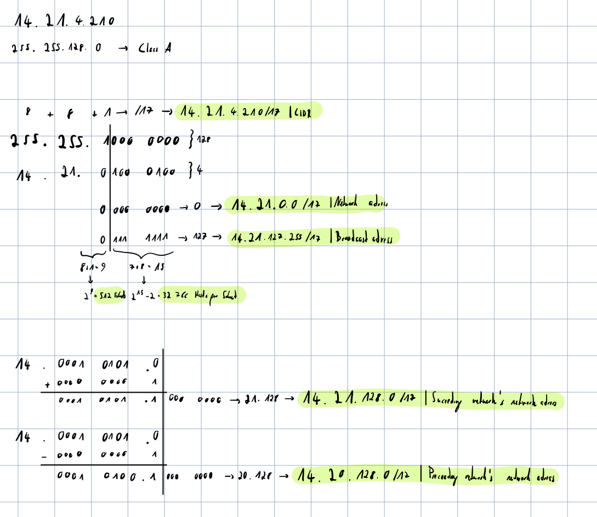
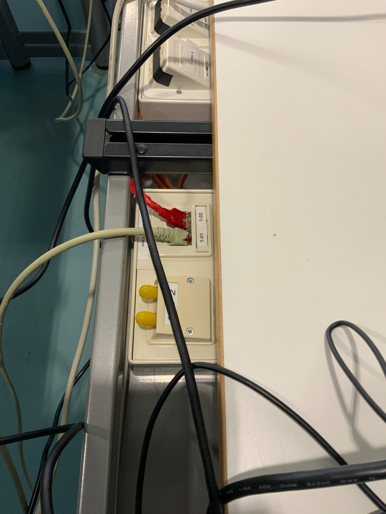
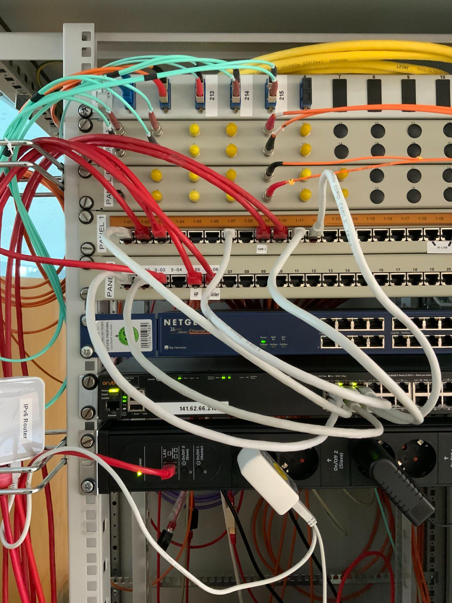
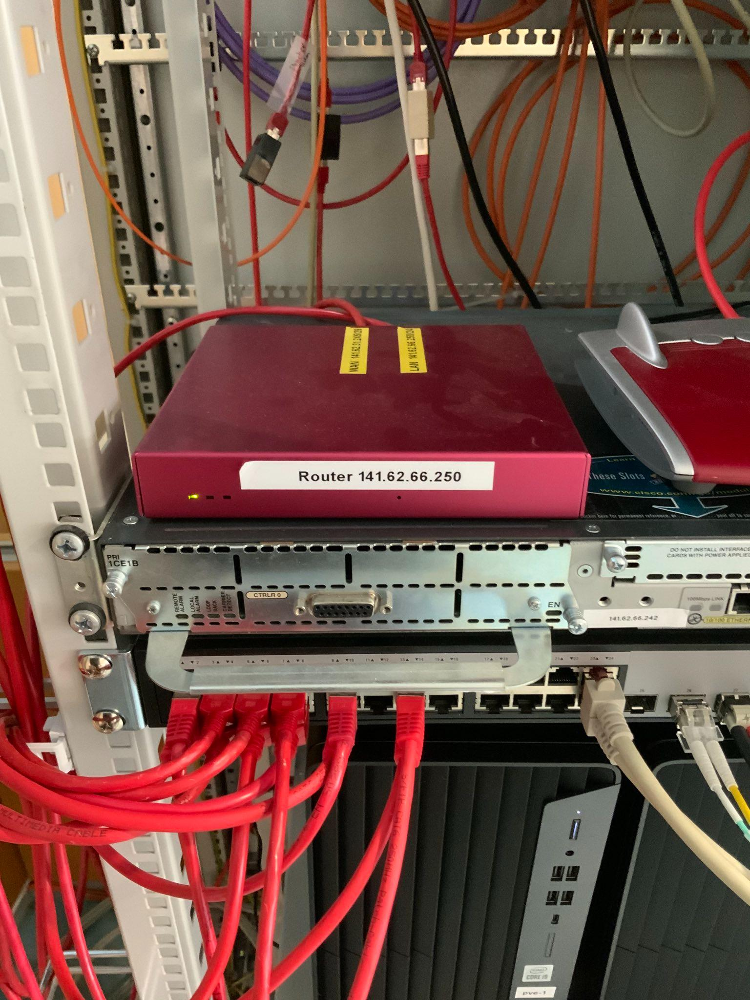

---
author: [Jakob Waibel, Daniel Hiller, Elia Wüstner, Felix Pojtinger]
date: "2021-10-19"
subject: "Praktikum Rechnernetze: Protokoll zu Versuch 1 (Troubleshooting TCP/IP) von Gruppe 1"
keywords: [Rechnernetze, Protokoll, Versuch, HdM Stuttgart]
subtitle: "Protokoll zu Versuch 1 (Troubleshooting TCP/IP) von Gruppe 1"
lang: "de"
...

# Praktikum Rechnernetze

## Einführung

### Mitwirken

Diese Materialien basieren auf [Professor Kiefers "Praktikum Rechnernetze"-Vorlesung der HdM Stuttgart](https://www.hdm-stuttgart.de/vorlesung_detail?vorlid=5212254).

**Sie haben einen Fehler gefunden oder haben einen Verbesserungsvorschlag?** Bitte eröffnen Sie ein Issue auf GitHub ([github.com/pojntfx/uni-netpractice-notes](https://github.com/pojntfx/uni-netpractice-notes)):

{ width=150px }

Wenn ihnen die Materialien gefallen, würden wir uns über einen GitHub-Stern sehr freuen.

### Lizenz

Dieses Dokument und der enthaltene Quelltext ist freie Kultur bzw. freie Software.

{ width=128px }

Uni Network Practice Notes (c) 2021 Jakob Waibel, Daniel Hiller, Elia Wüstner, Felix Pojtinger

SPDX-License-Identifier: AGPL-3.0

\newpage

## IP-Subnetz-Berechnung

**Ergänzen Sie die Tabelle**




## Werkzeuge des Betriebssystems

### IP-Konfiguration

**Überprüfen Sie zunächst die Netzkonfiguration Ihres PC. IP-Adresse, Subnetzmaske, Default-Gateway und DNS-Server Erfragen Sie den Klartextnamen Ihres PC.**

**IP-Addresse:** `142.62.66.5` \
**Subnetzmaske:** `255.255.255.0` \
**Default-Gateway:** `141.62.66.250`  
**DNS-Server:** `141.62.66.250` \
**Klartextnamen:** `rn05`

**Wie können Sie die korrekte Installation der Netzwerkkarten-Treiber testen?**

```shell
$ lspci
# ...
00:1f.6 Ethernet controller: Intel Corporation Ethernet Connection (2) I219-LM
# ...
$ find /sys | grep drivers.*00:1f.6
# ...
/sys/bus/pci/drivers/e1000e/0000:00:1f.6
```

**Testen Sie die DNS-Namensauflösung mit nslookup**

Wir verwenden an dieser Stelle `dig`, da `nslookup` deprecated ist. Die Option `+noall` entfernt alle Display-Flags und `+answer` zeigt dann nur die Antwortsektion des Outputs an.

```shell
$ dig +noall +answer +multiline www.hdm-stuttgart.de
www.hdm-stuttgart.de. 3553 IN A 141.62.1.53
www.hdm-stuttgart.de. 3553 IN A 141.62.1.59
```

Wir erhalten zwei Ergebnisse auf unsere Anfrage. Das könnte daran liegen, dass die HdM zur Lastenaufteilung zwei Webserver einsetzt.

\newpage

### Anschluss des PC an das Labornetz

**Betrachten Sie die Verbindungen der Labor-Switches untereinander. Welche Wege können Sie erkennen?**

Folgende Verbindungen konnten erkannt werden:

{ width=400px }

{ width=240px }

{ width=240px }

Wenn die Verbindung am Patch-Panel zu 1-01 unterbrochen wird, so verliert die Netzwerkkarte die Verbindung, was der Kernel-Buffer bestätigt:

```shell
$ dmesg -w
# ...
[    6.048643] e1000e 0000:00:1f.6 enp0s31f6: NIC Link is Up 1000 Mbps Full Duplex, Flow Control: None
[ 1360.221984] e1000e 0000:00:1f.6 enp0s31f6: NIC Link is Down
# ...
```

**Verfolgen Sie den im Netzwerkschrank gepatchten Weg, auf dem die Pakete Ihres Rechners zum Router gelangen**

Wie schon an den Bildern vorher illustriert lässt sich folgender Weg ableiten:

```plaintext
Patch-Feld -> Switch -> Router -> Rest der Infrastruktur
```

\newpage

**Verfolgen Sie den Weg, auf dem die Pakete Ihres Rechners den gegenüberliegenden Netzwerkschrank erreichen**

{ width=400px }

\newpage

**Warum ist im Netzwerkschrank wohl ein Hub installiert?**

Es ist ein Hub installiert, sodass die verschiedenen Nodes im LAN-Netzwerk miteinander kommunizieren können. Dies ermöglicht zudem auch einfacheres Debugging über Sniffing.

### Überprüfung der korrekten Installation

**Sehen Sie sich die IP-Konfiguration Ihres Rechners an durch Eingabe von ipconfig bzw. ipconfig/all in der DOS-Box.**

`ifconfig` ist deprecated, es wird stattdessen `ip` verwendet.

```shell
$ ip a
1: lo: <LOOPBACK,UP,LOWER_UP> mtu 65536 qdisc noqueue state UNKNOWN group default qlen 1000
    link/loopback 00:00:00:00:00:00 brd 00:00:00:00:00:00
    inet 127.0.0.1/8 scope host lo
       valid_lft forever preferred_lft forever
2: enp0s31f6: <BROADCAST,MULTICAST,UP,LOWER_UP> mtu 1500 qdisc pfifo_fast state UP group default qlen 1000
    link/ether 4c:52:62:0e:54:8b brd ff:ff:ff:ff:ff:ff
    inet 141.62.66.5/24 brd 141.62.66.255 scope global dynamic enp0s31f6
       valid_lft 11902sec preferred_lft 11902sec
```

\newpage

**Senden Sie einen ping-command an einen zweiten Rechner, der am gleichen Switch angeschlossen ist**

Hier wird ein anderer Laborrechner, `141.62.66.4`, angepingt.

```shell
$ ping 141.62.66.4
PING 141.62.66.4 (141.62.66.4) 56(84) bytes of data.
64 bytes from 141.62.66.4: icmp_seq=1 ttl=64 time=0.670 ms
64 bytes from 141.62.66.4: icmp_seq=2 ttl=64 time=0.509 ms
64 bytes from 141.62.66.4: icmp_seq=3 ttl=64 time=0.532 ms
64 bytes from 141.62.66.4: icmp_seq=4 ttl=64 time=0.526 ms
64 bytes from 141.62.66.4: icmp_seq=5 ttl=64 time=0.533 ms
^C
--- 141.62.66.4 ping statistics ---
5 packets transmitted, 5 received, 0% packet loss, time 4085ms
rtt min/avg/max/mdev = 0.509/0.554/0.670/0.058 ms
```

**Senden Sie einen ping-command zu einem Rechner, der am Switch im gegenüberliegenden Netzwerkschrank angeschlossen ist**

Hier wird nun ein Rechner mit der IP `141.62.66.13` angepingt, welcher am Switch im gegenüberliegenden Netzwerkschrank angeschlossen ist. Wie zu sehen ist ist die Latenz um ~0.2 ms größer.

```shell
$ ping 141.62.66.13
PING 141.62.66.13 (141.62.66.13) 56(84) bytes of data.
64 bytes from 141.62.66.13: icmp_seq=1 ttl=128 time=0.786 ms
64 bytes from 141.62.66.13: icmp_seq=2 ttl=128 time=0.775 ms
64 bytes from 141.62.66.13: icmp_seq=3 ttl=128 time=0.853 ms
64 bytes from 141.62.66.13: icmp_seq=4 ttl=128 time=0.752 ms
64 bytes from 141.62.66.13: icmp_seq=5 ttl=128 time=0.793 ms
^C
--- 141.62.66.13 ping statistics ---
5 packets transmitted, 5 received, 0% packet loss, time 4095ms
rtt min/avg/max/mdev = 0.752/0.791/0.853/0.033 ms
```

\newpage

**Senden Sie einen ping-command zum Labor-Router**

Der Labor-Router hat die IP-Addresse `141.62.66.250`. Die Latenz beläuft sich bei diesem mal auf ~1.05 ms.

```shell
$ ping 141.62.66.250
PING 141.62.66.250 (141.62.66.250) 56(84) bytes of data.
64 bytes from 141.62.66.250: icmp_seq=1 ttl=64 time=1.13 ms
64 bytes from 141.62.66.250: icmp_seq=2 ttl=64 time=1.07 ms
64 bytes from 141.62.66.250: icmp_seq=3 ttl=64 time=1.03 ms
64 bytes from 141.62.66.250: icmp_seq=4 ttl=64 time=1.02 ms
64 bytes from 141.62.66.250: icmp_seq=5 ttl=64 time=1.02 ms
64 bytes from 141.62.66.250: icmp_seq=6 ttl=64 time=1.03 ms
^C
--- 141.62.66.250 ping statistics ---
6 packets transmitted, 6 received, 0% packet loss, time 5007ms
rtt min/avg/max/mdev = 1.015/1.046/1.127/0.040 ms
```

**Starten Sie einen Web-Browser und überprüfen Sie die korrekte Funktion des DNS-Servers durch Aufruf einer beliebigen URL**


Die Seite ist erreichbar und war davor nicht gecached. Daraus lässt sich schließen, dass die DNS-Abfrage erfolgreich funktioniert hat.

\newpage

**Sehen Sie sich den DNS-Cache an**

```shell
$ sudo journalctl -u systemd-resolved
-- Journal begins at Tue 2021-10-05 07:59:05 CEST, ends at Tue 2021-10-19 15:33:33 CEST. --
Oct 19 15:31:00 rn05 systemd[1]: Starting Network Name Resolution...
Oct 19 15:31:00 rn05 systemd-resolved[34579]: Positive Trust Anchors:
Oct 19 15:31:00 rn05 systemd-resolved[34579]: . IN DS 20326 8 2 e06d44b80b8f1d39a95c0b0d7c65d08458e880409bbc683457104237c7f8ec8d
Oct 19 15:31:00 rn05 systemd-resolved[34579]: Negative trust anchors: 10.in-addr.arpa 16.172.in-addr.arpa 17.172.in-addr.arpa 18.172.in-addr.arpa 19.172.in-addr.arpa 20.172.in-addr.arpa 21.172.in-addr.arpa 22.172.in-addr.arpa 23.172.in-addr.arpa 24.172.in-addr.arpa 25.172.in-addr.arpa 26.172.in-addr.arpa 27.172.in-addr.arpa 28.172.in-addr.arpa 29.172.in-addr.arpa 30.172.in-addr.arpa 31.172.in-addr.arpa 168.192.in-addr.arpa d.f.ip6.arpa corp home internal intranet lan local private test
Oct 19 15:31:00 rn05 systemd-resolved[34579]: Using system hostname 'rn05'.
Oct 19 15:31:00 rn05 systemd[1]: Started Network Name Resolution.
Oct 19 15:31:29 rn05 systemd-resolved[34579]: [Scope protocol=llmnr interface=enp0s31f6 family=AF_INET]
Oct 19 15:31:29 rn05 systemd-resolved[34579]: ZONE:
Oct 19 15:31:29 rn05 systemd-resolved[34579]:         5.66.62.141.in-addr.arpa IN PTR rn05
Oct 19 15:31:29 rn05 systemd-resolved[34579]:         rn05 IN A 141.62.66.5
Oct 19 15:31:29 rn05 systemd-resolved[34579]: [Scope protocol=dns]
Oct 19 15:31:29 rn05 systemd-resolved[34579]: [Server 141.62.66.250 type=system]
Oct 19 15:31:29 rn05 systemd-resolved[34579]:         Verified feature level: n/a
Oct 19 15:31:29 rn05 systemd-resolved[34579]:         Possible feature level: TLS+EDNS0+D0
Oct 19 15:31:29 rn05 systemd-resolved[34579]:         DNSSEC Mode: no
Oct 19 15:31:29 rn05 systemd-resolved[34579]:         Can do DNSSEC: yes
Oct 19 15:31:29 rn05 systemd-resolved[34579]:         Maximum UDP packet size received: 512
Oct 19 15:31:29 rn05 systemd-resolved[34579]:         Failed UDP attempts: 0
Oct 19 15:31:29 rn05 systemd-resolved[34579]:         Failed TCP attempts: 0
Oct 19 15:31:29 rn05 systemd-resolved[34579]:         Seen truncated packet: no
Oct 19 15:31:29 rn05 systemd-resolved[34579]:         Seen OPT RR getting lost: no
Oct 19 15:31:29 rn05 systemd-resolved[34579]:         Seen RRSIG RR missing: no
Oct 19 15:32:38 rn05 systemd-resolved[34579]: [Scope protocol=llmnr interface=enp0s31f6 family=AF_INET]
Oct 19 15:32:38 rn05 systemd-resolved[34579]: ZONE:
Oct 19 15:32:38 rn05 systemd-resolved[34579]:         5.66.62.141.in-addr.arpa IN PTR rn05
Oct 19 15:32:38 rn05 systemd-resolved[34579]:         rn05 IN A 141.62.66.5
Oct 19 15:32:38 rn05 systemd-resolved[34579]: [Scope protocol=dns]
Oct 19 15:32:38 rn05 systemd-resolved[34579]: [Server 141.62.66.250 type=system]
Oct 19 15:32:38 rn05 systemd-resolved[34579]:         Verified feature level: n/a
Oct 19 15:32:38 rn05 systemd-resolved[34579]:         Possible feature level: TLS+EDNS0+D0
Oct 19 15:32:38 rn05 systemd-resolved[34579]:         DNSSEC Mode: no
Oct 19 15:32:38 rn05 systemd-resolved[34579]:         Can do DNSSEC: yes
Oct 19 15:32:38 rn05 systemd-resolved[34579]:         Maximum UDP packet size received: 512
Oct 19 15:32:38 rn05 systemd-resolved[34579]:         Failed UDP attempts: 0
Oct 19 15:32:38 rn05 systemd-resolved[34579]:         Failed TCP attempts: 0
Oct 19 15:32:38 rn05 systemd-resolved[34579]:         Seen truncated packet: no
Oct 19 15:32:38 rn05 systemd-resolved[34579]:         Seen OPT RR getting lost: no
Oct 19 15:32:38 rn05 systemd-resolved[34579]:         Seen RRSIG RR missing: no
Oct 19 15:33:00 rn05 systemd-resolved[34579]: [Scope protocol=llmnr interface=enp0s31f6 family=AF_INET]
Oct 19 15:33:00 rn05 systemd-resolved[34579]: ZONE:
Oct 19 15:33:00 rn05 systemd-resolved[34579]:         5.66.62.141.in-addr.arpa IN PTR rn05
Oct 19 15:33:00 rn05 systemd-resolved[34579]:         rn05 IN A 141.62.66.5
Oct 19 15:33:00 rn05 systemd-resolved[34579]: [Scope protocol=dns]
Oct 19 15:33:00 rn05 systemd-resolved[34579]: CACHE:
Oct 19 15:33:00 rn05 systemd-resolved[34579]:         test.com IN A 67.225.146.248
Oct 19 15:33:00 rn05 systemd-resolved[34579]:         test.com IN AAAA -- NODATA
Oct 19 15:33:00 rn05 systemd-resolved[34579]: [Server 141.62.66.250 type=system]
Oct 19 15:33:00 rn05 systemd-resolved[34579]:         Verified feature level: UDP+EDNS0
Oct 19 15:33:00 rn05 systemd-resolved[34579]:         Possible feature level: UDP+EDNS0
Oct 19 15:33:00 rn05 systemd-resolved[34579]:         DNSSEC Mode: no
Oct 19 15:33:00 rn05 systemd-resolved[34579]:         Can do DNSSEC: no
Oct 19 15:33:00 rn05 systemd-resolved[34579]:         Maximum UDP packet size received: 512
Oct 19 15:33:00 rn05 systemd-resolved[34579]:         Failed UDP attempts: 0
Oct 19 15:33:00 rn05 systemd-resolved[34579]:         Failed TCP attempts: 0
Oct 19 15:33:00 rn05 systemd-resolved[34579]:         Seen truncated packet: no
Oct 19 15:33:00 rn05 systemd-resolved[34579]:         Seen OPT RR getting lost: no
Oct 19 15:33:00 rn05 systemd-resolved[34579]:         Seen RRSIG RR missing: no
Oct 19 15:33:30 rn05 systemd-resolved[34579]: [Scope protocol=llmnr interface=enp0s31f6 family=AF_INET]
Oct 19 15:33:30 rn05 systemd-resolved[34579]: ZONE:
Oct 19 15:33:30 rn05 systemd-resolved[34579]:         5.66.62.141.in-addr.arpa IN PTR rn05
Oct 19 15:33:30 rn05 systemd-resolved[34579]:         rn05 IN A 141.62.66.5
Oct 19 15:33:30 rn05 systemd-resolved[34579]: [Scope protocol=dns]
Oct 19 15:33:30 rn05 systemd-resolved[34579]: CACHE:
Oct 19 15:33:30 rn05 systemd-resolved[34579]:         test.com IN AAAA -- NODATA
Oct 19 15:33:30 rn05 systemd-resolved[34579]:         example.com IN AAAA 2606:2800:220:1:248:1893:25c8:1946
Oct 19 15:33:30 rn05 systemd-resolved[34579]:         test.com IN A 67.225.146.248
Oct 19 15:33:30 rn05 systemd-resolved[34579]:         example.com IN A 93.184.216.34
Oct 19 15:33:30 rn05 systemd-resolved[34579]: [Server 141.62.66.250 type=system]
Oct 19 15:33:30 rn05 systemd-resolved[34579]:         Verified feature level: UDP+EDNS0
Oct 19 15:33:30 rn05 systemd-resolved[34579]:         Possible feature level: UDP+EDNS0
Oct 19 15:33:30 rn05 systemd-resolved[34579]:         DNSSEC Mode: no
Oct 19 15:33:30 rn05 systemd-resolved[34579]:         Can do DNSSEC: no
Oct 19 15:33:30 rn05 systemd-resolved[34579]:         Maximum UDP packet size received: 512
Oct 19 15:33:30 rn05 systemd-resolved[34579]:         Failed UDP attempts: 0
Oct 19 15:33:30 rn05 systemd-resolved[34579]:         Failed TCP attempts: 0
Oct 19 15:33:30 rn05 systemd-resolved[34579]:         Seen truncated packet: no
Oct 19 15:33:30 rn05 systemd-resolved[34579]:         Seen OPT RR getting lost: no
Oct 19 15:33:30 rn05 systemd-resolved[34579]:         Seen RRSIG RR missing: no
```

Wie zu erkennen ist, befinden sich mom. 2 Einträge im DNS-Cache: `test.com` und `example.com`, für welche jeweils die `A` und `AAAA`-Records gecached wurden.

### Adress Resolution Protocol ARP

`arp` ist deprecated, es wird stattdessen `ip neigh` verwendet.

**Dokumentieren Sie den Inhalt der ARP-Tabelle Ihres PC (arp-a, DOS-Box).**

```shell
$ ip neigh show
141.62.66.186 dev enp0s31f6 lladdr 10:82:86:01:36:6d STALE
141.62.66.12 dev enp0s31f6 lladdr 4c:52:62:0e:e0:e9 STALE
141.62.66.14 dev enp0s31f6 lladdr 4c:52:62:0e:e0:ae STALE
141.62.66.250 dev enp0s31f6 lladdr 00:0d:b9:4f:b8:14 REACHABLE
141.62.66.4 dev enp0s31f6 lladdr 4c:52:62:0e:53:eb STALE
141.62.66.13 dev enp0s31f6 lladdr 4c:52:62:0e:54:5d STALE
141.62.66.22 dev enp0s31f6  FAILED
141.62.66.216 dev enp0s31f6 lladdr 44:31:92:50:6c:61 STALE
```

**Nun pingen Sie einen beliebigen anderen Arbeitsplatz an und beobachten Sie evtl. Veränderungen der ARP-Tabelle**

```shell
$ ping 141.62.66.236
PING 141.62.66.236 (141.62.66.236) 56(84) bytes of data.
64 bytes from 141.62.66.236: icmp_seq=1 ttl=64 time=0.530 ms
64 bytes from 141.62.66.236: icmp_seq=2 ttl=64 time=0.684 ms
64 bytes from 141.62.66.236: icmp_seq=3 ttl=64 time=0.424 ms
^C
--- 141.62.66.236 ping statistics ---
3 packets transmitted, 3 received, 0% packet loss, time 2031ms
$ ip neigh show
141.62.66.186 dev enp0s31f6 lladdr 10:82:86:01:36:6d STALE
141.62.66.12 dev enp0s31f6 lladdr 4c:52:62:0e:e0:e9 STALE
141.62.66.236 dev enp0s31f6 lladdr 26:c5:04:8a:fa:eb STALE
141.62.66.14 dev enp0s31f6 lladdr 4c:52:62:0e:e0:ae STALE
141.62.66.250 dev enp0s31f6 lladdr 00:0d:b9:4f:b8:14 REACHABLE
141.62.66.4 dev enp0s31f6 lladdr 4c:52:62:0e:53:eb STALE
141.62.66.13 dev enp0s31f6 lladdr 4c:52:62:0e:54:5d STALE
141.62.66.22 dev enp0s31f6  FAILED
141.62.66.216 dev enp0s31f6 lladdr 44:31:92:50:6c:61 STALE
```

Nun wurde die Adresse `141.62.66.236` zur ARP-Tabelle hinzugefügt.

\newpage

**Ist die MAC-Adresse Ihres PC lokal oder global vergeben?**

```shell
$ ip a
1: lo: <LOOPBACK,UP,LOWER_UP> mtu 65536 qdisc noqueue state UNKNOWN group default qlen 1000
    link/loopback 00:00:00:00:00:00 brd 00:00:00:00:00:00
    inet 127.0.0.1/8 scope host lo
       valid_lft forever preferred_lft forever
2: enp0s31f6: <BROADCAST,MULTICAST,UP,LOWER_UP> mtu 1500 qdisc pfifo_fast state UP group default qlen 1000
    link/ether 4c:52:62:0e:54:8b brd ff:ff:ff:ff:ff:ff
    inet 141.62.66.5/24 brd 141.62.66.255 scope global dynamic enp0s31f6
       valid_lft 10201sec preferred_lft 10201sec
```

Es findet sich die MAC-Addresse `4c:52:62:0e:54:8b`; ein Lookup der OUI ergibt: `4C:52:62 Fujitsu Technology Solutions GmbH`, woraus sich schließen lässt, dass die MAC global vergeben ist.

**Was würde geschehen, wenn ein weiterer PC mit gleicher IP (aber selbstverständlich anderer MAC) ans gleiche Subnetz angeschlossen würde?**

Ein reines Ethernet-Frame würde den Host noch korrekt erreichen, aber da die IP nun mehreren Hosts zugeordnet wäre, würden IP-Packete nicht mehr den richtigen Host erreichen.

**Vergleichen Sie die Vorteile / Nachteile einer statischen und dynamische ARP-Tabelle**

Vorteile einer statischen/Nachteile einer dynamischen:

- Schneller und weniger Traffic; ARP-Request muss nicht gemacht werden
- Chain of Trust ist kürzer, da nicht dem Host, welche den ARP-Request beantwortet, vertraut werden muss

Vorteile einer dynamischen/Nachteile einer statischen:

- Wenn Geräte entfernt werden, dann müssen die Einträge manuell gelöscht werden
- Neue Geräte müssen nicht manuell hinzugefügt werden

**Warum wird die ARP-Tabelle ganz oder teilweise nach Ablauf einer bestimmten Zeit gelöscht, wie Sie leicht nachvollziehen können?**

Durch die Löschung der ARP-Tabelle werden die ARP-Anfragen erneut gemacht; wenn Geräte zum Netzwerk hinzukommen oder entfernt werden, so werden diese Änderungen dadurch repräsentiert.

\newpage

### Ping

**Ping-Nutzung**

```shell
$ ping --help
Usage
  ping [options] <destination>

Options:
  <destination>      dns name or ip address
  -a                 use audible ping
  -A                 use adaptive ping
  -B                 sticky source address
  -c <count>         stop after <count> replies
  -D                 print timestamps
  -d                 use SO_DEBUG socket option
  -f                 flood ping
  -h                 print help and exit
  -I <interface>     either interface name or address
  -i <interval>      seconds between sending each packet
  -L                 suppress loopback of multicast packets
  -l <preload>       send <preload> number of packages while waiting replies
  -m <mark>          tag the packets going out
  -M <pmtud opt>     define mtu discovery, can be one of <do|dont|want>
  -n                 no dns name resolution
  -O                 report outstanding replies
  -p <pattern>       contents of padding byte
  -q                 quiet output
  -Q <tclass>        use quality of service <tclass> bits
  -s <size>          use <size> as number of data bytes to be sent
  -S <size>          use <size> as SO_SNDBUF socket option value
  -t <ttl>           define time to live
  -U                 print user-to-user latency
  -v                 verbose output
  -V                 print version and exit
  -w <deadline>      reply wait <deadline> in seconds
  -W <timeout>       time to wait for response

IPv4 options:
  -4                 use IPv4
  -b                 allow pinging broadcast
  -R                 record route
  -T <timestamp>     define timestamp, can be one of <tsonly|tsandaddr|tsprespec>

IPv6 options:
  -6                 use IPv6
  -F <flowlabel>     define flow label, default is random
  -N <nodeinfo opt>  use icmp6 node info query, try <help> as argument

For more details see ping(8).
```

Erzwungenes IPv4:

```shell
$ ping -4 google.com
PING google.com (142.250.185.78) 56(84) bytes of data.
64 bytes from fra16s48-in-f14.1e100.net (142.250.185.78): icmp_seq=1 ttl=114 time=4.58 ms
64 bytes from fra16s48-in-f14.1e100.net (142.250.185.78): icmp_seq=2 ttl=114 time=5.40 ms
^C
--- google.com ping statistics ---
2 packets transmitted, 2 received, 0% packet loss, time 1002ms
rtt min/avg/max/mdev = 4.582/4.989/5.397/0.407 ms
```

Nur zwei Pakete:

```
praktikum@rn05:~$ ping -c 2 google.com
PING google.com (142.250.185.78) 56(84) bytes of data.
64 bytes from fra16s48-in-f14.1e100.net (142.250.185.78): icmp_seq=1 ttl=114 time=4.45 ms
64 bytes from fra16s48-in-f14.1e100.net (142.250.185.78): icmp_seq=2 ttl=114 time=4.46 ms

--- google.com ping statistics ---
2 packets transmitted, 2 received, 0% packet loss, time 1002ms
rtt min/avg/max/mdev = 4.447/4.453/4.460/0.006 ms
```

2 Sekunden Pause zwischen den Paketen:

```shell
$ ping -i 2 google.com
PING google.com (142.250.185.78) 56(84) bytes of data.
64 bytes from fra16s48-in-f14.1e100.net (142.250.185.78): icmp_seq=1 ttl=114 time=4.69 ms
64 bytes from fra16s48-in-f14.1e100.net (142.250.185.78): icmp_seq=2 ttl=114 time=4.59 ms
^C
--- google.com ping statistics ---
2 packets transmitted, 2 received, 0% packet loss, time 2003ms
rtt min/avg/max/mdev = 4.586/4.639/4.693/0.053 ms
```

\newpage

**HRPing-Nutzung**

HRPing ist ein erweiteres Ping-Command mit folgenden Optionen:

```shell
$ wine64 hrping.exe
This is hrPING v5.04 by cFos Software GmbH -- http://www.cfos.de

usage: hrPING [options] host

data options:
  -f           Set Don't Fragment bit in IP header
  -i TTL       Time To Live (default 255 for ping, 30 for traceroute)
  -v TOS       Type Of Service (default 0, deprecated)
  -l size      Send buffer size (payload size, default 32)
  -l s1[:s2[:i]]  Size sweep: send buffer size from <s1> to <s2> step <i>
  -L s1[:s2[:i]]  IP datagram size (payload size + 28, default 60) [with sweep]
  -M           Send ICMP timestamp requests
  -u [port]    Send UDP packets (port 7 by default)

operational options:
  -t           Ping the specified host until stopped (Ctrl-C to stop)
  -n count     Number of packets to send (default 4)
  -w timeout   Timeout in msec to wait for a reply (default 2000)
  -s time      Sending interval between packets in msec (default 500)
  -c [num]     Concurrent sending of up to <num> pings at a time (default 1)
  -r [count]   Be a traceroute (do <count> pings each hop, default 3)
  -a [hop]     Resolve addresses to names for traceroute (start at <hop>)
  -p           Trace path to destination, then ping all hops on path

output options:
  -lic         Show public license and warranty
  -fwhelp      Print firewall help text
  -F file      Log output into <file> as well, even if -q is set
  -T           Print timestamp in front of each line
  -q[r|e|t]    Be quiet (-qr=no replies, -qe=no errors, -qt=no timeouts)
  -y [sec]     Print summary of the last <sec> secs (default 10)
  -g -G        Show graph (-gg=close graph on exit, -G use running grping.exe)
  -? -h        This help (-??=more help)

hrPING is Freeware, please share it!  See www.cfos.de for our other solutions:
  -- Internet Acceleration via Traffic Shaping     : cFosSpeed
  -- Webserver for home users and professionals    : cFos Personal Net
  -- IPv6 Connectivity for XP, Vista and Windows 7 : cFos IPv6 Link
```

HRPing jedoch ist unfreie Software und respektiert deshalb nicht die digitalen Rechte der Versuchsdurchführenden; zudem funktioniert es nicht auf freien Systemen und der Quellcode steht nicht zur Verfügung, was ein Sicherheitsrisiko darstellt: Als freien Äquivalent wurde deshalb `fping` verwendet:

```plaintext
Name         : fping
Version      : 5.0
Release      : 3.fc34
Architecture : x86_64
Size         : 63 k
Source       : fping-5.0-3.fc34.src.rpm
Repository   : @System
From repo    : fedora
Summary      : Scriptable, parallelized ping-like utility
URL          : http://www.fping.org/
License      : BSD with advertising
Description  : fping is a ping-like program which can determine the
             : accessibility of multiple hosts using ICMP echo requests. fping
             : is designed for parallelized monitoring of large numbers of
             : systems, and is developed with ease of use in scripting in mind.
```

Diese hat ähnliche Optionen:

```shell
$ fping --help
Usage: fping [options] [targets...]

Probing options:
   -4, --ipv4         only ping IPv4 addresses
   -6, --ipv6         only ping IPv6 addresses
   -b, --size=BYTES   amount of ping data to send, in bytes (default: 56)
   -B, --backoff=N    set exponential backoff factor to N (default: 1.5)
   -c, --count=N      count mode: send N pings to each target
   -f, --file=FILE    read list of targets from a file ( - means stdin)
   -g, --generate     generate target list (only if no -f specified)
                      (give start and end IP in the target list, or a CIDR address)
                      (ex. fping -g 192.168.1.0 192.168.1.255 or fping -g 192.168.1.0/24)
   -H, --ttl=N        set the IP TTL value (Time To Live hops)
   -I, --iface=IFACE  bind to a particular interface
   -l, --loop         loop mode: send pings forever
   -m, --all          use all IPs of provided hostnames (e.g. IPv4 and IPv6), use with -A
   -M, --dontfrag     set the Don't Fragment flag
   -O, --tos=N        set the type of service (tos) flag on the ICMP packets
   -p, --period=MSEC  interval between ping packets to one target (in ms)
                      (in loop and count modes, default: 1000 ms)
   -r, --retry=N      number of retries (default: 3)
   -R, --random       random packet data (to foil link data compression)
   -S, --src=IP       set source address
   -t, --timeout=MSEC individual target initial timeout (default: 500 ms,
                      except with -l/-c/-C, where it's the -p period up to 2000 ms)

Output options:
   -a, --alive        show targets that are alive
   -A, --addr         show targets by address
   -C, --vcount=N     same as -c, report results in verbose format
   -D, --timestamp    print timestamp before each output line
   -e, --elapsed      show elapsed time on return packets
   -i, --interval=MSEC  interval between sending ping packets (default: 10 ms)
   -n, --name         show targets by name (-d is equivalent)
   -N, --netdata      output compatible for netdata (-l -Q are required)
   -o, --outage       show the accumulated outage time (lost packets * packet interval)
   -q, --quiet        quiet (don't show per-target/per-ping results)
   -Q, --squiet=SECS  same as -q, but show summary every n seconds
   -s, --stats        print final stats
   -u, --unreach      show targets that are unreachable
   -v, --version      show version
   -x, --reachable=N  shows if >=N hosts are reachable or not
```

Die Verwendung ist ähnlich wie `ping`.

**Weisen Sie mithilfe von HRPING nach, dass ein Ping, der zuerst eine ARP-Auflösung erforderlich macht, zu deutlich erhöhten Antwortzeiten führt.**

```shell
$ fping -e 10.60.43.50
10.60.43.50 is alive (70.9 ms)
$ sudo ip -s -s neigh flush all
10.60.63.252 dev wlp0s20f3 lladdr 3c:fd:fe:b6:ed:2d ref 1 used 10/10/10 probes 4 REACHABLE
10.60.43.50 dev wlp0s20f3 lladdr 7a:11:bd:7c:f9:ff ref 1 used 2/19/2 probes 4 DELAY

*** Round 1, deleting 2 entries ***
*** Flush is complete after 1 round ***
$ fping -e 10.60.43.50
10.60.43.50 is alive (212 ms)
```

Nach dem Löschen der ARP-Tabelle ist eine deutlich längere Antwortzeit zu messen.

### Traceroute & MTR

**Versuchen Sie, den zentralen Peering-Point (DE-CIX) in Deutschland geografisch anhand des Namens zu lokalisieren.**

```shell
$ traceroute de-cix.net
traceroute to de-cix.net (46.31.121.136), 30 hops max, 60 byte packets
 1  opnsense-router.rnlabor.hdm-stuttgart.de (141.62.66.250)  0.509 ms  1.566 ms  0.991 ms
 2  ciscovlgw318.hdm-stuttgart.de (141.62.31.246)  2.047 ms  1.295 ms  1.019 ms
 3  firewall-h.hdm-stuttgart.de (141.62.1.1)  1.118 ms  1.450 ms  1.120 ms
 4  * * *
 5  stu-al30-1-te0-0-0-17.belwue.net (129.143.56.53)  3.625 ms  3.191 ms  3.331 ms
 6  stu-nwz-a99-hu0-3-0-5.belwue.net (129.143.56.106)  3.030 ms  1.325 ms  1.440 ms
 7  fra-decix-1-hu0-0-0-4.belwue.net (129.143.60.113)  5.149 ms fra-decix-1-hu0-0-0-3.belwue.net (129.143.57.127)  5.283 ms  5.465 ms
 8  sgw2-te-0-0-2-3-ixp.fra.de-cix.net (80.81.194.116)  7.276 ms  7.181 ms  7.103 ms
 9  * * *
10  * * *
11  * * *
12  * * *
13  * * *
14  *^C
```

1. `opnsense-router.rnlabor.hdm-stuttgart.de`: Gateway des RN-Labors
2. `ciscovlgw318.hdm-stuttgart.de`: Gateway zwischen RN-Labor-Router und Firewall
3. `firewall-h.hdm-stuttgart.de`: Firewall der HdM
4. `stu-al30-1-te0-0-0-17.belwue.net` und `stu-nwz-a99-hu0-3-0-5.belwue.net`: Router Belwue in Stuttgart
5. `fra-decix-1-hu0-0-0-4.belwue.net`: Router Belwue in Frankfurt
6. `sgw2-te-0-0-2-3-ixp.fra.de-cix.net`: Router DE-CIX in Frankfurt

\newpage

**Zeichnen Sie den Weg eines Pakets zu www.aol.com auf.**

```shell
$ traceroute www.aol.com
traceroute to www.aol.com (212.82.100.163), 30 hops max, 60 byte packets
 1  opnsense.rnlabor.hdm-stuttgart.de (141.62.66.250)  1.284 ms  0.653 ms  0.956 ms
 2  ciscovlgw318.hdm-stuttgart.de (141.62.31.246)  1.168 ms  1.601 ms  2.339 ms
 3  firewall-h.hdm-stuttgart.de (141.62.1.1)  1.800 ms  1.896 ms  2.378 ms
 4  * * *
 5  stu-al30-1-te0-0-0-17.belwue.net (129.143.56.53)  3.143 ms  3.819 ms  3.212 ms
 6  stu-nwz-a99-hu0-3-0-5.belwue.net (129.143.56.106)  3.510 ms  2.147 ms  3.579 ms
 7  fra-decix-1-hu0-0-0-3.belwue.net (129.143.57.127)  5.073 ms  5.193 ms  4.812 ms
 8  ge-1-3-0.pat1.dee.yahoo.com (80.81.192.115)  5.630 ms  5.656 ms  5.699 ms
 9  ae-3.pat1.frz.yahoo.com (209.191.112.17)  13.928 ms  14.322 ms  13.942 ms
10  ae-2.pat1.iry.yahoo.com (209.191.112.54)  30.229 ms  30.613 ms  30.790 ms
11  et-1-1-2.msr1.ir2.yahoo.com (66.196.65.19)  30.763 ms  29.649 ms  29.854 ms
12  lo0.fab2-1-gdc.ir2.yahoo.com (77.238.190.3)  29.678 ms lo0.fab3-1-gdc.ir2.yahoo.com (77.238.190.4)  29.709 ms lo0.fab2-1-gdc.ir2.yahoo.com (77.238.190.3)  29.842 ms
13  usw2-1-lba.ir2.yahoo.com (77.238.190.103)  29.724 ms  29.602 ms usw1-1-lba.ir2.yahoo.com (77.238.190.102)  29.750 ms
14  media-router-aol71.prod.media.vip.ir2.yahoo.com (212.82.100.163)  29.546 ms  30.166 ms  29.797 ms
```

\newpage

**Beobachten Sie Zeitüberschreitungen? Wie können Sie tracert so manipulieren, dass möglichst selten Zeitüberschreitungen auftauchen?**

Eine Zeitüberschreitung kann zwischen `firewall-h.hdm-stuttgart.de` und `stu-al30-1-te0-0-0-17.belwue.net` erkannt werden; hier wurde versucht das Timeout auf 5 Sekunden mittels `-w` zu setzen und mit `-I` über die Raw Sockets API direkt die Pakete am Kernel-Stack vorbeizuschicken, was jedoch in beiden Fällen die durch `* * *` gekennzeichneten Timeouts nicht umgehen kann.

```shell
$ traceroute --help
Usage:
  traceroute [ -46dFITnreAUDV ] [ -f first_ttl ] [ -g gate,... ] [ -i device ] [ -m max_ttl ] [ -N squeries ] [ -p port ] [ -t tos ] [ -l flow_label ] [ -w MAX,HERE,NEAR ] [ -q nqueries ] [ -s src_addr ] [ -z sendwait ] [ --fwmark=num ] host [ packetlen ]
Options:
  -4                          Use IPv4
  -6                          Use IPv6
  -d  --debug                 Enable socket level debugging
  -F  --dont-fragment         Do not fragment packets
  -f first_ttl  --first=first_ttl
                              Start from the first_ttl hop (instead from 1)
  -g gate,...  --gateway=gate,...
                              Route packets through the specified gateway
                              (maximum 8 for IPv4 and 127 for IPv6)
  -I  --icmp                  Use ICMP ECHO for tracerouting
  -T  --tcp                   Use TCP SYN for tracerouting (default port is 80)
  -i device  --interface=device
                              Specify a network interface to operate with
  -m max_ttl  --max-hops=max_ttl
                              Set the max number of hops (max TTL to be
                              reached). Default is 30
  -N squeries  --sim-queries=squeries
                              Set the number of probes to be tried
                              simultaneously (default is 16)
  -n                          Do not resolve IP addresses to their domain names
  -p port  --port=port        Set the destination port to use. It is either
                              initial udp port value for "default" method
                              (incremented by each probe, default is 33434), or
                              initial seq for "icmp" (incremented as well,
                              default from 1), or some constant destination
                              port for other methods (with default of 80 for
                              "tcp", 53 for "udp", etc.)
  -t tos  --tos=tos           Set the TOS (IPv4 type of service) or TC (IPv6
                              traffic class) value for outgoing packets
  -l flow_label  --flowlabel=flow_label
                              Use specified flow_label for IPv6 packets
  -w MAX,HERE,NEAR  --wait=MAX,HERE,NEAR
                              Wait for a probe no more than HERE (default 3)
                              times longer than a response from the same hop,
                              or no more than NEAR (default 10) times than some
                              next hop, or MAX (default 5.0) seconds (float
                              point values allowed too)
  -q nqueries  --queries=nqueries
                              Set the number of probes per each hop. Default is
                              3
  -r                          Bypass the normal routing and send directly to a
                              host on an attached network
  -s src_addr  --source=src_addr
                              Use source src_addr for outgoing packets
  -z sendwait  --sendwait=sendwait
                              Minimal time interval between probes (default 0).
                              If the value is more than 10, then it specifies a
                              number in milliseconds, else it is a number of
                              seconds (float point values allowed too)
  -e  --extensions            Show ICMP extensions (if present), including MPLS
  -A  --as-path-lookups       Perform AS path lookups in routing registries and
                              print results directly after the corresponding
                              addresses
  -M name  --module=name      Use specified module (either builtin or external)
                              for traceroute operations. Most methods have
                              their shortcuts (`-I' means `-M icmp' etc.)
  -O OPTS,...  --options=OPTS,...
                              Use module-specific option OPTS for the
                              traceroute module. Several OPTS allowed,
                              separated by comma. If OPTS is "help", print info
                              about available options
  --sport=num                 Use source port num for outgoing packets. Implies
                              `-N 1'
  --fwmark=num                Set firewall mark for outgoing packets
  -U  --udp                   Use UDP to particular port for tracerouting
                              (instead of increasing the port per each probe),
                              default port is 53
  -UL                         Use UDPLITE for tracerouting (default dest port
                              is 53)
  -D  --dccp                  Use DCCP Request for tracerouting (default port
                              is 33434)
  -P prot  --protocol=prot    Use raw packet of protocol prot for tracerouting
  --mtu                       Discover MTU along the path being traced. Implies
                              `-F -N 1'
  --back                      Guess the number of hops in the backward path and
                              print if it differs
  -V  --version               Print version info and exit
  --help                      Read this help and exit

Arguments:
+     host          The host to traceroute to
      packetlen     The full packet length (default is the length of an IP
                    header plus 40). Can be ignored or increased to a minimal
                    allowed value
$ traceroute www.aol.com
traceroute to www.aol.com (212.82.100.163), 30 hops max, 60 byte packets
 1  opnsense.rnlabor.hdm-stuttgart.de (141.62.66.250)  1.284 ms  0.653 ms  0.956 ms
 2  ciscovlgw318.hdm-stuttgart.de (141.62.31.246)  1.168 ms  1.601 ms  2.339 ms
 3  firewall-h.hdm-stuttgart.de (141.62.1.1)  1.800 ms  1.896 ms  2.378 ms
 4  * * *
 5  stu-al30-1-te0-0-0-17.belwue.net (129.143.56.53)  3.143 ms  3.819 ms  3.212 ms
 6  stu-nwz-a99-hu0-3-0-5.belwue.net (129.143.56.106)  3.510 ms  2.147 ms  3.579 ms
 7  fra-decix-1-hu0-0-0-3.belwue.net (129.143.57.127)  5.073 ms  5.193 ms  4.812 ms
 8  ge-1-3-0.pat1.dee.yahoo.com (80.81.192.115)  5.630 ms  5.656 ms  5.699 ms
 9  ae-3.pat1.frz.yahoo.com (209.191.112.17)  13.928 ms  14.322 ms  13.942 ms
10  ae-2.pat1.iry.yahoo.com (209.191.112.54)  30.229 ms  30.613 ms  30.790 ms
11  et-1-1-2.msr1.ir2.yahoo.com (66.196.65.19)  30.763 ms  29.649 ms  29.854 ms
12  lo0.fab2-1-gdc.ir2.yahoo.com (77.238.190.3)  29.678 ms lo0.fab3-1-gdc.ir2.yahoo.com (77.238.190.4)  29.709 ms lo0.fab2-1-gdc.ir2.yahoo.com (77.238.190.3)  29.842 ms
13  usw2-1-lba.ir2.yahoo.com (77.238.190.103)  29.724 ms  29.602 ms usw1-1-lba.ir2.yahoo.com (77.238.190.102)  29.750 ms
14  media-router-aol71.prod.media.vip.ir2.yahoo.com (212.82.100.163)  29.546 ms  30.166 ms  29.797 ms
[pojntfx@felixs-xps13 hrping-v504]$ ssh pojntfx@159.223.25.154 "nc -lp 6969"
$ traceroute -w 5 www.aol.com
traceroute to www.aol.com (212.82.100.163), 30 hops max, 60 byte packets
 1  opnsense.rnlabor.hdm-stuttgart.de (141.62.66.250)  0.707 ms  3.001 ms  1.312 ms
 2  ciscovlgw318.hdm-stuttgart.de (141.62.31.246)  1.782 ms  2.642 ms  2.615 ms
 3  firewall-h.hdm-stuttgart.de (141.62.1.1)  3.417 ms  0.907 ms  2.692 ms
 4  * * *
 5  stu-al30-1-te0-0-0-17.belwue.net (129.143.56.53)  2.044 ms  2.630 ms  2.032 ms
 6  stu-nwz-a99-hu0-3-0-5.belwue.net (129.143.56.106)  3.323 ms  1.287 ms  1.541 ms
 7  fra-decix-1-hu0-0-0-4.belwue.net (129.143.60.113)  7.004 ms  7.114 ms  7.266 ms
 8  ge-1-3-0.pat1.dee.yahoo.com (80.81.192.115)  6.009 ms  4.880 ms  4.545 ms
 9  ae-3.pat1.frz.yahoo.com (209.191.112.17)  14.326 ms  13.727 ms  13.700 ms
10  ae-2.pat1.iry.yahoo.com (209.191.112.54)  31.291 ms  31.060 ms  31.097 ms
11  ge-0-3-9-d104.pat1.the.yahoo.com (66.196.65.21)  29.823 ms  29.921 ms et-1-1-2.msr1.ir2.yahoo.com (66.196.65.19)  29.735 ms
12  lo0.fab4-1-gdc.ir2.yahoo.com (77.238.190.5)  29.809 ms lo0.fab1-1-gdc.ir2.yahoo.com (77.238.190.2)  29.664 ms  29.659 ms
13  usw1-1-lba.ir2.yahoo.com (77.238.190.102)  29.517 ms  29.572 ms  29.759 ms
14  media-router-aol71.prod.media.vip.ir2.yahoo.com (212.82.100.163)  29.563 ms  29.706 ms  29.883 ms
$ sudo traceroute -I www.aol.com
traceroute to www.aol.com (212.82.100.163), 30 hops max, 60 byte packets
 1  opnsense-router.rnlabor.hdm-stuttgart.de (141.62.66.250)  0.461 ms  0.551 ms  0.664 ms
 2  ciscovlgw318.hdm-stuttgart.de (141.62.31.246)  2.064 ms  2.290 ms  2.657 ms
 3  firewall-h.hdm-stuttgart.de (141.62.1.1)  1.315 ms  1.628 ms  1.878 ms
 4  * * *
 5  stu-al30-1-te0-0-0-17.belwue.net (129.143.56.53)  2.891 ms  3.008 ms  3.068 ms
 6  stu-nwz-a99-hu0-3-0-5.belwue.net (129.143.56.106)  3.175 ms  1.587 ms  1.432 ms
 7  fra-decix-1-hu0-0-0-3.belwue.net (129.143.57.127)  5.115 ms  5.213 ms  5.328 ms
 8  ge-1-3-0.pat1.dee.yahoo.com (80.81.192.115)  4.916 ms  4.915 ms  5.005 ms
 9  ae-3.pat1.frz.yahoo.com (209.191.112.17)  13.831 ms  13.886 ms  14.163 ms
10  ae-2.pat1.iry.yahoo.com (209.191.112.54)  30.506 ms  30.505 ms  30.108 ms
11  ge-0-3-9-d104.pat1.the.yahoo.com (66.196.65.21)  29.434 ms  29.657 ms  29.699 ms
12  lo0.fab3-1-gdc.ir2.yahoo.com (77.238.190.4)  29.757 ms  29.662 ms  29.707 ms
13  usw2-1-lba.ir2.yahoo.com (77.238.190.103)  29.685 ms  29.690 ms  29.696 ms
14  media-router-aol71.prod.media.vip.ir2.yahoo.com (212.82.100.163)  29.631 ms  29.915 ms  30.152 ms
```

**Besuchen Sie das DENIC (www.denic.de) und erfragen Sie den Besitzer von Domain-Namen, die Sie interessieren.**

Hier z.B. die HdM Stuttgart:

```shell
$ whois www.hdm-stuttgart.de
[Querying whois.denic.de]
[whois.denic.de]
% Restricted rights.
%
% Terms and Conditions of Use
%
% The above data may only be used within the scope of technical or
% administrative necessities of Internet operation or to remedy legal
% problems.
% The use for other purposes, in particular for advertising, is not permitted.
%
% The DENIC whois service on port 43 doesn't disclose any information concerning
% the domain holder, general request and abuse contact.
% This information can be obtained through use of our web-based whois service
% available at the DENIC website:
% http://www.denic.de/en/domains/whois-service/web-whois.html
%
%

Domain: hdm-stuttgart.de
Nserver: dns1.belwue.de
Nserver: dns3.belwue.de
Nserver: iz-net-2.hdm-stuttgart.de 141.62.1.2
Nserver: iz-net-3.hdm-stuttgart.de 141.62.1.3
Nserver: iz-net-4.hdm-stuttgart.de 141.62.1.4
Status: connect
Changed: 2015-04-22T16:37:06+02:00
```

Und die Electronic Frontier Foundation:

```shell
$ whois eff.org
[Querying whois.pir.org]
[whois.pir.org]
Domain Name: EFF.ORG
Registry Domain ID: D2234962-LROR
Registrar WHOIS Server: whois.gandi.net
Registrar URL: http://www.gandi.net
Updated Date: 2018-03-08T02:19:58Z
Creation Date: 1990-10-10T04:00:00Z
Registry Expiry Date: 2022-10-09T04:00:00Z
Registrar Registration Expiration Date:
Registrar: Gandi SAS
Registrar IANA ID: 81
Registrar Abuse Contact Email: abuse@support.gandi.net
Registrar Abuse Contact Phone: +33.170377661
Reseller:
Domain Status: clientTransferProhibited https://icann.org/epp#clientTransferProhibited
Registrant Organization: Electronic Frontier Foundation
Registrant State/Province: CA
Registrant Country: US
Name Server: NS1.EFF.ORG
Name Server: NS2.EFF.ORG
Name Server: NS4.EFF.ORG
DNSSEC: unsigned
URL of the ICANN Whois Inaccuracy Complaint Form https://www.icann.org/wicf/)
>>> Last update of WHOIS database: 2021-10-20T20:35:43Z <<<

For more information on Whois status codes, please visit https://icann.org/epp

Access to Public Interest Registry WHOIS information is provided to assist persons in determining the contents of a domain name registration record in the Public Interest Registry registry database. The data in this record is provided by Public Interest Registry for informational purposes only, and Public Interest Registry does not guarantee its accuracy. This service is intended only for query-based access. You agree that you will use this data only for lawful purposes and that, under no circumstances will you use this data to (a) allow, enable, or otherwise support the transmission by e-mail, telephone, or facsimile of mass unsolicited, commercial advertising or solicitations to entities other than the data recipient's own existing customers; or (b) enable high volume, automated, electronic processes that send queries or data to the systems of Registry Operator, a Registrar, or Afilias except as reasonably necessary to register domain names or modify existing registrations. All rights reserved. Public Interest Registry reserves the right to modify these terms at any time. By submitting this query, you agree to abide by this policy.

The Registrar of Record identified in this output may have an RDDS service that can be queried for additional information on how to contact the Registrant, Admin, or Tech contact of the queried domain name.
```

**Sehen Sie sich die Möglichkeiten von PathPing an.**

PathPing ist unfreie Software und respektiert deshalb nicht die digitalen Rechte der Versuchs-
durchführenden; zudem funktioniert es nicht auf freien Systemen und der Quellcode steht nicht zur
Verfügung, was ein Sicherheitsrisiko darstellt. Als freien Äquivalent zu PathPing wurde deshalb `mtr` verwendet:

```plaintext
Name         : mtr
Epoch        : 2
Version      : 0.94
Release      : 3.fc34
Architecture : x86_64
Size         : 191 k
Source       : mtr-0.94-3.fc34.src.rpm
Repository   : @System
From repo    : updates
Summary      : Network diagnostic tool combining 'traceroute' and 'ping'
URL          : https://www.bitwizard.nl/mtr/
License      : GPLv2
Description  : MTR combines the functionality of the 'traceroute' and 'ping'
             : programs in a single network diagnostic tool.
             :
             : When MTR is started, it investigates the network connection
             : between the host MTR runs on and the user-specified destination
             : host. Afterwards it determines the address of each network hop
             : between the machines and sends a sequence of ICMP echo requests
             : to each one to determine the quality of the link to each machine.
             : While doing this, it prints running statistics about each
             : machine.
             :
             : MTR provides two user interfaces: an ncurses interface, useful
             : for the command line, e.g. for SSH sessions; and a GTK interface
             : for X (provided in the mtr-gtk package).
```

`mtr` kombiniert die Funktionalität von `traceroute` und `ping`, was folgende Optionen ermöglicht:

```shell
Usage:
 mtr [options] hostname

 -F, --filename FILE        read hostname(s) from a file
 -4                         use IPv4 only
 -6                         use IPv6 only
 -u, --udp                  use UDP instead of ICMP echo
 -T, --tcp                  use TCP instead of ICMP echo
 -I, --interface NAME       use named network interface
 -a, --address ADDRESS      bind the outgoing socket to ADDRESS
 -f, --first-ttl NUMBER     set what TTL to start
 -m, --max-ttl NUMBER       maximum number of hops
 -U, --max-unknown NUMBER   maximum unknown host
 -P, --port PORT            target port number for TCP, SCTP, or UDP
 -L, --localport LOCALPORT  source port number for UDP
 -s, --psize PACKETSIZE     set the packet size used for probing
 -B, --bitpattern NUMBER    set bit pattern to use in payload
 -i, --interval SECONDS     ICMP echo request interval
 -G, --gracetime SECONDS    number of seconds to wait for responses
 -Q, --tos NUMBER           type of service field in IP header
 -e, --mpls                 display information from ICMP extensions
 -Z, --timeout SECONDS      seconds to keep probe sockets open
 -M, --mark MARK            mark each sent packet
 -r, --report               output using report mode
 -w, --report-wide          output wide report
 -c, --report-cycles COUNT  set the number of pings sent
 -j, --json                 output json
 -x, --xml                  output xml
 -C, --csv                  output comma separated values
 -l, --raw                  output raw format
 -p, --split                split output
 -t, --curses               use curses terminal interface
     --displaymode MODE     select initial display mode
 -n, --no-dns               do not resolve host names
 -b, --show-ips             show IP numbers and host names
 -o, --order FIELDS         select output fields
 -y, --ipinfo NUMBER        select IP information in output
 -z, --aslookup             display AS number
 -h, --help                 display this help and exit
 -v, --version              output version information and exit

See the 'man 8 mtr' for details.
```

Interessant ist z.B. die `-n`-Flag:

```shell
$ mtr -n --json www.aol.com
{
    "report": {
        "mtr": {
            "src": "felixs-xps13",
            "dst": "www.aol.com",
            "tos": 0,
            "tests": 10,
            "psize": "64",
            "bitpattern": "0x00"
        },
        "hubs": [
            {
                "count": 1,
                "host": "10.60.63.252",
                "Loss%": 0.0,
                "Snt": 10,
                "Last": 88.565,
                "Avg": 10.379,
                "Best": 1.066,
                "Wrst": 88.565,
                "StDev": 27.477
            },
            {
                "count": 2,
                "host": "141.62.31.94",
                "Loss%": 0.0,
                "Snt": 10,
                "Last": 11.83,
                "Avg": 2.541,
                "Best": 1.24,
                "Wrst": 11.83,
                "StDev": 3.272
            },
            {
                "count": 3,
                "host": "???",
                "Loss%": 100.0,
                "Snt": 10,
                "Last": 0.0,
                "Avg": 0.0,
                "Best": 0.0,
                "Wrst": 0.0,
                "StDev": 0.0
            },
# ...
            {
                "count": 12,
                "host": "77.238.190.103",
                "Loss%": 0.0,
                "Snt": 10,
                "Last": 30.614,
                "Avg": 33.189,
                "Best": 30.017,
                "Wrst": 56.002,
                "StDev": 8.102
            },
            {
                "count": 13,
                "host": "212.82.100.163",
                "Loss%": 0.0,
                "Snt": 10,
                "Last": 32.157,
                "Avg": 30.531,
                "Best": 29.846,
                "Wrst": 32.157,
                "StDev": 0.818
            }
        ]
    }
}
$ mtr --json www.aol.com
{
    "report": {
        "mtr": {
            "src": "felixs-xps13",
            "dst": "www.aol.com",
            "tos": 0,
            "tests": 10,
            "psize": "64",
            "bitpattern": "0x00"
        },
        "hubs": [
            {
                "count": 1,
                "host": "_gateway",
                "Loss%": 0.0,
                "Snt": 10,
                "Last": 35.643,
                "Avg": 5.191,
                "Best": 1.074,
                "Wrst": 35.643,
                "StDev": 10.757
            },
            {
                "count": 2,
                "host": "141.62.31.94",
                "Loss%": 0.0,
                "Snt": 10,
                "Last": 49.069,
                "Avg": 14.104,
                "Best": 1.404,
                "Wrst": 77.221,
                "StDev": 26.687
            },
            {
                "count": 3,
                "host": "???",
                "Loss%": 100.0,
                "Snt": 10,
                "Last": 0.0,
                "Avg": 0.0,
                "Best": 0.0,
                "Wrst": 0.0,
                "StDev": 0.0
            },
# ...
            {
                "count": 12,
                "host": "usw1-1-lba.ir2.yahoo.com",
                "Loss%": 0.0,
                "Snt": 10,
                "Last": 53.336,
                "Avg": 34.049,
                "Best": 30.023,
                "Wrst": 53.336,
                "StDev": 8.066
            },
            {
                "count": 13,
                "host": "media-router-aol71.prod.media.vip.ir2.yahoo.com",
                "Loss%": 0.0,
                "Snt": 10,
                "Last": 30.159,
                "Avg": 41.64,
                "Best": 30.008,
                "Wrst": 141.8,
                "StDev": 35.2
            }
        ]
    }
}
```

Wie zu erkennen ist wird durch diese z.B. die Hostnamen-Auflösungen übersprungen, was die Geschwindigkeit erhöht.

### SS

`netstat` ist deprecated, es wird stattdessen dessen Nachfolger `ss` aus dem `iproute2`-Package verwendet:

```plaintext
Name         : iproute
Version      : 5.10.0
Release      : 2.fc34
Architecture : x86_64
Size         : 1.7 M
Source       : iproute-5.10.0-2.fc34.src.rpm
Repository   : @System
From repo    : anaconda
Summary      : Advanced IP routing and network device configuration tools
URL          : http://kernel.org/pub/linux/utils/net/iproute2/
License      : GPLv2+ and Public Domain
Description  : The iproute package contains networking utilities (ip and rtmon,
             : for example) which are designed to use the advanced networking
             : capabilities of the Linux kernel.
```

**Gehen Sie ins www und beobachten Sie die Veränderungen der netstat-Tabelle (netstat –an). Interpretieren Sie die Anzeige**

Zuvor:

```shell
$ ss -tnp
State                  Recv-Q             Send-Q                                                    Local Address:Port                                   Peer Address:Port             Process
FIN-WAIT-1             0                  1                                                           10.60.54.18:60340                                104.17.239.204:443
FIN-WAIT-1             0                  1                                                           10.60.54.18:52990                                  104.16.18.94:443
ESTAB                  0                  0                                                           10.60.54.18:49524                                198.252.206.25:443               users:(("chrome",pid=57314,fd=55))
FIN-WAIT-1             0                  1                                                           10.60.54.18:48368                                  151.101.1.69:443
FIN-WAIT-1             0                  1                                                           10.60.54.18:45586                               142.250.186.161:443
FIN-WAIT-1             0                  1                                                           10.60.54.18:60886                                151.101.14.217:443
FIN-WAIT-1             0                  1                                                           10.60.54.18:45862                                    23.185.0.3:443
ESTAB                  0                  0                                                            10.60.6.89:52008                                  66.102.1.188:5228              users:(("chrome",pid=57314,fd=26))
FIN-WAIT-1             0                  1                                                           10.60.54.18:42784                                104.244.42.193:443
FIN-WAIT-1             0                  1                                                           10.60.54.18:43802                                  140.82.121.3:443
FIN-WAIT-1             0                  1                                                           10.60.54.18:56072                                 104.19.154.83:443
ESTAB                  0                  0                                                           10.60.54.18:57766                                 159.69.63.133:443               users:(("nextcloud",pid=4890,fd=38))
FIN-WAIT-1             0                  1                                                           10.60.54.18:58314                                  104.244.42.2:443
FIN-WAIT-1             0                  1                                                           10.60.54.18:41736                               185.199.109.154:443
```

Nach dem Aufruf von `news.ycombinator.com`:

```shell
$ ss -tnp
State                  Recv-Q             Send-Q                                                    Local Address:Port                                   Peer Address:Port             Process
FIN-WAIT-1             0                  1                                                           10.60.54.18:60340                                104.17.239.204:443
FIN-WAIT-1             0                  1                                                           10.60.54.18:52990                                  104.16.18.94:443
ESTAB                  0                  0                                                           10.60.54.18:49524                                198.252.206.25:443               users:(("chrome",pid=57314,fd=55))
ESTAB                  0                  0                                                            10.60.6.89:50696                                 159.69.63.133:443               users:(("nextcloud",pid=4890,fd=65))
FIN-WAIT-1             0                  1                                                           10.60.54.18:48368                                  151.101.1.69:443
FIN-WAIT-1             0                  1                                                           10.60.54.18:45586                               142.250.186.161:443
FIN-WAIT-1             0                  1                                                           10.60.54.18:60886                                151.101.14.217:443
FIN-WAIT-1             0                  1                                                           10.60.54.18:45862                                    23.185.0.3:443
FIN-WAIT-2             0                  0                                                            10.60.6.89:52008                                  66.102.1.188:5228
FIN-WAIT-1             0                  1                                                           10.60.54.18:56072                                 104.19.154.83:443
FIN-WAIT-1             0                  1                                                           10.60.54.18:41736                               185.199.109.154:443
ESTAB                  0                  0                                                            10.60.6.89:50692                                 159.69.63.133:443               users:(("nextcloud",pid=4890,fd=38))
ESTAB                  0                  0                                                            10.60.6.89:47334                                188.166.16.132:443               users:(("chrome",pid=57314,fd=40))
FIN-WAIT-1             0                  1                                                           10.60.54.18:54590                                104.17.131.171:443
FIN-WAIT-1             0                  1                                                           10.60.54.18:53934                                  172.66.43.53:443
FIN-WAIT-1             0                  1                                                           10.60.54.18:44820                               185.199.111.133:443
FIN-WAIT-1             0                  1                                                           10.60.54.18:41740                               185.199.109.154:443
ESTAB                  0                  0                                                            10.60.6.89:47336                                188.166.16.132:443               users:(("chrome",pid=57314,fd=44))
FIN-WAIT-1             0                  1                                                           10.60.54.18:45360                                104.17.211.204:443
ESTAB                  0                  0                                                            10.60.6.89:50686                                 159.69.63.133:443               users:(("nextcloud",pid=4890,fd=62))
FIN-WAIT-1             0                  1                                                           10.60.54.18:32944                                151.101.13.132:443
ESTAB                  0                  0                                                            10.60.6.89:55356                               209.216.230.240:443               users:(("chrome",pid=57314,fd=43))
FIN-WAIT-1             0                  1                                                           10.60.54.18:52794                                  66.102.1.188:5228
LAST-ACK               1                  1                                                           10.60.54.18:37382                               209.216.230.240:443
LAST-ACK               0                  1043                                                        10.60.54.18:57762                                 159.69.63.133:443
LAST-ACK               1                  1                                                           10.60.54.18:37378                               209.216.230.240:443
FIN-WAIT-1             0                  1                                                           10.60.54.18:60308                                151.101.12.193:443
ESTAB                  0                  0                                                            10.60.6.89:50694                                 159.69.63.133:443               users:(("nextcloud",pid=4890,fd=63))
ESTAB                  0                  0                                                            10.60.6.89:52010                                  66.102.1.188:5228              users:(("chrome",pid=57314,fd=26))
FIN-WAIT-1             0                  1                                                           10.60.54.18:41304                                  40.68.78.177:443
FIN-WAIT-1             0                  1                                                           10.60.54.18:38950                                104.17.233.204:443
ESTAB                  0                  0                              [2001:7c7:2121:8d00:1902:f308:6c8b:acb7]:50102                         [2606:50c0:8001::153]:443               users:(("gnome-software",pid=4888,fd=92))
ESTAB                  0                  0                              [2001:7c7:2121:8d00:1902:f308:6c8b:acb7]:50100                         [2606:50c0:8001::153]:443               users:(("gnome-software",pid=4888,fd=42))
```

Wie zu sehen ist wurde eine TCP-Verbindung mit `news.ycombinator.com` aufgebaut:

```shell
$ dig +noall +answer news.ycombinator.com
news.ycombinator.com.	228	IN	A	209.216.230.240
```

\newpage

**Testen Sie nun die Verbindung zwischen Ihrem PC und dem PC einer anderen Praktikumsgruppe und loten Sie die Möglichkeiten zur Verkehrsanalyse aus (netstat –s).**

```shell
# Auf Host A
$ ss -tlnp
State    Recv-Q   Send-Q           Local Address:Port       Peer Address:Port   Process
LISTEN   0        128                    0.0.0.0:22              0.0.0.0:*
LISTEN   0        1                      0.0.0.0:6767            0.0.0.0:*       users:(("nc",pid=10523,fd=3))
LISTEN   0        2           [::ffff:127.0.0.1]:3350                  *:*
LISTEN   0        128                       [::]:22                 [::]:*
LISTEN   0        2                            *:3389                  *:*
$ nc -lp 6767
asdf

asdf
$ ss -tlnp
State   Recv-Q  Send-Q        Local Address:Port    Peer Address:Port  Process
LISTEN  0       128                 0.0.0.0:22           0.0.0.0:*
LISTEN  0       2        [::ffff:127.0.0.1]:3350               *:*
LISTEN  0       128                    [::]:22              [::]:*
LISTEN  0       2                         *:3389               *:*

# Auf Host B
$ ss -tnp | grep 6767
State   Recv-Q   Send-Q     Local Address:Port        Peer Address:Port  Process
ESTAB   0        0            141.62.66.5:54694        141.62.66.4:6767   users:(("nc",pid=36529,fd=3))
$ nc 141.62.66.4 6767
asdf

asdf
$ ss -tnp | grep 6767
State      Recv-Q      Send-Q           Local Address:Port            Peer Address:Port     Process
```

Wie zu Erkennen ist wurde eine TCP-Verbindung zwischen Host A und Host B erstellt, über welcher hier folgende Nachricht gesendet wurde:

```plaintext
asdf

asdf
```

**Beobachten, dokumentieren und interpretieren Sie die Veränderungen der netstat-Tabelle beim „Durchklicken“ eines beliebigen Internet-Angebots.**

```shell
$ ss -tnp
State      Recv-Q      Send-Q           Local Address:Port           Peer Address:Port      Process
$ ss -tnp
State Recv-Q Send-Q Local Address:Port       Peer Address:Port Process
ESTAB 0      0        141.62.66.5:54096     34.107.221.82:80    users:(("firefox-esr",pid=36809,fd=98))
ESTAB 0      0        141.62.66.5:52748        65.9.84.27:443   users:(("firefox-esr",pid=36809,fd=41))
ESTAB 0      0        141.62.66.5:53806     54.239.39.102:443   users:(("firefox-esr",pid=36809,fd=111))
ESTAB 0      0        141.62.66.5:40840   142.250.186.138:443   users:(("firefox-esr",pid=36809,fd=86))
ESTAB 0      0        141.62.66.5:36194    173.239.79.196:443   users:(("firefox-esr",pid=36809,fd=77))
ESTAB 0      0        141.62.66.5:33678     93.184.220.29:80    users:(("firefox-esr",pid=36809,fd=34))
ESTAB 0      0        141.62.66.5:55186    162.219.226.52:443   users:(("firefox-esr",pid=36809,fd=119))
ESTAB 0      0        141.62.66.5:54384   209.216.230.240:80    users:(("firefox-esr",pid=36809,fd=161))
ESTAB 0      0        141.62.66.5:36590       52.95.122.8:443   users:(("firefox-esr",pid=36809,fd=141))
ESTAB 0      0        141.62.66.5:46840        65.9.83.39:443   users:(("firefox-esr",pid=36809,fd=74))
ESTAB 0      0        141.62.66.5:37550     54.239.39.102:80    users:(("firefox-esr",pid=36809,fd=109))
ESTAB 0      0        141.62.66.5:43074    142.250.185.67:80    users:(("firefox-esr",pid=36809,fd=96))
ESTAB 0      0        141.62.66.5:54094     34.107.221.82:80    users:(("firefox-esr",pid=36809,fd=85))
ESTAB 0      0        141.62.66.5:42432   209.216.230.240:443   users:(("firefox-esr",pid=36809,fd=172))
ESTAB 0      0        141.62.66.5:42430   209.216.230.240:443   users:(("firefox-esr",pid=36809,fd=164))
ESTAB 0      0        141.62.66.5:36288        65.9.83.11:443   users:(("firefox-esr",pid=36809,fd=105))
ESTAB 0      0        141.62.66.5:50220    151.101.12.201:443   users:(("firefox-esr",pid=36809,fd=84))
ESTAB 0      0        141.62.66.5:42822       54.194.65.3:443   users:(("firefox-esr",pid=36809,fd=120))
ESTAB 0      0        141.62.66.5:43710        2.21.21.24:80    users:(("firefox-esr",pid=36809,fd=83))
ESTAB 0      0        141.62.66.5:43922     54.68.102.210:443   users:(("firefox-esr",pid=36809,fd=125))
ESTAB 0      0        141.62.66.5:42428   209.216.230.240:443   users:(("firefox-esr",pid=36809,fd=162))
ESTAB 0      0        141.62.66.5:42434   209.216.230.240:443   users:(("firefox-esr",pid=36809,fd=176))
ESTAB 0      0        141.62.66.5:34436   162.219.224.163:443   users:(("firefox-esr",pid=36809,fd=113))
ESTAB 0      0        141.62.66.5:44868       65.9.84.191:80    users:(("firefox-esr",pid=36809,fd=140))
$ ss -tnp
State      Recv-Q      Send-Q           Local Address:Port           Peer Address:Port      Process
```

Wie zu erkennen ist, werden viele TCP-Verbindungen zu Webservern (Port 80 & Port 443) aufgebaut, hier zu news.ycombinator.com, eff.org und Amazon.

### Route

`route` ist deprecated, es wird stattdessen `ip route` verwendet.

**Interpretieren Sie die Einträge in der Routing-Tabelle Ihres Rechners.**

Zu Erkennen ist, dass das Default-Gateway `141.62.66.250` ist, über das Netzwerkgerät `enp0s31f6`. Auf `localhost` wird über den Kernel geroutet, d.h. dass Traffic niemals das System verlässt. Andere Subnetze werden über das Default-Gateway gerouted.

```shell
$ ip route show table all
default via 141.62.66.250 dev enp0s31f6
141.62.66.0/24 dev enp0s31f6 proto kernel scope link src 141.62.66.5
broadcast 127.0.0.0 dev lo table local proto kernel scope link src 127.0.0.1
local 127.0.0.0/8 dev lo table local proto kernel scope host src 127.0.0.1
local 127.0.0.1 dev lo table local proto kernel scope host src 127.0.0.1
broadcast 127.255.255.255 dev lo table local proto kernel scope link src 127.0.0.1
broadcast 141.62.66.0 dev enp0s31f6 table local proto kernel scope link src 141.62.66.5
local 141.62.66.5 dev enp0s31f6 table local proto kernel scope host src 141.62.66.5
broadcast 141.62.66.255 dev enp0s31f6 table local proto kernel scope link src 141.62.66.5
```

\newpage

**Erweitern oder modifizieren Sie die Routing-Tabelle Ihres PC**

Hier wurde nun eine neue Route hinzugefügt, welche das Subnetz `192.0.2.128/25` über den Host `141.62.66.4` routed. Lädt der Host die richtigen Kernel-Module und wird IP-Weiterleitung mittels `sysctl` aktiviert, so könnte dieser damit als Router fungieren.

```shell
$ sudo ip route add 192.0.2.128/25 via 141.62.66.4
$ ip route show table all
default via 141.62.66.250 dev enp0s31f6
141.62.66.0/24 dev enp0s31f6 proto kernel scope link src 141.62.66.5
192.0.2.128/25 via 141.62.66.4 dev enp0s31f6
broadcast 127.0.0.0 dev lo table local proto kernel scope link src 127.0.0.1
local 127.0.0.0/8 dev lo table local proto kernel scope host src 127.0.0.1
local 127.0.0.1 dev lo table local proto kernel scope host src 127.0.0.1
broadcast 127.255.255.255 dev lo table local proto kernel scope link src 127.0.0.1
broadcast 141.62.66.0 dev enp0s31f6 table local proto kernel scope link src 141.62.66.5
local 141.62.66.5 dev enp0s31f6 table local proto kernel scope host src 141.62.66.5
broadcast 141.62.66.255 dev enp0s31f6 table local proto kernel scope link src 141.62.66.5
```

## Weitere Werkzeuge

### iperf

Mittels `iperf3` kann die Übertragungsrate zwischen zwei Hosts getestet werden.

```shell
# Host A
$ iperf3 -s
-----------------------------------------------------------
Server listening on 5201
-----------------------------------------------------------
Accepted connection from 141.62.66.4, port 54336
[  5] local 141.62.66.5 port 5201 connected to 141.62.66.4 port 54338
[ ID] Interval           Transfer     Bitrate
[  5]   0.00-1.00   sec  99.4 MBytes   834 Mbits/sec
[  5]   1.00-2.00   sec  99.5 MBytes   835 Mbits/sec
[  5]   2.00-3.00   sec   101 MBytes   846 Mbits/sec
[  5]   3.00-4.00   sec   101 MBytes   845 Mbits/sec
[  5]   4.00-5.00   sec   101 MBytes   845 Mbits/sec
[  5]   5.00-6.00   sec   101 MBytes   844 Mbits/sec
[  5]   6.00-7.00   sec   101 MBytes   844 Mbits/sec
[  5]   7.00-8.00   sec   101 MBytes   850 Mbits/sec
[  5]   8.00-9.00   sec   102 MBytes   853 Mbits/sec
[  5]   9.00-10.00  sec   102 MBytes   856 Mbits/sec
[  5]  10.00-10.00  sec   222 KBytes   756 Mbits/sec
- - - - - - - - - - - - - - - - - - - - - - - - -
[ ID] Interval           Transfer     Bitrate
# Host B
$ sudo iperf3 -c 141.62.66.5
Connecting to host 141.62.66.5, port 5201
[  5] local 141.62.66.4 port 54338 connected to 141.62.66.5 port 5201
[ ID] Interval           Transfer     Bitrate         Retr  Cwnd
[  5]   0.00-1.00   sec   101 MBytes   845 Mbits/sec    0    342 KBytes
[  5]   1.00-2.00   sec  99.9 MBytes   838 Mbits/sec    0    359 KBytes
[  5]   2.00-3.00   sec   101 MBytes   845 Mbits/sec    0    359 KBytes
[  5]   3.00-4.00   sec   101 MBytes   846 Mbits/sec    0    359 KBytes
[  5]   4.00-5.00   sec   101 MBytes   846 Mbits/sec    0    359 KBytes
[  5]   5.00-6.00   sec   100 MBytes   840 Mbits/sec    0    359 KBytes
[  5]   6.00-7.00   sec   101 MBytes   844 Mbits/sec    0    359 KBytes
[  5]   7.00-8.00   sec   101 MBytes   851 Mbits/sec    0    359 KBytes
[  5]   8.00-9.00   sec   102 MBytes   852 Mbits/sec    0    359 KBytes
[  5]   9.00-10.00  sec   102 MBytes   859 Mbits/sec    0    359 KBytes
- - - - - - - - - - - - - - - - - - - - - - - - -
[ ID] Interval           Transfer     Bitrate         Retr
[  5]   0.00-10.00  sec  1009 MBytes   847 Mbits/sec    0             sender
[  5]   0.00-10.00  sec  1008 MBytes   845 Mbits/sec                  receiver

iperf Done.
```

Hier kann z.B. erkannt werden, dass ca. 850 Mbits/sec erreicht werden können, was für die verwendete Gigabit-Netzwerkkarte mit CAT-5e-Kabel zu erwarten ist.

### Nmap

`Nmap` ist die Kurzform für Network Mapper. Mit diesem kann man Ports scannen, Informationen über die Services bekommen (Version, Betriebssystem etc.) und vorinstallierte als auch eigene Skripts verwenden.

Es gibt verschiedene Möglichkeiten Scans durchzuführen, der gängige (und die Standardeinstellung) ist der `TCP connect Port Scan`. Es gibt noch weitere, welche situativ über Flags verwendet werden können:

```shell
$ nmap 10.10.247.15 -sS               # TCP SYN Port Scan
$ nmap 10.10.247.15 -sA               # TCP ACK Port Scan
$ nmap 10.10.247.15 -sU               # UDP Port Scan
```

\newpage

Es besteht die Möglichkeit mehrere IPs zu scannen, ebenso wie ein Bereich von IPs, eine einzige IP oder eine Domain:

```shell
$ nmap 10.10.247.15                   # Scannen einer einzigen IP
$ nmap 10.10.247.15 10.10.247.240     # Scannen mehrerer IPs
$ nmap 10.10.247.15-240               # Scannen des Bereichs von .15-.240
$ nmap scanme.nmap.org                # Scannen der Domain scanme.nmap.org
```

Es lassen sich ebenfalls die Ports definieren, welche auf einer IP gescannt werden sollen:

```shell
$ nmap 10.10.247.15 -p-               # Scannen der gesamten Portrange
$ nmap 10.10.247.15 -p 21             # Scannen des Port 21
$ nmap 10.10.247.15 -p 21-200         # Scannen alle Ports von 21 bis 200
```

Um Informationen bezüglich der verwendeten Versionen und Betriebssysteme zu erhalten können folgende Flags verwendet werden:

```shell
$ nmap 10.10.247.15 -sV               # Versucht die Version des Services zu ermitteln
$ nmap 10.10.247.15 -O                # Versucht das Betriebsystem zu ermitteln
```
