# Praktikum Rechnernetze

## Einführung

### Mitwirken

Diese Materialien basieren auf [Professor Kiefers "Praktikum Rechnernetze"-Vorlesung der HdM Stuttgart](https://www.hdm-stuttgart.de/vorlesung_detail?vorlid=j212254).

**Sie haben einen Fehler gefunden oder haben einen Verbesserungsvorschlag?** Bitte eröffnen Sie ein Issue auf GitHub ([github.com/pojntfx/uni-netpractice-notes](https://github.com/pojntfx/uni-netpractice-notes)):

{ width=150px }

Wenn ihnen die Materialien gefallen, würden wir uns über einen GitHub-Stern sehr freuen.

### Lizenz

Dieses Dokument und der enthaltene Quelltext ist freie Kultur bzw. freie Software.

{ width=128px }

Uni Network Practice Notes (c) 2021 Jakob Waibel, Daniel Hiller, Elia Wüstner, Felix Pojtinger

SPDX-License-Identifier: AGPL-3.0

\newpage

## STUN und Registrierung

**Bei der Konfiguration des sipgate-Accounts sind auch Angaben zum sogenannten STUN-Server erforderlich. Beschreiben Sie mit eigenen Worten Aufgaben und die Funktion eines STUN-Servers**

Die "Session Traversal Utilities for NAT" ist ein Standard, welcher dabei hilft, die öffentlichen Netzwerkadressen von Netzwerknodes herauszufinden, um eine Peer-to-peer Verbindung zwischen diesen Nodes hinter NAT herzustellen. Es kann außerdem festgestellt werden, welche Art von NAT verwendet wird (Full Cone, Restricted Cone...). Da die Belastung von STUN-Servern in der Realität vergleichsweise niedrig ist, können für viele Projekte öffentliche STUN-Server ausreichend sein.

**Welche IP-Adresse hat das REGISTER-Paket nach dem NAT-Vorgang (NAT ist wegen der privaten Adresse erforderlich)?**

Wie dem unteren Screenshot entnommen werden kann, hat das REGISTER-Paket nach dem NAT-Vorgang die IP-Adresse `194.49.221.7`.

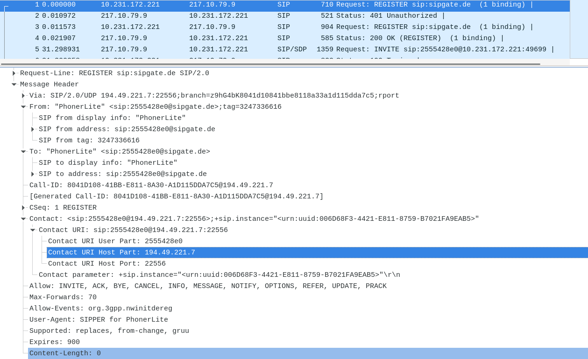

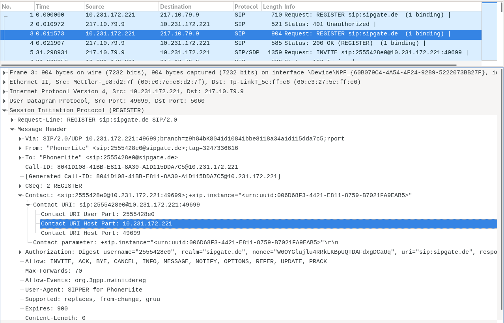

**Erstellen und dokumentieren Sie den „FlowGraph“ des vorliegenden Pakets und erläutern Sie kurz den prinzipiellen Ablauf.**

Im ersten Schritt registriert sich der Client beim Server in Form eines `Register`. Bei diesem teilt der Client dem Server seine Standort-Informationen mit. Wenn dies erfolgt ist, kann durch den `Invite` ein Anruf initialisiert werden. Es wird eine Verbindung zur Gegenseite hergestellt und anschließend auf deren Reaktion gewartet. Wenn die Gegenseite mit einem `Ack` reagiert, bestätigt sie uns die Verbindung. Nun kann die Kommunikation über einen RTP-Stream erfolgen. Um die Trennung der Verbindung zu realisieren, kann einer der beiden Teilnehmer ein `Bye` senden.

\newpage

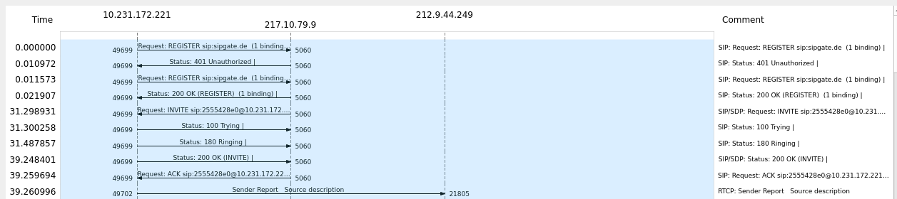

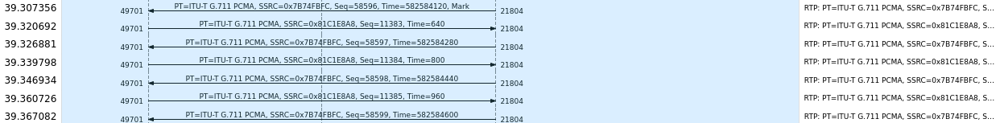

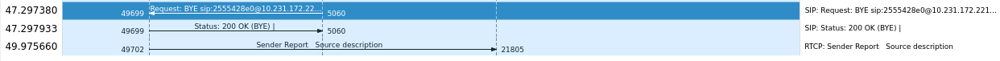

\newpage

**Nach diesem typischen Ablauf ist der UAC beim Provider registriert. Warum wird die Anfrage zur Registrierung zunächst abgewiesen?**

Die Credentials des UAC werden mit Hilfe der in der Rejection (401 Unauthorized) vorhandenen Daten verschlüsselt. Sobald die Credentials verschlüsselt wurden, können sie an das SIP-Gateway geschickt werden.

**Worin unterscheiden sich die beiden REGISTER-Pakete?**

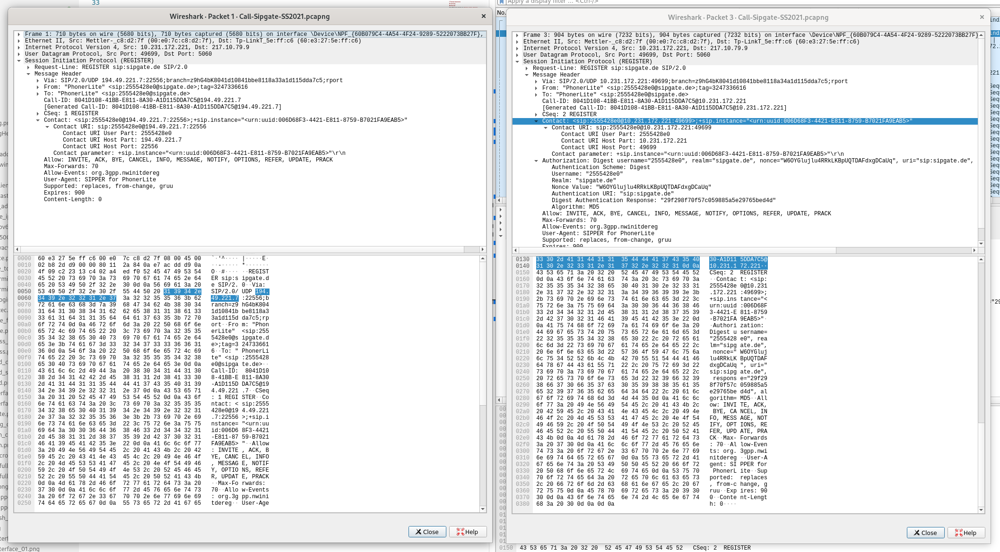

Dem linken (ersten) Paket fehlt die Authorisierung, das zweite besitzt diese im Realm `sipgate.de`

**Warum wird für die so wichtige Registrierung nicht TCP (garantiert die bitgetreue Zustellung) verwendet, sondern UDP?**

Für die Registrierung wird UDP statt TCP verwendet, da das Session Initiation Protocol (SIP) selbst eine spezifizierte Nachrichtenabfolge hat und verbindungsorientiert ist. Das ermöglicht, dass das SIP fehlerhafte Protokollabläufe selbst feststellt und nicht zwigend TCP zur Fehlerkorrektur benötigt.

**Wie lange ist die Registrierung gültig?**

Wie im folgenden Bild zu sehen ist, beträgt der "Expires" Wert 900 Sekunden. Dies entspricht 15 Minuten.

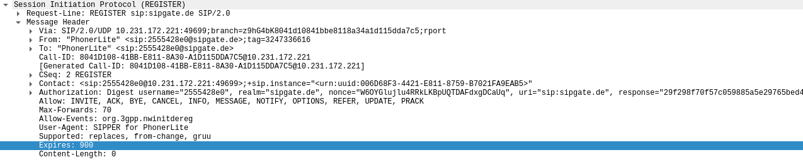

**Die interne IP-Adresse des UA wird durch NAT in eine offizielle externe IP umgesetzt. Wie lautet die externe IP und zu welchem Unternehmen gehört diese IP?**

Die externe IP des UA lautet `194.49.221.0` und gehört zur "DFS Deutsche Flugsicherung GmbH".

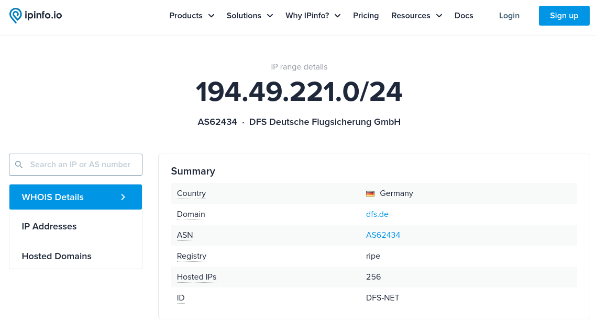

## Verbindungsaufbau und SDP-Protokoll

**Welche SIP_Methods unterstützt der Anrufer?**

Wie im Screenshot zu sehen unterstützt der Anrufer die SIP-Methoden `INVITE`, `ACK`, `CANCEL`, `OPTIONS`, `BYE`, `REFER`, `SUBSCRIBE`, `NOTIFY`, `INFO`, `PUBLISH` und `MESSAGE`.


**Welche Bedeutung haben Trying und Ringing?**

Die Response `100 Trying` bedeutet, dass der next-hop Server die Anfrage erhalten hat und eine unspezifizierte Handlung vorgenommen wird, um diesen Anruf zu ermöglichen.
Nach `Trying` werden die `INVITE` Nachrichten gestoppt.

Die Response `180 Ringing` bedeutet, dass der UA den `INVITE` erhalten hat und den Nutzer benachrichtigt.

\newpage

**Welche Angabe bzgl. der Absender-Rufnummer erscheint auf dem Display des Empfängers?**

In unserem Fall ist die Absender-Rufnummer "anonymous", was auf eine verstecke Rufnummer hindeutet.

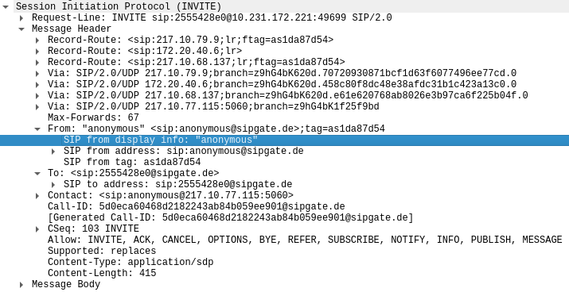

\newpage

**Der sehr lange "branch"-Wert ist eine Zufallszahl und identifiziert eindeutig eine SIP-Vermittlungsinstanz. Berechnen Sie die Wahrscheinlichkeit, dass zwei SIP-Geräte einen identischen Wert erwürfeln (es zählen nur die Angaben zwischen den beiden Punkten).**

Mittels folgendem JavaScript-Code wurden die Anzahl an Möglichkeiten berechnet:

```js
Math.pow(
  16,
  "z9hG4bK620d.70720930871bcf1d63f6077496ee77cd.0".split(".")[1].length
);
```

Wir kommen zur folgenden Anzahl an Möglichkeiten:

```js
3.402823669209385e38;
```

Die Wahrscheinlichkeit, dass zweimal diesselbe Zahl berechnet wird, lässt sich also wie folgt berechnen:

```js
1 /
  Math.pow(
    16,
    "z9hG4bK620d.70720930871bcf1d63f6077496ee77cd.0".split(".")[1].length
  );
```

Wir kommen zur folgenden Wahrscheinlichkeit:

```js
2.938735877055719e-39;
```

Die Wahrscheinlichkeit für eine Kollision ist, wie zu erwarten sehr klein.

\newpage

**Beschreiben Sie Aufbau und Inhalt des Session Description Protokoll (SDP), insbesondere die verwendeten Portnummern und das Audio-Video-Profile AVP, das die erlaubten Codecs in einer priorisierten Reihenfolge angibt.**

In SDP werden Eigenschaften von Multimediadatenströmen aufgezeigt. SDP beinhaltet die Sitzungsbeschreibungen (Protokollversion (v), Session-ID (o)), die Zeitbeschreibung (Zeit, in der die Session schon aktiv ist (t),...) und die Medienbeschreibung (Medientyp, Port und Protokoll (m)). Wichtig bei den Medienbeschreibungen sind auch die Medienattribute (a), mit welchen weitere Einstellungen getroffen werden können.

Ein Beispiel des SDP-Teils einer SIP-Nachricht könnte wie folgt aussehen: 

```
v=0
o=Jean 1234 1234 IN IP4 host.hdm.com
s=Video von 987654
c=IN IP4 host.hdm.com
t=0 0
m=audio 20000 RTP/AVP 97
a=rtpmap:97 iLBC/8000
a=fmtp:97 mode=30
m=video 20002 RTP/AVP 31
a=rtpmap:31 H261/90000
```

Das Audio-Video-Profile (AVP) spezifiziert die Formate für Audio- und Videostreams. Im obenstehenden Beispiel werden mit den IDs 97 und 31 iLBC und H.261 spezifiziert. Es können auch mehrere ID's hintereinander aufgeführt werden, was dann eine Liste mit Priorisierungen darstellt.

Die Portnummern hängen vom jeweiligen Datenstrom ab. Der eine Datenstrom, welcher in diesem Beispiel ein Audiostrom im Format iLBC (ID: 97) darstellt, läuft in diesem Fall auf Port 20000. Der andere Datenstrom, welcher einen Videodatenstrom im Fromat H.261 (ID:31) darstellt, läuft auf Port 20002. Dies konnte auch jeweils in der Beschreibung der Medienypen (m) in der Medienbeschreibung festgelegt werden.

\newpage

**Welcher Sprach-Codec wird hier eingesetzt? Wir hoch ist die Bitrate dieses Codecs?**

Wie im folgenden zu sehen wird der Codec G.711 verwendet. Dieser Codec weist eine Bitrate von 64 kbit/s. Diese Bitrate resultiert aus den 8000 samples pro Sekunde mit jeweils 8 Bit.

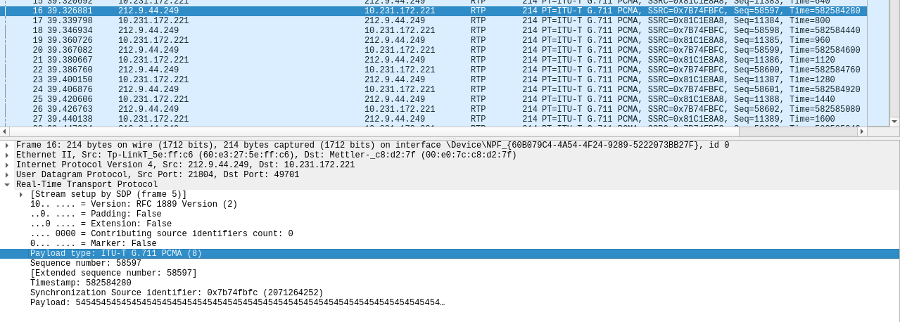

## RTP/RTCP

**Dokumentieren Sie den RTP-Kommunikationsfluss anhand der IP-Adressen. Wer kommuniziert mit wem?**

Die beiden Teilnehmer kommunizieren durch den Server miteinander. Zur Veranschaulichung sprechen wir hier von Bob und Alice. Alice versendet ihr Paket an den Server, dieser leitet es dann an Bob weiter. Das gleiche gilt für die Pakete, welche Bob versendet. Dies ist zum Beispiel bei SRTP wichtig, da hierdurch die Streams unabhängig verschlüsselt werden.

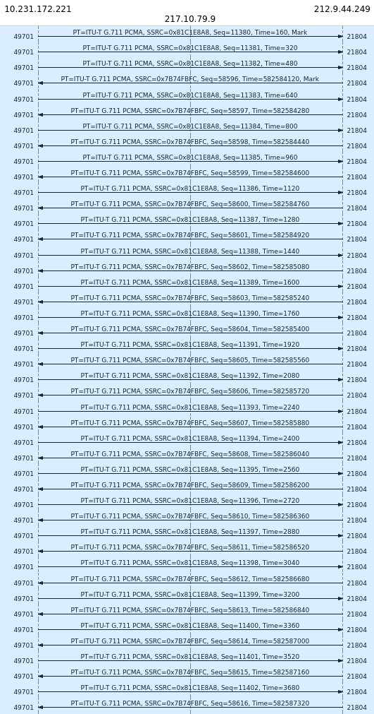

**Wieviel „Audio-Samples“ (Abtastproben) enthält ein Ethernet-Paket? In welchen zeitlichen Abständen werden die Pakete gesendet?**

In digitaler Telefonie wird üblicherweise mit 8000Hz gearbeitet. Die Samplerate kann dann im Media-Attribut eingestellt werden.

**Welche Ethernet-Paketlänge wird übertragen? Warum fasst man nicht längere oder kürzere Zeiträume zusammen?**

Es wird eine Paketlänge von insgesamt 214 Bytes übertragen. Von diesen 214 Bytes, stellen 54 Bytes Header von Ethernet (14 Byte), IPv4 (20 Byte), UDP (8 Byte) und RTP (12 Byte) dar. Somit bleibt eine Nutzlast von 160 Bytes. Längere Zeiträume würden zu höherer Latenz, kleine Zeiträume zu größerem Overhead durch den Header führen.

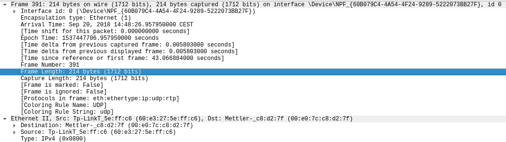

**Wie groß ist die Verzögerungszeit über das Verbindungsnetz?**

Um unser Ergebnis zu ermitteln, haben wir unter `Protocol Preferences` uns die `relative roundtrip calculation` anzeigen lassen und anschließend den Anzeigefilter `rtcp.roundtrip-delay` angewendet.
Das Ergebnis war eine Verzögerungszeit von 11ms.

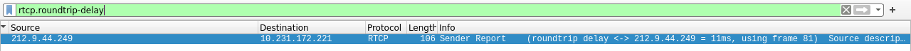

**Können Sie auch RTCP-Pakete erkennen? Wie häufig werden sie gesendet? Welchem Zweck dienen sie?**

Es sind RTCP-Pakete in regelmäßigen Abständen zu finden. In userem Fall beträgt das Zeitintervall zwischen von einer Node ausgehenden Nachrichten 10 Sekunden. Das ist insofern passend, da das minimale Zeitintervall zwischen RTCP-Paketen 5 Sekunden betragen sollte.
RTCP dient dem Zweck Statistiken und Kontrollinformationen über RTP-Sessions bereitzustellen.

**Welche Portnummern werden für die RTP-Verbindung verwendet, welche für die zugehörigen RTCP-Kontrollkanäle (Wireshark: VoipCalls – SIPFlows - FlowSequence)**

RTCP verwendet den Port 49702 bei der einen Node und 21805 bei der anderen. Relativ dazu betragen die RTP Ports 49701 und 21804. Dies ist jeweils der um 1 verringerte RTCP Port.

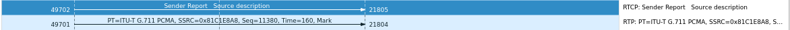

## SIP-Byte

**Beschreiben Sie, wie der BYE-Method-Timer arbeitet?**

Der Mechanismus verwendet periodische Aktualiserungen, um die Sitzung aktiv zu halten. Dies wird durch re-INVITEs oder UPDATEs realisiert. Der Mechanismus ist abwärtskompatibel mit SIP, sodass er funktioniert, solange einer der beiden Teilnehmer eines Dialogs, ihn beherrscht. Es werden zwei neue Header-Felder (Session-Expires und Min-SE) und ein neuer Antwortcode (422) definiert. Session-Expires gibt die Dauer der Sitzung an, und Min-SE gibt den minimal zulässigen Wert für den Ablauf der Sitzung an. Der Antwortcode 422 zeigt an, dass die Dauer des Sitzungszeitraums zu gering war.


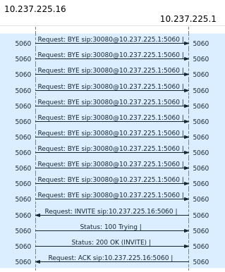

\newpage

**Berechnen Sie die Bandbreite einer bidirektionalen VoIP-Verbindung (mit dem Codec G.711) mit den angegebenen Zahlenwerten. Gehen Sie dabei davon aus, dass alle 20 ms ein Sprachpaket abgegeben wird**

| Teil     | Größe    |
| -------- | -------- |
| FCS      | 4 Byte   |
| Payload  | 160 Byte |
| RTP      | 16 Byte  |
| UDP      | 8 Byte   |
| IP       | 20 Byte  |
| Ethernet | 14 Byte  |

- Alle 20ms ein Sprachpaket
- Pro Sekunde: $\frac{1000ms}{20ms} = 50\ Sprachpakete/s$
- Wie groß ist jedes der Pakete?
- $4\ Byte + 160\ Byte + 16\ Byte + 8\ Byte + 20\ Byte + 14\ Byte=222\ Byte$
- $50\ Sprachpakete/s \cdot 222\ Bytes=11100\ Bytes/s=88800\ Bit/=88\ kBit/s$
- Die Bandbreite einer VoIP-Verbindung beträgt mit dem G.711-Codec 88 kBit/s.
