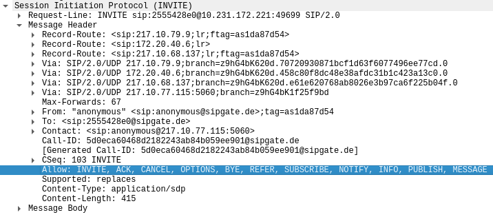

# Praktikum Rechnernetze

## Einführung

### Mitwirken

Diese Materialien basieren auf [Professor Kiefers "Praktikum Rechnernetze"-Vorlesung der HdM Stuttgart](https://www.hdm-stuttgart.de/vorlesung_detail?vorlid=j212254).

**Sie haben einen Fehler gefunden oder haben einen Verbesserungsvorschlag?** Bitte eröffnen Sie ein Issue auf GitHub ([github.com/pojntfx/uni-netpractice-notes](https://github.com/pojntfx/uni-netpractice-notes)):

{ width=150px }

Wenn ihnen die Materialien gefallen, würden wir uns über einen GitHub-Stern sehr freuen.

### Lizenz

Dieses Dokument und der enthaltene Quelltext ist freie Kultur bzw. freie Software.

{ width=128px }

Uni Network Practice Notes (c) 2021 Jakob Waibel, Daniel Hiller, Elia Wüstner, Felicitas Pojtinger

SPDX-License-Identifier: AGPL-3.0

\newpage

## STUN und Registrierung

**Bei der Konfiguration des sipgate-Accounts sind auch Angaben zum sogenannten STUN-Server erforderlich. Beschreiben Sie mit eigenen Worten Aufgaben und die Funktion eines STUN-Servers**

Die "Session Traversal Utilities for NAT" ist ein Standard, welcher dabei hilft, die öffentlichen Netzwerkadressen von Netzwerknodes herauszufinden, um eine Peer-to-peer Verbindung zwischen diesen Nodes hinter NAT herzustellen. Es kann außerdem festgestellt werden, welche Art von NAT verwendet wird (Full Cone, Restricted Cone...). Da die Belastung von STUN-Servern in der Realität vergleichsweise niedrig ist, können für viele Projekte öffentliche STUN-Server ausreichend sein.

**Welche IP-Adresse hat das REGISTER-Paket nach dem NAT-Vorgang (NAT ist wegen der privaten Adresse erforderlich)?**

TODO: Add interpretation


**Erstellen und dokumentieren Sie den „FlowGraph“ des vorliegenden Pakets und erläutern Sie kurz den prinzipiellen Ablauf.**

TODO: Add interpretation


**Nach diesem typischen Ablauf ist der UAC beim Provider registriert. Warum wird die Anfrage zur Registrierung zunächst abgewiesen?**

TODO: Add answer (NAT)

**Worin unterscheiden sich die beiden REGISTER-Pakete?**

TODO: Add interpretation


**Warum wird für die so wichtige Registrierung nicht TCP (garantiert die bitgetreue Zustellung) verwendet, sondern UDP?**

Für die Registrierung wird UDP statt TCP verwendet, da das Session Initiation Protocol (SIP) selbst eine spezifizierte Nachrichtenabfolge hat und verbindungsorientiert ist. Das ermöglicht, dass das SIP fehlerhafte Protokollabläufe selbst feststellt und nicht zwigend TCP zur Fehlerkorrektur benötigt, um Fehler festzustellen.

**Wie lange ist die Registrierung gültig?**

Wie im folgenden Bild zu sehen ist beträgt der "Expires" Wert 900 Sekunden. Dies entspricht 15 Minuten.


**Die interne IP-Adresse des UA wird durch NAT in eine offizielle externe IP umgesetzt. Wie lautet die externe IP und zu welchem Unternehmen gehört diese IP?**

Die externe IP des UA lautet `194.49.221.0` und gehört zur "DFS Deutsche Flugsicherung GmbH".


## Verbindungsaufbau und SDP-Protokoll

**Welche SIP_Methods unterstützt der Anrufer?**

Wie im Screenshot zu sehen unterstützt der Anrufer die SIP-Methoden `INVITE`, `ACK`, `CANCEL`, `OPTIONS`, `BYE`, `REFER`, `SUBSCRIBE`, `NOTIFY`, `INFO`, `PUBLISH` und `MESSAGE`.



**Welche Bedeutung haben Trying und Ringing?**

Die Response `100 Trying` bedeutet, dass der next-hop Server die Anfrage erhalten hat und eine unspezifizierte Handlung vorgenommen wird, um diesen Anruf zu ermöglichen.
Nach `Trying` werden die `INVITE` Nachrichten gestoppt.

Die Response `180 Ringing` bedeutet, dass der UA den `INVITE` erhalten hat und den Nutzer benachrichtigt.

**Welche Angabe bzgl. der Absender-Rufnummer erscheint auf dem Display des Empfängers?**

In unserem Fall ist die Absender-Rufnummer "anonymous", was auf eine verstecke Rufnummer hindeutet.


**Der sehr lange "branch"-Wert ist eine Zufallszahl und identifiziert eindeutig eine SIP-Vermittlungsinstanz. Berechnen Sie die Wahrscheinlichkeit, dass zwei SIP-Geräte einen identischen Wert erwürfeln (es zählen nur die Angaben zwischen den beiden Punkten).**

Mittels folgendem JavaScript-Code wurden die Anzahl an Möglichkeiten berechnet:

```js
Math.pow(
  16,
  "z9hG4bK620d.70720930871bcf1d63f6077496ee77cd.0".split(".")[1].length
);
```

Wir kommen zur folgenden Anzahl an Möglichkeiten:

```js
3.402823669209385e38;
```

Die Wahrscheinlichkeit, dass zweimal diesselbe Zahl berechnet wird, lässt sich also wie folgt berechnen:

```js
1 /
  Math.pow(
    16,
    "z9hG4bK620d.70720930871bcf1d63f6077496ee77cd.0".split(".")[1].length
  );
```

Wir kommen zur folgenden Wahrscheinlichkeit:

```js
2.938735877055719e-39;
```

Die Wahrscheinlichkeit für eine Kollision ist, wie zu erwarten sehr klein.

**Beschreiben Sie Aufbau und Inhalt des Session Description Protokoll (SDP), insbesondere die verwendeten Portnummern und das Audio-Video-Profile AVP, das die erlaubten Codecs in einer priorisierten Reihenfolge angibt.**

TODO: Add answer

**Welcher Sprach-Codec wird hier eingesetzt? Wir hoch ist die Bitrate dieses Codecs?**

Wie im folgenden zu sehen wird der Codec G.711 verwendet. Dieser Codec weist eine Bitrate von 64 kbit/s. Diese Bitrate resultiert aus den 8000 samples pro Sekunde mit jeweils 8 Bit.


## RTP/RTCP

**Dokumentieren Sie den RTP-Kommunikationsfluss anhand der IP-Adressen. Wer kommuniziert mit wem?**

TODO: Add interpretation


**Wieviel „Audio-Samples“ (Abtastproben) enthält ein Ethernet-Paket? In welchen zeitlichen Abständen werden die Pakete gesendet?**

TODO: Add answer

**Welche Ethernet-Paketlänge wird übertragen? Warum fasst man nicht längere oder kürzere Zeiträume zusammen?**

TODO: Add interpretation


**Wie groß ist die Verzögerungszeit über das Verbindungsnetz?**

TODO: Translate answer

In your captured trace select any RTCP packet, then right click on mouse, Select "Protocol Preferences" then select "Show relative roundtrip calculation" Secondly now apply a Display filter: rtcp.roundtrip-delay.

TODO: Add interpretation (is it only half the roundtrip delay?)


**Können Sie auch RTCP-Pakete erkennen? Wie häufig werden sie gesendet? Welchem Zweck dienen sie?**

Es sind RTCP-Pakete in regelmäßigen Abständen zu finden. In userem Fall beträgt das Zeitintervall zwischen von einer Node ausgehenden Nachrichten 10 Sekunden. Das ist insofern passend, da das minimale Zeitintervall zwischen RTCP-Paketen 5 Sekunden betragen sollte.
RTCP dient dem Zweck Statistiken und Kontrollinformationen über RTP-Sessions bereitzustellen.

**Welche Portnummern werden für die RTP-Verbindung verwendet, welche für die zugehörigen RTCP-Kontrollkanäle (Wireshark: VoipCalls – SIPFlows - FlowSequence)**

RTCP verwendet den Port 49702 bei der einen Node und 21805 bei der anderen. Relativ dazu betragen die RTP Ports 49701 und 21804. Dies ist jeweils der um 1 verringerte RTCP Port.


## SIP-Byte

**Beschreiben Sie, wie der BYE-Method-Timer arbeitet?**

TODO: Translate answer

This document provides an extension to SIP that defines a session
expiration mechanism. Periodic refreshes, through re-INVITEs or
UPDATEs, are used to keep the session active. The extension is
sufficiently backward compatible with SIP that it works as long as
either one of the two participants in a dialog understands the
extension. Two new header fields (Session-Expires and Min-SE) and a
new response code (422) are defined. Session-Expires conveys the
duration of the session, and Min-SE conveys the minimum allowed value
for the session expiration. The 422 response code indicates that the
session timer duration was too small.


**Berechnen Sie die Bandbreite einer bidirektionalen VoIP-Verbindung (mit dem Codec G.711) mit den angegebenen Zahlenwerten. Gehen Sie dabei davon aus, dass alle 20 ms ein Sprachpaket abgegeben wird**

| Teil     | Größe    |
| -------- | -------- |
| FCS      | 4 Byte   |
| Payload  | 160 Byte |
| RTP      | 16 Byte  |
| UDP      | 8 Byte   |
| IP       | 20 Byte  |
| Ethernet | 14 Byte  |

- Alle 20ms ein Sprachpaket
- Pro Sekunde: $\frac{1000ms}{20ms} = 50\ Sprachpakete/s$
- Wie groß ist jedes der Pakete?
- $4\ Byte + 160\ Byte + 16\ Byte + 8\ Byte + 20\ Byte + 14\ Byte=222\ Byte$
- $50\ Sprachpakete/s \cdot 222\ Bytes=11100\ Bytes/s=88800\ Bit/=88\ kBit/s$
- Die Bandbreite einer VoIP-Verbindung beträgt mit dem G.711-Codec 88 kBit/s.
