---
author: [Jakob Waibel, Daniel Hiller, Elia Wüstner, Felix Pojtinger]
date: "2021-10-19"
subject: "Praktikum Rechnernetze: Protokoll zu Versuch 2 (Protokollanalyse mit Wireshark) von Gruppe 1"
keywords: [Rechnernetze, Protokoll, Versuch, HdM Stuttgart]
subtitle: "Protokoll zu Versuch 2 (Protokollanalyse mit Wireshark) von Gruppe 1"
lang: "de"
...

# Praktikum Rechnernetze

## Einführung

### Mitwirken

Diese Materialien basieren auf [Professor Kiefers "Praktikum Rechnernetze"-Vorlesung der HdM Stuttgart](https://www.hdm-stuttgart.de/vorlesung_detail?vorlid=5212254).

**Sie haben einen Fehler gefunden oder haben einen Verbesserungsvorschlag?** Bitte eröffnen Sie ein Issue auf GitHub ([github.com/pojntfx/uni-netpractice-notes](https://github.com/pojntfx/uni-netpractice-notes)):

{ width=150px }

Wenn ihnen die Materialien gefallen, würden wir uns über einen GitHub-Stern sehr freuen.

### Lizenz

Dieses Dokument und der enthaltene Quelltext ist freie Kultur bzw. freie Software.

{ width=128px }

Uni Network Practice Notes (c) 2021 Jakob Waibel, Daniel Hiller, Elia Wüstner, Felix Pojtinger

SPDX-License-Identifier: AGPL-3.0

\newpage

## Wireshark

### Einführung

**An welchem Koppelelement im Systemschrank sollte der Hardware-Analysator/Netzwerk-Sniffer sinnvollerweise angeschlossen werden und warum? Welche grundsätzlichen Möglichkeiten gibt es noch?**

- Switch, damit Nachrichten auf Layer 2 auch abgefangen werden können
- Grundsätzlich könnte, vor allem auch in Heimnetzwerken, der Router hierzu verwendet werden, da hier oft Router und Switch zu einem Gerät kombiniert sind.

**Starten Sie Wireshark und capturern Sie den aktuellen Traffic. Dokumentieren Sie zunächst, was alles auf Wireshark einprasselt.**

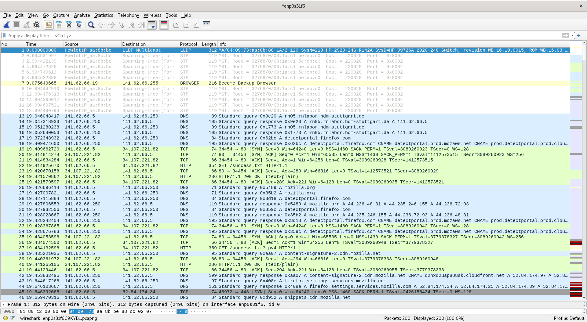

Zu erkennen sind Pakete von mehreren Protokollen:

- LLDP
- Spanning-Tree-Protokoll (`STP`)
- DNS
- TCP
- HTTP

Die letzten beiden Protokolle (TCP, HTTP) lassen sich durch das Öffnen des Browsers erklären.

**Wie lautet der Filter, mit dem Sie ihre eigene Verbindung ins Labor ausklammern? Welche Möglichkeiten gibt es?**

Hierzu gibt es mehrere Optionen:

```wireshark
!ip.addr == 141.62.66.5
not ip.addr == 141.62.66.5
!ip.addr eq 141.62.66.5
```

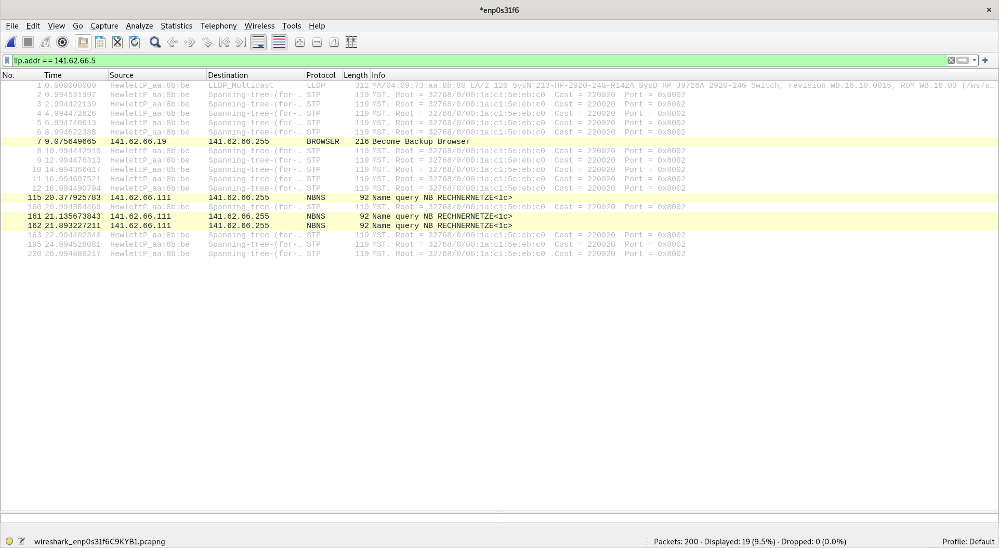{ width=450px }

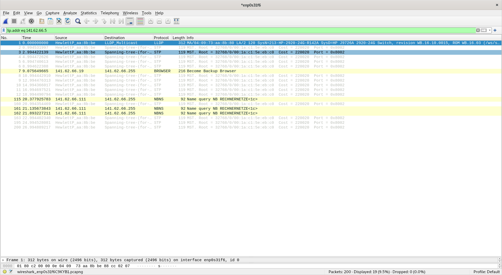{ width=450px }

### Ping

**Senden Sie einen Ping zu nachfolgenden Empfängern und zeichnen Sie die entsprechenden Protokolle gezielt mit Wireshark auf. Vergleichen Sie die Protokollabläufe: wer sendet welches Protokoll warum an wen? Pingen Sie an ....**

**Einen Rechner Ihrer Wahl im Labornetz:**

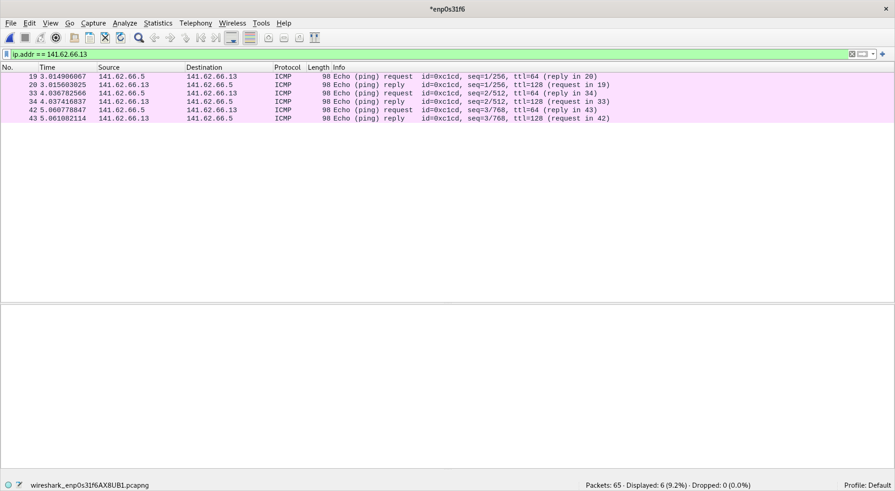{ width=450px }

**Einen beliebigen Server im Internet (Google)**

> Wir haben hierzu die Name Resultion aktiviert, damit die IPs zur Domain `google.com` zugeordnet werden können.

{ width=450px }

**Eine beliebige nicht existierenden IP-Adresse**

{ width=450px }

### DHCP

**Analysieren Sie die Abläufe bei DHCP (im Labor installiert). Ihre Teilgruppe am Nachbartisch bootet den PC am Arbeitsplatz, protokollieren Sie die DHCP-Abläufe sowie sonstigen Netzverkehr, den der PC bis zum Erhalt der IP-Adresse erzeugt.**

TODO: Add descriptions

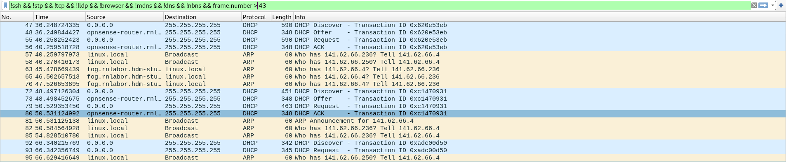{ width=450px }

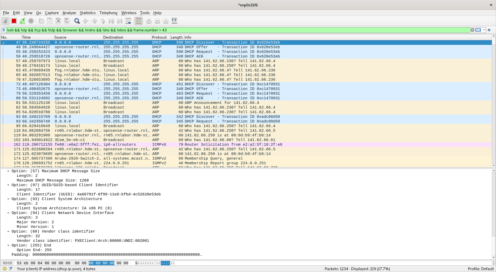{ width=450px }

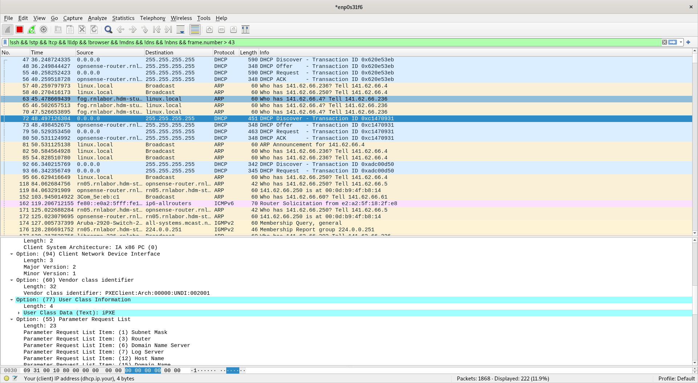{ width=450px }

**Strukturieren Sie die DHCP-Abläufe und beschreiben Sie, wie DHCP im Detail funktioniert.**

TODO: Add answer

**Vergleich Sie den Ablauf, wenn Sie den DHCP-Ablauf per `ipconfig /release` und `ipconfig /renew` initiieren**

Mittels der folgenden Commands wurde eine IP-Addresse freigegeben und eine neue angefordert.

```shell
# dhclient -r # Release der IP-Addresse
# dhclient # Anfrage einer neuen IP-Addresse
```

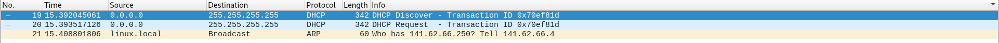.

TODO: Add description (no BIOS and iPXE DHCP requests)

### DNS

**Dokumentieren Sie den Ablauf bei einer DNS-Abfrage**

**Fall 1: DNS-Server 141.62.66.250**:

Mittels folgendem Command wurde eine DNS-Abfrage gemacht:

```shell
$ dig @141.62.66.250 google.com
google.com.		163	IN	A	142.250.186.174
```

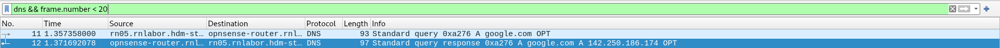

TODO: Add interpretation

**Fall 2: DNS-Server 1.1.1.1 (Cloudflare)**:

Mittels folgendem Command wurde eine DNS-Abfrage gemacht:

```shell
$ dig @1.1.1.1 +noall +answer  google.com
google.com.		231	IN	A	142.250.185.110
```

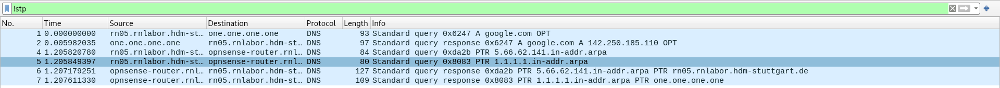

TODO: Add interpretation

**Fall 3: DNS-Server 8.8.8.9 (DNS-Dienst ist dort nicht installiert)**:

Mittels folgendem Command wurde eine DNS-Abfrage gemacht:

```shell
$ dig @8.8.8.9 +noall +answer  google.com
;; connection timed out; no servers could be reached
```

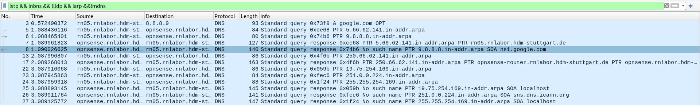

TODO: Add interpretation

**Wie erkennen Sie mit Wireshark, dass "versehentlich" ein falscher DNS-Server eingetragen wurde?**

TODO: Add interpretation (based on case 3)

### ARP

**Lösen Sie eine ARP-Anfrage aus und protokollieren Sie die Datenpakete.**

> Hierzu wurde ein Rechner, welcher zuvor nicht im lokalen ARP-Cache war, neugestartet.

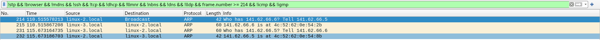

**Wann wird eine ARP-Anfrage gestartet?**

TODO: Add interpretation

**Welcher Rahmentyp wird für die Anfrage verwendet?**

TODO: Add description (Ethernet II)

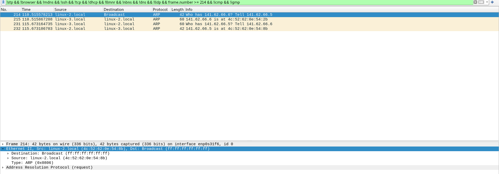

**Beobachten Sie die Veränderung in der ARP-Tabelle Ihres Rechners**

Zuvor:

```shell
$ ip neigh show
141.62.66.6 dev enp0s31f6 lladdr 4c:52:62:0e:54:2b STALE
141.62.66.250 dev enp0s31f6 lladdr 00:0d:b9:4f:b8:14 STALE
141.62.66.13 dev enp0s31f6 lladdr 4c:52:62:0e:54:5d STALE
141.62.66.236 dev enp0s31f6 lladdr 26:c5:04:8a:fa:eb STALE
```

Danach:

```shell
$ ip neigh show
141.62.66.6 dev enp0s31f6 lladdr 4c:52:62:0e:54:2b STALE
141.62.66.250 dev enp0s31f6 lladdr 00:0d:b9:4f:b8:14 STALE
141.62.66.4 dev enp0s31f6 lladdr 4c:52:62:0e:53:eb STALE
141.62.66.13 dev enp0s31f6 lladdr 4c:52:62:0e:54:5d STALE
141.62.66.236 dev enp0s31f6 lladdr 26:c5:04:8a:fa:eb STALE
```

### Layer-2-Protokolle

**Gelegentlich werden vom Analyzer Broadcasts erkannt. Wer sendet sie, warum und in welchen zeitlichen Abständen?**

Die Broadcasts sind ARP-Requests.

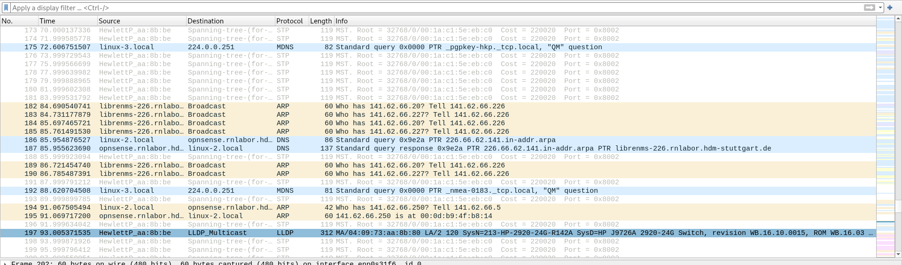

TODO: Add interpretation

**Haben Sie noch weitere Protokolle "eingefangen", die offensichtlich im Labor Rechnernetze keinen Sinn machen?**

NMEA 0183.

TODO: Add interpretation


**Wie sieht es mit UPnP im Labor aus? Auf welchen Maschinen von welchem Hersteller läuft der Dienst? Mit welchem Wireshark-Filter „fischen“ Sie den Traffic heraus?**

TODO: Re-start this experiment once the network is back up

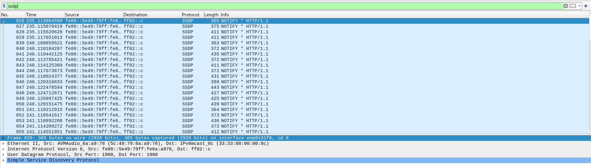

### HTTP und TCP

**Initiieren Sie eine HTTP-TCP-Sitzung (beliebige Website) und zeichnen Sie die Protokollabläufe auf**

TODO: Add description

**Können Sie den 3-Way-Handshake erkennen? Markieren Sie ihn in der Dokumentation. Welche TCP-Optionen sind beim Handshake aktiviert und welche Bedeutung haben sie?**

TODO: Add description

**Dokumentieren und erläutern Sie die Verwendung der Portnummern bei der Dienstanfrage und der Beantwortung des Dienstes durch den Server.**

TODO: Add description

**Klicken Sie auf der Website ein anderes Bild / Link an. Beobachten und dokumentieren Sie: wie verändert sich der TCP-Ablauf?**

TODO: Add description

### MAC

**Wie lauten die MAC-Adressen der im Labor befindlichen Ethernet-Switches? Wie haben Sie die Switches identifizieren können. Welche Möglichkeiten der Identifizierung gibt es?**

TODO: Add interpretation

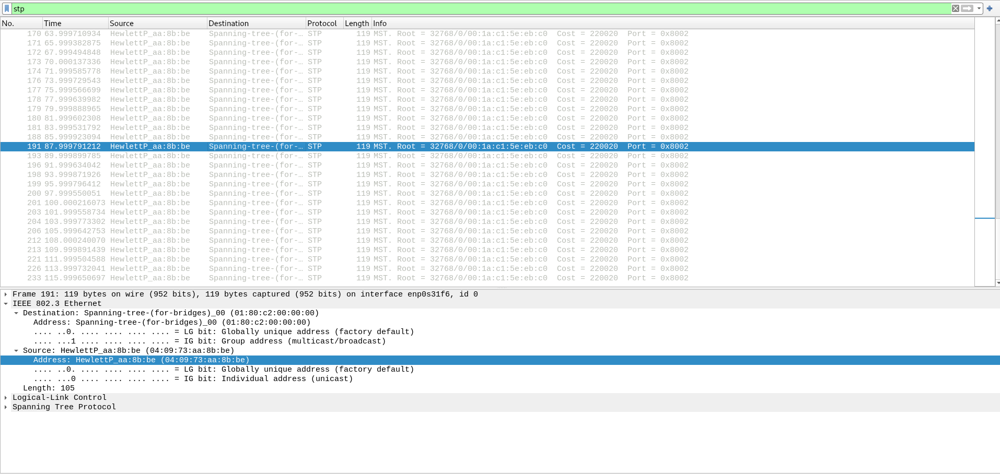

**Welche MAC-Adresse hat ihr Nachbarrechner?**

TODO: Add interpretation

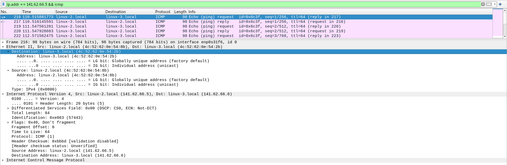

**Welche MAC-Adresse hat der Labor-Router?**

TODO: Add interpretation

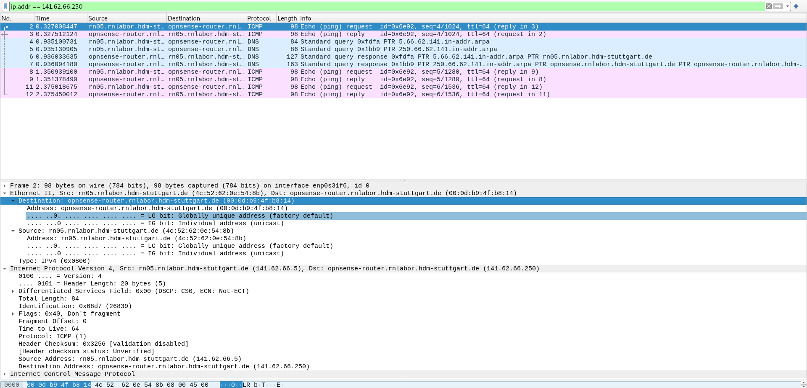

**Welche MAC-Adresse hat der Server 141.62.1.5 (außerhalb des Labor-Netzes)?**

TODO: Add interpretation

Da der Rechner außerhalb des Labor-Netzes ist, kann dessen Mac nicht bestimmt werden.

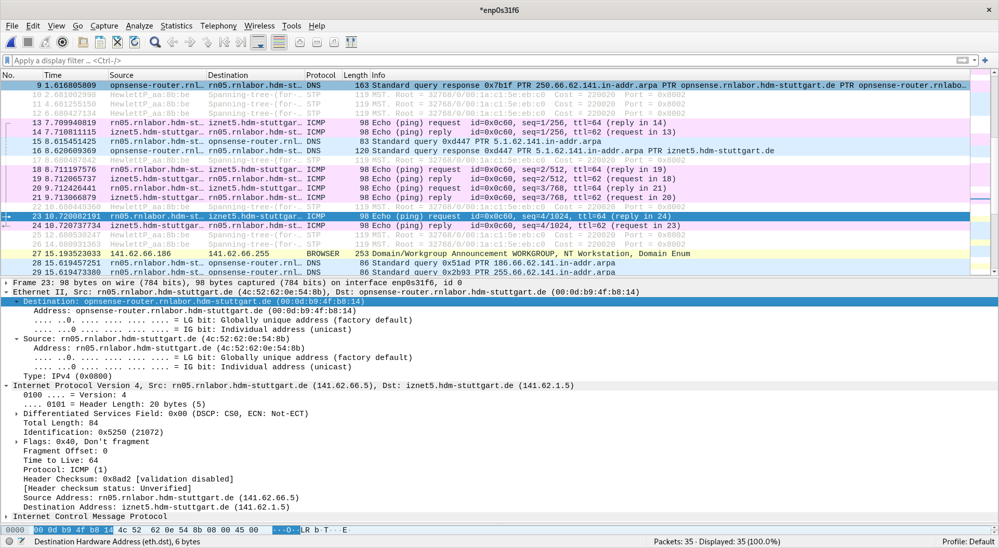

### STP

**Filtern Sie auf das Protokoll BPDU/STP. Wer sendet es und welchen Sinn hat dieses Protokoll?**

TODO: Add interpretation

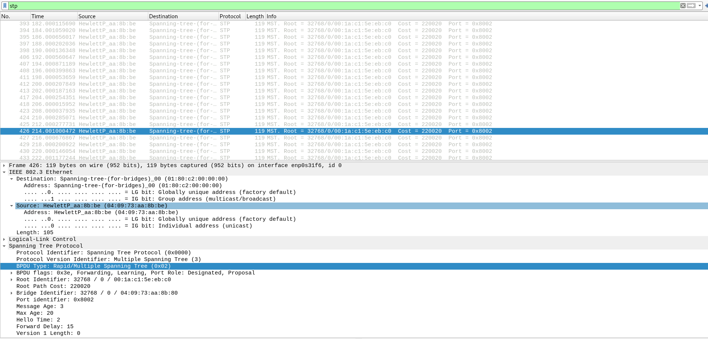

### SNMP

**Auf welchen Komponenten im Netzwerk wird das Protokoll SNMP ausgeführt?**

TODO: Add interpretation (there were no packets to be found at the time of the experiment)

### Streaming and Downloads

**Starten Sie einen Download einer größeren Datei aus dem Internet und stoppen Sie ihn während der Übertragung. Dokumentieren Sie, wie der Stop-Befehl innerhalb der Protokolle umgesetzt wird**

TODO: Add description

**Protokollieren sie ein Video-Streaming Ihrer Wahl. Welche TCP-Ports werden wozu benutzt? Filtern Sie alle Rahmen, in denen sich das TCP-Window geändert hat**

TODO: Add description

### Telnet und SSH

**Protokollieren Sie den Ablauf einer TELNET-Verbindung zur IP-Adresse 141.62.66.207 (login: praktikum; passwd: versuch). Können Sie Passwörter im Wireshark-Trace identifizieren? Wie verhält sich im Vergleich dazu eine SSH-Verbindung zum gleichen Server?**

TODO: Add interpretation

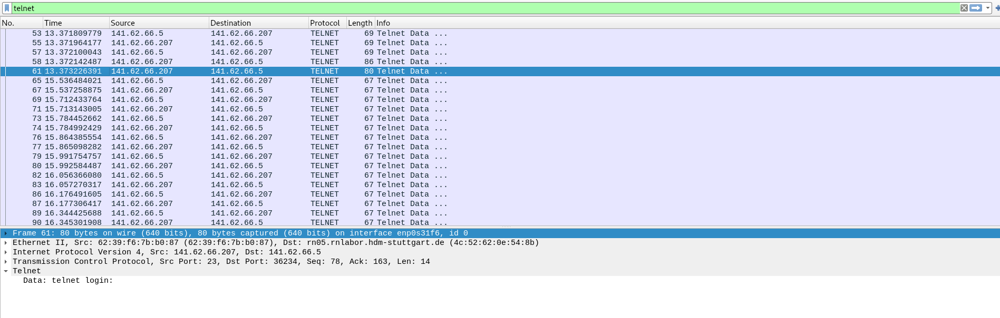

**Können Sie Passwörter im Wireshark-Trace identifizieren?**

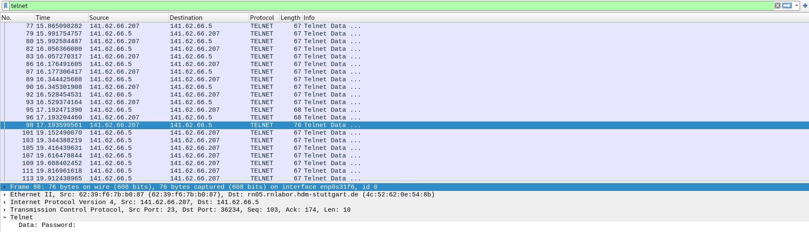

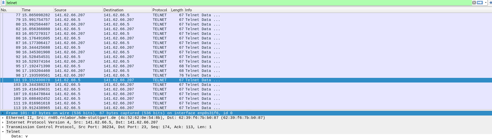

**Wie verhält sich im Vergleich dazu eine SSH-Verbindung zum gleichen Server?**

TODO: Add interpretation

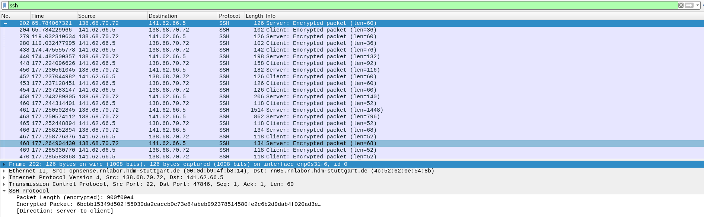

### Wireshark-Filter

**Entwickeln, testen und dokumentieren Sie Wireshark-Filter zur Lösung folgender Aufgaben:**

**Nur IP-Pakete, deren TTL größer ist als ein von Ihnen sinnvoll gewählter Referenzwert**

TODO: Add description

**Nur IP-Pakete, die fragmentiert sind**

TODO: Add description

**Beim Login-Versuch auf ftp.bellevue.de mit von Ihnen wählbaren Account-Daten nur Rahmen herausfiltern, die das gewählte Passwort im Ethernet-Datenfeld enthalten**

TODO: Add interpretation

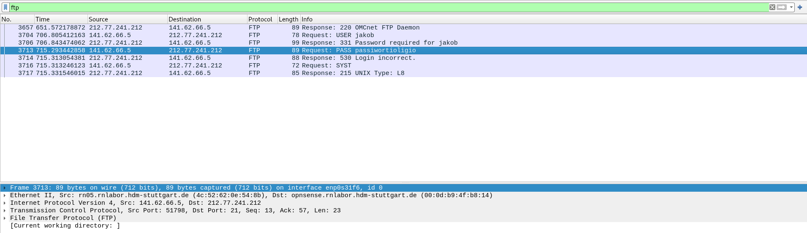

**Nur den Port 80-Verkehr zu Ihrer IP-Adresse (ankommend und abgehend)**

TODO: Add description

**Nur Pakete mit einer IP-Multicast-Adresse**

TODO: Add description
