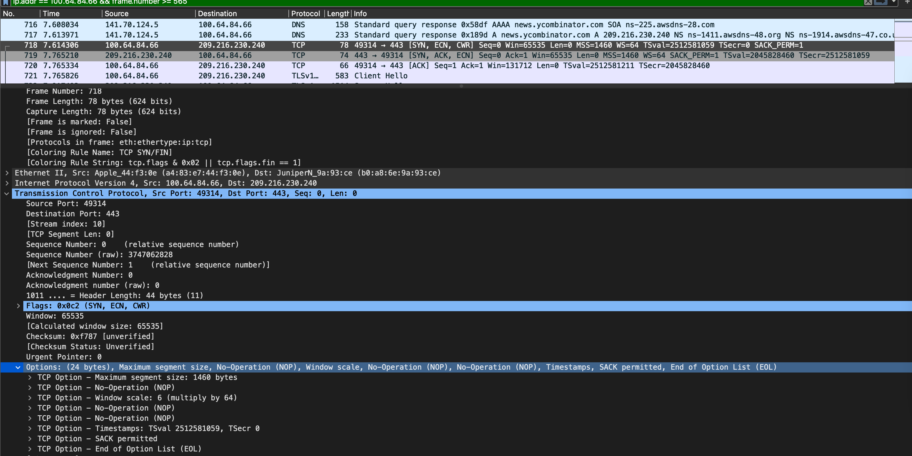
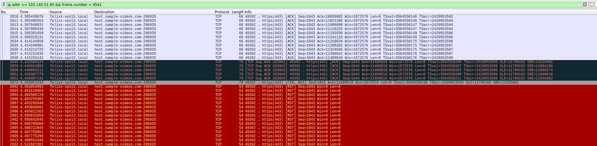

---
author: [Jakob Waibel, Daniel Hiller, Elia Wüstner, Felix Pojtinger]
date: "2021-10-26"
subject: "Praktikum Rechnernetze: Protokoll zu Versuch 2 (Protokollanalyse mit Wireshark) von Gruppe 1"
keywords: [Rechnernetze, Protokoll, Versuch, HdM Stuttgart]
subtitle: "Protokoll zu Versuch 2 (Protokollanalyse mit Wireshark) von Gruppe 1"
lang: "de"
...

# Praktikum Rechnernetze

## Einführung

### Mitwirken

Diese Materialien basieren auf [Professor Kiefers "Praktikum Rechnernetze"-Vorlesung der HdM Stuttgart](https://www.hdm-stuttgart.de/vorlesung_detail?vorlid=5212254).

**Sie haben einen Fehler gefunden oder haben einen Verbesserungsvorschlag?** Bitte eröffnen Sie ein Issue auf GitHub ([github.com/pojntfx/uni-netpractice-notes](https://github.com/pojntfx/uni-netpractice-notes)):

{ width=150px }

Wenn ihnen die Materialien gefallen, würden wir uns über einen GitHub-Stern sehr freuen.

### Lizenz

Dieses Dokument und der enthaltene Quelltext ist freie Kultur bzw. freie Software.

{ width=128px }

Uni Network Practice Notes (c) 2021 Jakob Waibel, Daniel Hiller, Elia Wüstner, Felix Pojtinger

SPDX-License-Identifier: AGPL-3.0

\newpage

## Wireshark

### Einführung

**An welchem Koppelelement im Systemschrank sollte der Hardware-Analysator/Netzwerk-Sniffer sinnvollerweise angeschlossen werden und warum? Welche grundsätzlichen Möglichkeiten gibt es noch?**

- Switch, damit Nachrichten auf Layer 2 auch abgefangen werden können
- Grundsätzlich könnte, vor allem auch in Heimnetzwerken, der Router hierzu verwendet werden, da hier oft Router und Switch zu einem Gerät kombiniert sind.

**Starten Sie Wireshark und capturern Sie den aktuellen Traffic. Dokumentieren Sie zunächst, was alles auf Wireshark einprasselt.**


Zu erkennen sind Pakete von mehreren Protokollen:

- LLDP
- Spanning-Tree-Protokoll (`STP`)
- DNS
- TCP
- HTTP

Die letzten beiden Protokolle (TCP, HTTP) lassen sich durch das Öffnen des Browsers erklären.

**Wie lautet der Filter, mit dem Sie ihre eigene Verbindung ins Labor ausklammern? Welche Möglichkeiten gibt es?**

Hierzu gibt es mehrere Optionen:

```wireshark
!ip.addr == 141.62.66.5
not ip.addr == 141.62.66.5
!ip.addr eq 141.62.66.5
```

{ width=450px }

{ width=450px }

### Ping

**Senden Sie einen Ping zu nachfolgenden Empfängern und zeichnen Sie die entsprechenden Protokolle gezielt mit Wireshark auf. Vergleichen Sie die Protokollabläufe: wer sendet welches Protokoll warum an wen? Pingen Sie an ....**

**Einen Rechner Ihrer Wahl im Labornetz:**

{ width=450px }

**Einen beliebigen Server im Internet (Google)**

> Wir haben hierzu die Namensauflösung aktiviert, damit die IPs zur Domain `google.com` zugeordnet werden können.

{ width=450px }

**Eine beliebige nicht existierenden IP-Adresse**

{ width=450px }

### DHCP

**Analysieren Sie die Abläufe bei DHCP (im Labor installiert). Ihre Teilgruppe am Nachbartisch bootet den PC am Arbeitsplatz, protokollieren Sie die DHCP-Abläufe sowie sonstigen Netzverkehr, den der PC bis zum Erhalt der IP-Adresse erzeugt.**

Während des Startens werden drei DHCP-Requests für verschiedene Komponenten abgehandelt.

{ width=450px }

{ width=450px }

{ width=450px }

**Strukturieren Sie die DHCP-Abläufe und beschreiben Sie, wie DHCP im Detail funktioniert.**

Durch Booten des PCs wird dem Rechner mittels DHCP eine IP zugewiesen. Ergänzend kommen noch Standard-Gateway-Adresse und DNS Adresse hinzu. DHCP ermöglicht damit erst, dass verschiedene Rechner in einem Netzwerk kommunizieren können, da dafür jeder Computer eine eigene IP benötigt.

Grundlegend funktioniert DHCP mithilfe von vier Nachrichtentypen. Es gibt den DHCP-Discover, welcher den DHCP-Server in erster Linie benachrichtigen will, dass eine neue IP verlangt wird. Der Server antwortet daraufhin mit einer Offer, welche eine IP reserviert und diese dem Client anbietet. Außerdem enthält die Offer die IP des DHCP-Servers, die Subnetzmaske und die Lease-Time. Danach kann der Client mit einer DHCP-Request die angebotene IP anfordern. Wenn das in Ordnung ist, antwortet der DHCP-Server mit einem DHCP-Acknowledge.

**Vergleich Sie den Ablauf, wenn Sie den DHCP-Ablauf per `ipconfig /release` und `ipconfig /renew` initiieren**

Mittels der folgenden Commands wurde eine IP-Addresse freigegeben und eine neue angefordert.

```shell
# dhclient -r # Release der IP-Addresse
# dhclient # Anfrage einer neuen IP-Addresse
```

.

Dem bereits hochgefahrenen Rechner wird eine neue IP zugeordnet. Wenn wir die IP Zuweisung auf diese weise neu initiieren dann ist der DHCP Ablauf deutlich kürzer, da beim Booten unter der Haube noch deutlich mehr gemacht werden muss (es muss e.g. keine DHCP-Request des BIOS zum Netzwerkboot getätigt werden).

### DNS

**Dokumentieren Sie den Ablauf bei einer DNS-Abfrage**

**Fall 1: DNS-Server 141.62.66.250**:

Mittels folgendem Command wurde eine DNS-Abfrage gemacht:

```shell
$ dig @141.62.66.250 google.com
google.com.		163	IN	A	142.250.186.174
```


Hier nutzten wir den internen DNS Server und machen eine Anfrage auf `google.com`.

**Fall 2: DNS-Server 1.1.1.1 (Cloudflare)**:

Mittels folgendem Command wurde eine DNS-Abfrage gemacht:

```shell
$ dig @1.1.1.1 +noall +answer  google.com
google.com.		231	IN	A	142.250.185.110
```


Bei der DNS Anfrage über Cloudflare erscheinen weitere DNS-Requests über DNS Reverse-Zones. Dies wird daran liegen, dass wir über den Router mit dem Internet kommunizieren.

**Fall 3: DNS-Server 8.8.8.9 (DNS-Dienst ist dort nicht installiert)**:

Mittels folgendem Command wurde eine DNS-Abfrage gemacht:

```shell
$ dig @8.8.8.9 +noall +answer  google.com
;; connection timed out; no servers could be reached
```


Wie im Bild zu sehen ist, bekommen wir den Response `No such name PTR 9.8.8.8.`

**Wie erkennen Sie mit Wireshark, dass "versehentlich" ein falscher DNS-Server eingetragen wurde?**

Es gibt eine Antwort, welche auf eine nicht gültige IP-Adresse hinweist (Siehe oben).

### ARP

**Lösen Sie eine ARP-Anfrage aus und protokollieren Sie die Datenpakete.**

Hierzu wurde ein Rechner, welcher zuvor nicht im lokalen ARP-Cache war, neu gestartet.


\newpage

**Wann wird eine ARP-Anfrage gestartet?**

Sobald ein Paket an die Zieladresse (in unserem Fall 141.62.66.6) gesendet werden soll, wird eine ARP-Anfrage in Form eines Broadcasts gestartet, um das Zielgerät im Netzwerk zu ermitteln, sofern sich diese nicht bereits im ARP-Cache befindet. Dieser kann mit `ip neigh show` ausgelesen werden. Mit `ip neigh flush all` kann der ARP-Cache geleert werden.

**Welcher Rahmentyp wird für die Anfrage verwendet?**

Als Rahmentyp wird Ethernet II verwendet.


**Beobachten Sie die Veränderung in der ARP-Tabelle Ihres Rechners**

Zuvor:

```shell
$ ip neigh show
141.62.66.6 dev enp0s31f6 lladdr 4c:52:62:0e:54:2b STALE
141.62.66.250 dev enp0s31f6 lladdr 00:0d:b9:4f:b8:14 STALE
141.62.66.13 dev enp0s31f6 lladdr 4c:52:62:0e:54:5d STALE
141.62.66.236 dev enp0s31f6 lladdr 26:c5:04:8a:fa:eb STALE
```

Danach:

```shell
$ ip neigh show
141.62.66.6 dev enp0s31f6 lladdr 4c:52:62:0e:54:2b STALE
141.62.66.250 dev enp0s31f6 lladdr 00:0d:b9:4f:b8:14 STALE
141.62.66.4 dev enp0s31f6 lladdr 4c:52:62:0e:53:eb STALE
141.62.66.13 dev enp0s31f6 lladdr 4c:52:62:0e:54:5d STALE
141.62.66.236 dev enp0s31f6 lladdr 26:c5:04:8a:fa:eb STALE
```

### Layer-2-Protokolle

**Gelegentlich werden vom Analyzer Broadcasts erkannt. Wer sendet sie, warum und in welchen zeitlichen Abständen?**

Die Broadcasts sind ARP-Requests. Sie entstehen dadurch, da Geräte versuchen Daten an andere Geräte zu übertragen, für welche sie keinen Eintrag in ihrem ARP-Cache haben, deshalb muss eine ARP-Anfrage in Form
eines Broadcasts gesendet werden, da jeder Host potenziell der gesuchte Host sein kann. Dieser besitzt gesuchte IP X und antwortet daraufhin mit seiner Mac.


**Haben Sie noch weitere Protokolle "eingefangen", die offensichtlich im Labor Rechnernetze keinen Sinn machen?**

Aus dem Screenshot lässt sich aus der MDNS-Nachricht der `_nmea-0183._tcp.local` Service-String entnehmen. NMEA 0183 ist ein Standard, welcher für die Kommunikation zwischen Navigationsgeräten auf Schiffen definiert wurde. Da es mitunter für die Kommunikation zwischen GPS-Empfänger und PCs verwendet wird, macht es in unserem Netzwerk wenig Sinn.


**Wie sieht es mit UPnP im Labor aus? Auf welchen Maschinen von welchem Hersteller läuft der Dienst? Mit welchem Wireshark-Filter „fischen“ Sie den Traffic heraus?**

Es existiert ein Gerät von AVMAudio im Netwerk, welches über UPnP angesteuert wird. Dies wird immer von demselben Gerät angesteuert, welches über eine Link-Lokale Adresse verfügt, was dafür sorgt, dass es nur innerhalb des Netzwerkes erreicht werden kann. Diese Adressen werden nicht geroutet, sprich die Geräte müssen durch einen Switch etc. verbunden sein. Es kann über den Display-Filter "herausgefischt werden", indem man nach `SSDP` filtert.


\newpage

### HTTP und TCP

**Initiieren Sie eine HTTP-TCP-Sitzung (beliebige Website) und zeichnen Sie die Protokollabläufe auf**

Zuerst wird ein DNS-Request getätigt. Daraufhin folgt der 3-Way-Handshake. Dieser ist an der charakteristischen Abfolge SYN, SYN-ACK, ACK zu erkennen.


\newpage

**Können Sie den 3-Way-Handshake erkennen? Markieren Sie ihn in der Dokumentation. Welche TCP-Optionen sind beim Handshake aktiviert und welche Bedeutung haben sie?**



Das SYN-Segment enthält die Optionen Maximum Segment Size, Window scale, Timestamps und SACK (Selective Acknowledgement).


Das SYN-ACK-Segment verwendet wieder die Optionen Maximum Segment Size, Window scale, SACK und Timestamps.


Das ACK Segment hat nur die Timestamps-Option gesetzt.

Die Maximum Segment Size gibt die maximale Anzahl an Daten in Bytes an, die pro Segment akzeptiert werden. Der Window scale factor ist dazu da, die zuvor gesetzte maximale window-size über 65535 Bytes zu setzen. Der Timestamp misst die derzeitige Roundtrip time. Dadurch kann man den retransmission-timer jederzeit neu evaluieren. Selective Acknowledgement wird benutzt, um bei verlorenen Segmenten wirklich nur die fehlenden retransmitten zu müssen.

**Dokumentieren und erläutern Sie die Verwendung der Portnummern bei der Dienstanfrage und der Beantwortung des Dienstes durch den Server.**

Unser Computer sendet von Port `49314` an Port `443`, welcher für HTTPS genutzt wird. Unser Port ist dabei arbiträr vom System gewählt, der HTTPS Port ist allerdings fest für HTTPS reserviert. Mit einem Port ist ein Dienst eines Rechners gekennzeichnet. Die Kombination aus Port und IP ergibt einen Socket. Wir senden unsere Nachrichten also an den Socket `209.216.230.240:443`.

**Klicken Sie auf der Website ein anderes Bild / Link an. Beobachten und dokumentieren Sie: wie verändert sich der TCP-Ablauf?**


\newpage

### MAC

**Wie lauten die MAC-Adressen der im Labor befindlichen Ethernet-Switches? Wie haben Sie die Switches identifizieren können. Welche Möglichkeiten der Identifizierung gibt es?**

Beim Spanning-Tree-Protocol lässt sich sehen, dass die Quelle der Nachrichten immer ein HP-Gerät ist. Dieses muss ein fähiges Kopplungselement des Netzwerkes sein, welches das Spanning-Tree-Protocol unterstützt. Daher wird dies mit hoher Wahrscheinlichkeit der Ethernet-Switch sein.

**MAC-Adresse**: `04:09:73:aa:8b:be`


\newpage

**Welche MAC-Adresse hat ihr Nachbarrechner?**

Durch einen `ping` konnten wir die MAC-Adresse des Switches herausfinden.

**MAC-Adresse**: `4c:52:62:0e:54:2b`


**Welche MAC-Adresse hat der Labor-Router?**

Durch einen `ping` konnten wir die MAC-Adresse des Routers herausfinden.

**MAC-Adresse**: `00:0d:b9:4f:b8:14`


\newpage 

**Welche MAC-Adresse hat der Server 141.62.1.5 (außerhalb des Labor-Netzes)?**

Da der Rechner außerhalb des Labor-Netzes ist, kann dessen Mac nicht bestimmt werden.


### STP

**Filtern Sie auf das Protokoll BPDU/STP. Wer sendet es und welchen Sinn hat dieses Protokoll?**

Das STP-Protokoll ist das Spanning Tree Protocol. Das STP-Protokoll verhindert Schleifenbildung; dies ist besonders dann von Nutzen, wenn Redundanzen vorhanden sind. Beim STP-Protokoll werden durch alle am Netz beteiligten Switches eine "Root Bridge" gewählt und redundante Links werden deaktiviert. Wie anhand der OUI der MAC-Addresse erkannt werden kann wird dieses hier von einem HP-Switch verwendet.


### SNMP

**Auf welchen Komponenten im Netzwerk wird das Protokoll SNMP ausgeführt?**

Es konnte kein SNMP-Traffic im Netzwerk gefunden werden. SNMP, das Simple Network Management Protocol, wird jedoch meist zur Wartung von verbundenen Geräte im Network verwendet, woraus sich schließen lässt, dass es auf Komponenten wie Switches, Routern oder Servern zum Einsatz kommen würde.

\newpage

### Streaming and Downloads

**Starten Sie einen Download einer größeren Datei aus dem Internet und stoppen Sie ihn während der Übertragung. Dokumentieren Sie, wie der Stop-Befehl innerhalb der Protokolle umgesetzt wird**



Da der Download hier via HTTPS durchgeführt wurde, kann erkannt werden, dass die darunterliegende TCP-Verbindung unterbrochen wurde, indem die `RST`-Flag gesetzt wurde. Auch ein TCP-Segment, in welchem hier die `FIN`- und `ACK`-Flags gesetzt wurden, ist dementsprechend zu erkennen.

**Protokollieren sie ein Video-Streaming Ihrer Wahl. Welche TCP-Ports werden wozu benutzt? Filtern Sie alle Rahmen, in denen sich das TCP-Window geändert hat**


Hier wurde ein Stream von Twitch konsumiert; wie zu erkennen ist, wird die Window-Size stetig erhöht. Es wird Port 443, der Standard-Port für HTTPS, verwendet. Seitens des Clients wird vom TCP-Stack des Kernels ein temporärer Port zugewiesen.

### Telnet und SSH

**Protokollieren Sie den Ablauf einer TELNET-Verbindung zur IP-Adresse 141.62.66.207 (login: praktikum; passwd: versuch). Können Sie Passwörter im Wireshark-Trace identifizieren? Wie verhält sich im Vergleich dazu eine SSH-Verbindung zum gleichen Server?**

Wie zu erkennen ist, wird für eine Telnet-Verbindung eine TCP-Verbindung aufgebaut. Die Passwörter sind zu erkennen.


**Können Sie Passwörter im Wireshark-Trace identifizieren?**

Da Telnet unverschlüsselt ist, können Passwörter identifiziert und ausgelesen werden.


**Wie verhält sich im Vergleich dazu eine SSH-Verbindung zum gleichen Server?**

Die SSH-Verbindung ist verschlüsselt; Passwörter, Logins etc. können hier nicht mitgelesen werden.


\newpage

### Wireshark-Filter

**Entwickeln, testen und dokumentieren Sie Wireshark-Filter zur Lösung folgender Aufgaben:**

**Nur IP-Pakete, deren TTL größer ist als ein von Ihnen sinnvoll gewählter Referenzwert**


Der Linux-Kernel stellt standardmäßig die TTL auf 64; hier wurde ab 200 gefiltert, damit ausschließlich "ungewöhnliche" Pakete wie z.B. `Type: 11 (Time-to-live exceeded)`-ICMP-Pakete angezeigt werden.

**Nur IP-Pakete, die fragmentiert sind**

Mittels eines Filters auf "Must Fragment" konnten in dieser Aufgabe nur fragmentierte Pakete angezeigt werden.


\newpage

**Beim Login-Versuch auf ftp.bellevue.de mit von Ihnen wählbaren Account-Daten nur Rahmen herausfiltern, die das gewählte Passwort im Ethernet-Datenfeld enthalten**

Mittels des Filters `ftp.request.command == "PASS"` werden nur Pakete angezeigt, welche das Passwort enthalten.


**Nur den Port 80-Verkehr zu Ihrer IP-Adresse (ankommend und abgehend)**

Mittels eines Filters wurde ausschließlich TCP-Traffic auf Port 80 dargestellt. Mittels `|| udp.port == 80` hätte auch noch UDP-Traffic auf diesem Port dargestellt werden können.


**Nur Pakete mit einer IP-Multicast-Adresse**

Mittels eines Filters werden nur IPs > `224.0.0.0` dargestellt, was IP-Multicast-Adressen sind.


