---
author: [Jakob Waibel, Daniel Hiller, Elia Wüstner, Felix Pojtinger]
date: "2021-10-19"
subject: "Praktikum Rechnernetze: Protokoll zu Versuch 3 (Router-Betriebssystem Cisco IOS) von Gruppe 1"
keywords: [Rechnernetze, Protokoll, Versuch, HdM Stuttgart]
subtitle: "Protokoll zu Versuch 3 (Router-Betriebssystem Cisco IOS) von Gruppe 1"
lang: "de"
...

# Praktikum Rechnernetze

## Einführung

### Mitwirken

Diese Materialien basieren auf [Professor Kiefers "Praktikum Rechnernetze"-Vorlesung der HdM Stuttgart](https://www.hdm-stuttgart.de/vorlesung_detail?vorlid=5212254).

**Sie haben einen Fehler gefunden oder haben einen Verbesserungsvorschlag?** Bitte eröffnen Sie ein Issue auf GitHub ([github.com/pojntfx/uni-netpractice-notes](https://github.com/pojntfx/uni-netpractice-notes)):

{ width=150px }

Wenn ihnen die Materialien gefallen, würden wir uns über einen GitHub-Stern sehr freuen.

### Lizenz

Dieses Dokument und der enthaltene Quelltext ist freie Kultur bzw. freie Software.

{ width=128px }

Uni Network Practice Notes (c) 2021 Jakob Waibel, Daniel Hiller, Elia Wüstner, Felix Pojtinger

SPDX-License-Identifier: AGPL-3.0

\newpage

## Konfiguration

### Konfiguration des Routers, so dass er mittels ping oder telnet von ihrem Rechner erreichbar ist

TODO

## Internet-Verbindung unter einsatz von NAT

### Konfigurieren Sie ihren Router unter Einsatz von NAT so, dass von einem angeschlossenen PC aus eine Internet verbindung moeglich ist. 

Konfiguration `interface GigabitEthernet 0/1`

Interface `GigabitEthernet 0/1` ist in unserer Konfiguration das LAN-Interface

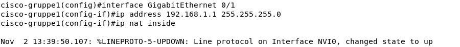

Konfiguration `interface GigabitEthernet 0/0`

Interface `GigabitEthernet 0/0` ist in unserer Konfiguration das WAN-Interface

Anfangs haben wir die falsche IP `141.62.67.2` gesetzt. Diese haben wir im Nachhinein korrigiert.

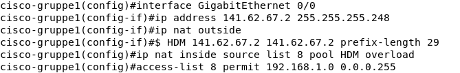

Mit `clear ip nat translation *` können die falschen Konfigurationen rückgängig gemacht werden.

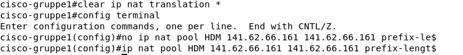

Nun muss noch sichergestellt werden, dass wirklich alle interfaces den Status `up` besitzen. Andernfalls können diese mit `no shutdown` in der jeweiligen Interface-Konfiguration aktiviert werden.

Interfaces mit `show ip interface brief` anzeigen und deren Status abfragen.
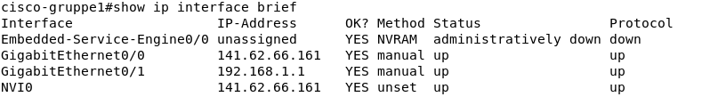

Danach kann am Router im `config` mode mit `ip route 0.0.0.0 0.0.0.0 141.62.66.250` die Route zum Router festgelegt werden und die Verbindung zum Internet sollte hergestellt sein.

Bevor der Lokale Computer über unseren Router eine Internetverbindung aufbauen kann, muss auch dieser konfiguriert werden.

Zuerst entfernen wir die alte IP von unserem Netzwerkinterface `enp0s31f6`.

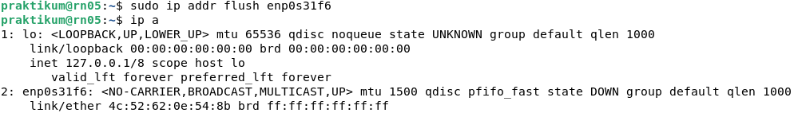

Danach fügen wir unsere neu bestimmte IP-Adresse zum Netzwerk-Interface hinzu.  

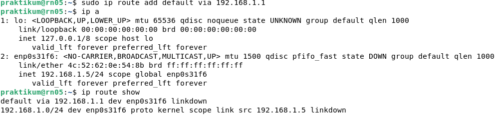

Testen der Internetverbindung unseres Lokalen Computers mit einem ping zu `8.8.8.8` (Googles Public DNS-Server). Dafür kann der Command `ping 8.8.8.8` verwendet werden.

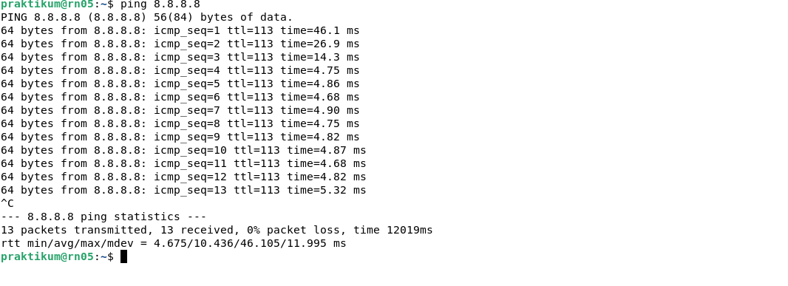

### Erläutern Sie in der Ausarbeitung die Bedeutung der einzelnen Zeilen der Konfiguration

TODO

### Dokumentieren Sie die Router-Konfiguration und die Routing-Tabelle des Routers und des PCs 

Die Konfiguration lässt sich mit `show running-config` anzeigen.

```
cisco-gruppe1#show running-config
Building configuration...

Current configuration : 1483 bytes
!
! Last configuration change atstname cisco-gruppe1
!
boot-start-marker
boot-end-marker
!
!
!
no aaa new-model
!
no ipv6 cef
ip source-route
ip cef
!
!         
!                                                                                                                                                                                                                                                                                                                                                                                                                                                                                                                                                                                                                                                      !   !    r
multilink bundle-name authenticated
!
 --More--  default removal timeout 0
!
!         
license udi pid CISCO1941/K9 sn FTX1636824P
 --More-- 
          !
!         
!
!         
!                                                                                                                                                                                                                                                                                                                                                                                                                                                                                                                                                                                                                                              shutdown   
!         
interface GigabitEthernet61 255.255.255.0
 ip nat outside
 ip virtual-reassembly in
 duplex auto
 speed auto
!                                                                                                                                                                                                                                                                                                                                                                                                                                                                                                                                                                                                                                           speed auto     
!
ip forward-protocol nd
!
no ip http server
no ip http secure-server
!         
ip nat pool HDM 141.62.66.161 141.62.66.161 prefix-length 24
 --Morermit 192.168.1.0 0.0.0.255
!         
!
!         
control-plane                                                                                                                                                                                                                                                                                                                                                                                                                                                                                                                                                                                                                                       !      
line con 0                                                                                                                                                                                                                                                                                                                                                                                                                                                                                                                                                                                                                                              line 2    -- 
 no activation-character
 no exec  
 transport preferred none
 transport input all
 transport output pad telnet rlogin lapb-ta mop udptn v120 ssh
 stopbits 1
line vty 0 4
 password hdm
 login
 transport input all
!
scheduler allocate 20000 1000
end

```

Die Routing-Tabelle des Routers kann mit `show ip route` angezeigt werden. 

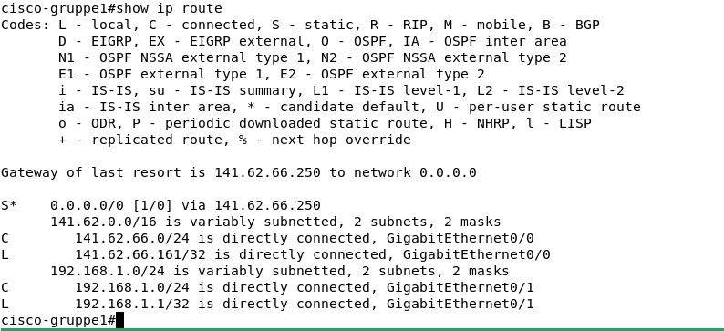

Die Routing Tabelle des Lokalen Computers kann mit `ip route show` angezeigt werden. Zusätzlich nutzen wir `ip a`, um die Netzwerk-Interfaces und deren jeweilige IP-Adressen zu betrachten.

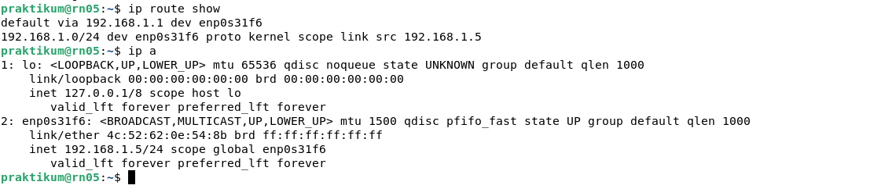

### Experimentieren Sie mit nachfolgenden Befehlen nach Aufruf einer beliebigen Website und dokumentieren Sie Ihre Ergebnisse

Als Erstes wurde unser Router von unserem Lokalen Computer angepingt.

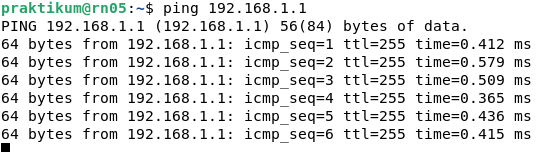

Danach wurde der Router im Rechnernetze-Labor von unserem Router angepingt. 

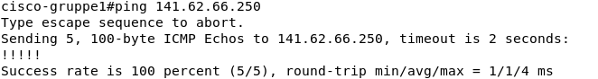

Danach haben wir den Google-DNS-Server angepingt.


TODO add output to the following commands

`show ip nat statistics`
`show ip nat translation`
`debug ip nat`

TODO: Add how to connect on linux to the top

## Internet-Verbindung ohne NAT 

### Konfigurieren Sie Ihren Router ohne NAT so, dass vom Subnetz ihrer Wahl eine Internet-Verbindung moeglich ist. Richten Sie dabei jeweils zwei Subnetze ein und stellen Sie zusaetzlich sicher, dass beide Subnetze sich gegenseitig erreichen koennen.

TODO

### Dokumenteiren Sie die Konfiguration und auch die Routing-Tabelle des Routers und des PCs

TODO

## Konfiguration Access-Liste (nur wenn die Zeit reicht)

### Richten Sie eine Access-Liste ein, sodass TCP und UDP Verbinungen vom Router nur erlaubt werden, sofern Sie von ihrem PC kommen. Versuchen Sie mit einer anderen IP-Adresse ins Internet zu gelangen, so werden TCP/UDP-Verbindungen unterbunden.

TODO

### Richten Sie eine Access-Liste ein, sodass ICMP Pakete (ping etc.) nur beantwortet werden, wenn sie von einem definierten Laborrechner kommen (141.62.66.x/24, suchen Sie sich einen aus).

TODO