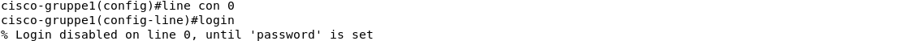

---
author: [Jakob Waibel, Daniel Hiller, Elia Wüstner, Felix Pojtinger]
date: "2021-10-19"
subject: "Praktikum Rechnernetze: Protokoll zu Versuch 3 (Router-Betriebssystem Cisco IOS) von Gruppe 1"
keywords: [Rechnernetze, Protokoll, Versuch, HdM Stuttgart]
subtitle: "Protokoll zu Versuch 3 (Router-Betriebssystem Cisco IOS) von Gruppe 1"
lang: "de"
...

# Praktikum Rechnernetze

## Einführung

### Mitwirken

Diese Materialien basieren auf [Professor Kiefers "Praktikum Rechnernetze"-Vorlesung der HdM Stuttgart](https://www.hdm-stuttgart.de/vorlesung_detail?vorlid=5212254).

**Sie haben einen Fehler gefunden oder haben einen Verbesserungsvorschlag?** Bitte eröffnen Sie ein Issue auf GitHub ([github.com/pojntfx/uni-netpractice-notes](https://github.com/pojntfx/uni-netpractice-notes)):

{ width=150px }

Wenn ihnen die Materialien gefallen, würden wir uns über einen GitHub-Stern sehr freuen.

### Lizenz

Dieses Dokument und der enthaltene Quelltext ist freie Kultur bzw. freie Software.

{ width=128px }

Uni Network Practice Notes (c) 2021 Jakob Waibel, Daniel Hiller, Elia Wüstner, Felix Pojtinger

SPDX-License-Identifier: AGPL-3.0

\newpage

## Konfiguration

### Konfiguration des Routers, so dass er mittels ping oder telnet von ihrem Rechner erreichbar ist

Um den Router auf die Default-Werte zurückzusetzen, verwenden wir ```write erase```. Um nun in den Urzustand zu kommen starten wir den Router neu mit ```reload```.
```shell
Router>enable
Router#write erase
```
{ width=450px }
```shell
Router#reload
```
{ width=450px }

Erst wechseln wir mit ```enable``` in den "Privileged Exec"- Mode, worüber wir anschließend mit ```configure terminal``` in "Configuration Exec"-Mode gelangen können.
```shell
Router>enable
Router#configure terminal
```
{ width=450px }

Den Hostname vergeben wir wie folgt ```hostname cisco-gruppe1```.
```shell
Router(configure)#hostname cisco-gruppe1
```
{ width=450px }
TODO
{ width=450px }

Um für ```line con 0``` kein Passwort zu vergeben, lassen wir den Passwortparameter im Kommando weg. Dies sorgt jedoch dafür, dass der Login verwährt wurde, wie im folgenden Scrreenshot zu sehen ist.
```shell
cisco-gruppe1(configure)#line con 0
```
{ width=450px }

Um für ```line vty 0 4``` das Passwort zu vergeben und uns einzuloggen, können wir folgende Kommandos verwenden.
```shell
cisco-gruppe1(config)#line vty 0 4
cisco-gruppe1(config-line)#password hdm
cisco-gruppe1(config-line)#login
```
{ width=450px }
{ width=450px }

Die Liste, in welcher alle Interfaces mit IP, etc. aufgelistet wird, kann durch ```show ip interface brief``` erzeugt werden.
```shell
cisco-gruppe1#show ip interface brief
```
{ width=450px }
{ width=450px }

Um die Konfigurationsdatei einzusehen, können wird ```show running-config``` verwenden.
```shell
cisco-gruppe1#show running-config
```
{ width=450px }

TODO richtige Scrreenshots?
{ width=450px }
{ width=450px }

Die statisch und dynamischen Routen, können wird mit ```show ip route``` einsehen.
```shell
cisco-gruppe1#show ip route
```
{ width=450px }

Informationen zur Version erhalten wir mit ```show version```.
```shell
cisco-gruppe1#show version
```
{ width=450px }

## Internet-Verbindung unter Einsatz von NAT

### Konfigurieren Sie ihren Router unter Einsatz von NAT so, dass von einem angeschlossenen PC aus eine Internet verbindung moeglich ist. 

TODO

### Erlaeutern Sie in der Ausarbeitung die Bedeutung der einzelnen Zeilen der Konfiguration

TODO

### Dokumentieren Sie die Router-Konfiguration und die Routing-Tabelle des Routers und des PCs 

TODO

### Experimentieren Sie mit nachfolgenden Befehlen nach Aufruf einer beliebigen Website und dokumentieren Sie Ihre Ergebnisse

TODO

## Internet-Verbindung ohne NAT 

### Konfigurieren Sie Ihren Router ohne NAT so, dass vom Subnetz ihrer Wahl eine Internet-Verbindung moeglich ist. Richten Sie dabei jeweils zwei Subnetze ein und stellen Sie zusaetzlich sicher, dass beide Subnetze sich gegenseitig erreichen koennen.

TODO

### Dokumenteiren Sie die Konfiguration und auch die Routing-Tabelle des Routers und des PCs

TODO

## Konfiguration Access-Liste (nur wenn die Zeit reicht)

### Richten Sie eine Access-Liste ein, sodass TCP und UDP Verbinungen vom Router nur erlaubt werden, sofern Sie von ihrem PC kommen. Versuchen Sie mit einer anderen IP-Adresse ins Internet zu gelangen, so werden TCP/UDP-Verbindungen unterbunden.

TODO

### Richten Sie eine Access-Liste ein, sodass ICMP Pakete (ping etc.) nur beantwortet werden, wenn sie von einem definierten Laborrechner kommen (141.62.66.x/24, suchen Sie sich einen aus).

TODO