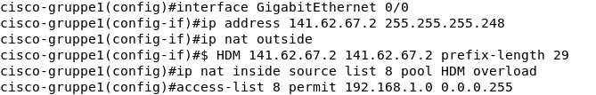
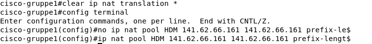
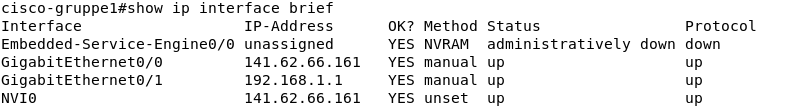
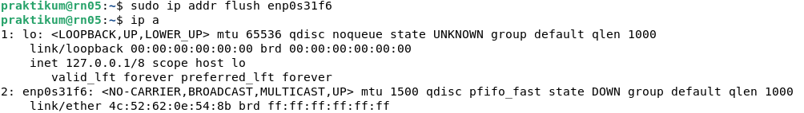
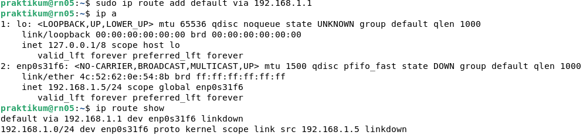
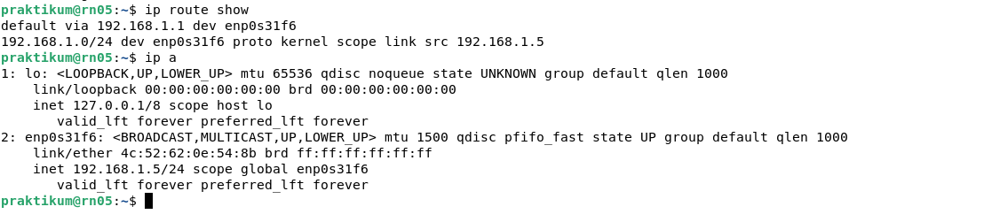
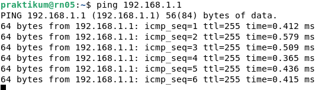

# Praktikum Rechnernetze

## Einführung

### Mitwirken

Diese Materialien basieren auf [Professor Kiefers "Praktikum Rechnernetze"-Vorlesung der HdM Stuttgart](https://www.hdm-stuttgart.de/vorlesung_detail?vorlid=5212254).

**Sie haben einen Fehler gefunden oder haben einen Verbesserungsvorschlag?** Bitte eröffnen Sie ein Issue auf GitHub ([github.com/pojntfx/uni-netpractice-notes](https://github.com/pojntfx/uni-netpractice-notes)):

{ width=150px }

Wenn ihnen die Materialien gefallen, würden wir uns über einen GitHub-Stern sehr freuen.

### Lizenz

Dieses Dokument und der enthaltene Quelltext ist freie Kultur bzw. freie Software.

{ width=128px }

Uni Network Practice Notes (c) 2021 Jakob Waibel, Daniel Hiller, Elia Wüstner, Felix Pojtinger

SPDX-License-Identifier: AGPL-3.0

\newpage

## Konfiguration

Anders als in der Anleitung beschrieben, haben wir den Versuch mit Ubuntu durchgeführt. Daher im Folgenden eine kleine Anleitung, wie man sich unter Ubuntu mit dem Router verbinden kann.

Zuerst muss man die Anwendung `screen` installieren.

```shell
$ sudo apt install screen
```

Bevor man den Router nun einsteckt, kann man mit Hilfe von `dmesg` feststellen, welche Gerätebezeichnung der Router hat.

```shell
$ sudo dmesg | grep -i tty
```

Steckt man das Gerät nun ein, sollte man eine Meldung sehen, in welchem eine Device-Bezeichnung zu finden ist. In unserem Fall `ttyUSB0`.

Abschließend muss man sich nur noch mit der Cisco-Konsole verbinden. Dies lässt sich mit folgendem Kommando erreichen.

```shell
$ sudo screen /dev/ttyUSB0
```

Nun sollte eine Verbindung zur Cisco-Konsole bestehen.

### Konfiguration des Routers, so dass er mittels ping oder telnet von ihrem Rechner erreichbar ist

Um den Router auf die Default-Werte zurückzusetzen, verwenden wir `write erase`. Zur Sicherheit Laden wir den Router neu mit `reload` neu.

```shell
Router> enable
Router# write erase
```


```shell
Router# reload
```


Erst wechseln wir mit `enable` in den "Privileged Exec-Mode", worüber wir anschließend mit `configure terminal` in "Configuration Exec-Mode" gelangen können.

```shell
Router> enable
Router# configure terminal
```


Den Hostname vergeben wir wie folgt `hostname cisco-gruppe1`.

```shell
Router(configure)# hostname cisco-gruppe1
```


Bevor wir nun eine IP-Adresse vergeben können, müssen wir in den Interface-Konfigurations-Modus wechseln. Dies können wir im Config-Exec-Mode mit dem Command `interface GigabitEthernet 0/0` erreichen.


Um für `line con 0` kein Passwort zu vergeben, lassen wir den Passwort-Parameter im Kommando weg. Dies sorgt jedoch dafür, dass der Login verwährt wurde, wie im folgenden Scrreenshot zu sehen ist.

```shell
cisco-gruppe1(configure)# line con 0
```


Um für `line vty 0 4` das Passwort zu vergeben und uns einzuloggen, können wir folgende Kommandos verwenden.

```shell
cisco-gruppe1(config)# line vty 0 4
cisco-gruppe1(config-line)# password hdm
cisco-gruppe1(config-line)# login
```


Die Liste, in welcher alle Interfaces mit IP, etc. aufgelistet wird, kann durch `show ip interface brief` erzeugt werden.

```shell
cisco-gruppe1# show ip interface brief
```


Um die Konfigurationsdatei einzusehen, können wird `show running-config` verwenden.

```shell
cisco-gruppe1# show running-config
```


Die statisch und dynamischen Routen, können wird mit `show ip route` einsehen.

```shell
cisco-gruppe1# show ip route
```


Informationen zur Version erhalten wir mit `show version`.

```shell
cisco-gruppe1# show version
```


Nun kann unser Router über `ping` erreicht werden.

## Internet-Verbindung unter Einsatz von NAT

### Konfigurieren Sie ihren Router unter Einsatz von NAT so, dass von einem angeschlossenen PC aus eine Internet verbindung moeglich ist.

Konfiguration `interface GigabitEthernet 0/1`

Interface `GigabitEthernet 0/1` ist in unserer Konfiguration das LAN-Interface


Konfiguration `interface GigabitEthernet 0/0`

Interface `GigabitEthernet 0/0` ist in unserer Konfiguration das WAN-Interface

Anfangs haben wir die falsche IP `141.62.67.2` gesetzt. Diese haben wir im Nachhinein korrigiert.



Mit `clear ip nat translation *` können die falschen Konfigurationen rückgängig gemacht werden.



Nun muss noch sichergestellt werden, dass wirklich alle interfaces den Status `up` besitzen. Andernfalls können diese mit `no shutdown` in der jeweiligen Interface-Konfiguration aktiviert werden.

Interfaces mit `show ip interface brief` anzeigen und deren Status abfragen.



Danach kann am Router im `config` mode mit `ip route 0.0.0.0 0.0.0.0 141.62.66.250` die Route zum Router festgelegt werden und die Verbindung zum Internet sollte hergestellt sein.

Bevor der Lokale Computer über unseren Router eine Internetverbindung aufbauen kann, muss auch dieser konfiguriert werden.

Zuerst entfernen wir die alte IP von unserem Netzwerkinterface `enp0s31f6`.



Danach fügen wir unsere neu bestimmte IP-Adresse zum Netzwerk-Interface hinzu.



Testen der Internetverbindung unseres Lokalen Computers mit einem ping zu `8.8.8.8` (Googles Public DNS-Server). Dafür kann der Command `ping 8.8.8.8` verwendet werden.


### Erläutern Sie in der Ausarbeitung die Bedeutung der einzelnen Zeilen der Konfiguration

```shell
interface GigabitEthernet 0/1
ip address 192.168.1.1 255.255.255.0
ip nat inside

interface GigabitEthernet 0/0
ip address 141.6266.161 255.255.255.0
ip nat outside
ip nat pool HDM 141.62.66.161 151.62.66.161 prefix-length 24
ip nat inside source list 8 HDM overload
access-list 8 permit 192.168.1.0 0.0.0.255
```

**`interface GigabitEthernet 0/1`**

In den Interface-Konfigurations-Modus des Interfaces `GigabitEthernet 0/1` wechseln, um dieses zu konfigurieren. Dieses Interface ist in unserem Versuch das LAN-Interface.

**`ip address 192.168.1.1 255.255.255.0`**

Dem Router, in dem momentan konfigurierbaren Interface `GigabitEthernet 0/1` die IP `192.168.1.1` mit der Subnetzmaske `255.255.255.0` zuweisen.

**`ip nat inside`**

Verbindet das interface `GigabitEthernet 0/1` mit dem inneren Netzwerk, welches von NAT betroffen ist.

**`interface GigabitEthernet 0/0`**

Wechselt in den Interface-Konfigurations-Modus des Interfaces `GigabitEthernet 0/0`, um dieses zu konfigurieren. Dieses Interface ist in unserem Versuch das WAN-Interface.

**`ip address 141.62.66.161 255.255.255.0`**

Mit diesem Command wird dem Router, in dem momentan konfigurierbaren Interface `GigabitEthernet 0/0`, die IP-Addresse `141.62.66.161` mit der Subnetzmaske `255.255.255.0` zugewiesen.

**`ip nat outside`**

Verbindet das Interface `GigabitEthernet 0/0` mit dem außenstehenden Netzwerk.

**`ip nat pool HDM 141.62.66.161 141.62.66.161 prefix-length 24`**

Definiert einen NAT-Pool mit der Adress-Range von `141.62.66.161` bis `141.62.66.161`, also genau diese Adresse. Zusätzlich ist noch der Netzwerk-Präfix angegeben, der in unserem Beispiel 24 Bit lang ist.

**`ip nat inside source list 8 HDM overload`**

Verändert die Source-IP der Pakete, die von innen nach aussen geleitet werden.
Üebersetzt die Destination-IP der Pakete, die von außen nach innen geleitet werden.

**`access-list 8 permit 192.168.1.0 0.0.0.255`**

Konfiguriert die Access-Control-List, insoweit, dass Pakete der IP 192.168.1.0 weitergeleitet werden dürfen.

### Dokumentieren Sie die Router-Konfiguration und die Routing-Tabelle des Routers und des PCs

Die Konfiguration lässt sich mit `show running-config` anzeigen.

```shell
cisco-gruppe1# show running-config
Building configuration...

Current configuration : 1483 bytes
!
! Last configuration change atstname cisco-gruppe1
!
boot-start-marker
boot-end-marker
!
!
!
no aaa new-model
!
no ipv6 cef
ip source-route
ip cef
!
!
!                                                                                                                                                                                                                                                                                                                                                                                                                                                                                                                                                                                                                                                      !   !    r
multilink bundle-name authenticated
!
 --More--  default removal timeout 0
!
!
license udi pid CISCO1941/K9 sn FTX1636824P
 --More--
          !
!
!
!
!                                                                                                                                                                                                                                                                                                                                                                                                                                                                                                                                                                                                                                              shutdown
!
interface GigabitEthernet61 255.255.255.0
 ip nat outside
 ip virtual-reassembly in
 duplex auto
 speed auto
!                                                                                                                                                                                                                                                                                                                                                                                                                                                                                                                                                                                                                                           speed auto
!
ip forward-protocol nd
!
no ip http server
no ip http secure-server
!
ip nat pool HDM 141.62.66.161 141.62.66.161 prefix-length 24
 --Morermit 192.168.1.0 0.0.0.255
!
!
!
control-plane                                                                                                                                                                                                                                                                                                                                                                                                                                                                                                                                                                                                                                       !
line con 0                                                                                                                                                                                                                                                                                                                                                                                                                                                                                                                                                                                                                                              line 2    --
 no activation-character
 no exec
 transport preferred none
 transport input all
 transport output pad telnet rlogin lapb-ta mop udptn v120 ssh
 stopbits 1
line vty 0 4
 password hdm
 login
 transport input all
!
scheduler allocate 20000 1000
end
```

Die Routing-Tabelle des Routers kann mit `show ip route` angezeigt werden.


Die Routing Tabelle des Lokalen Computers kann mit `ip route show` angezeigt werden. Zusätzlich nutzen wir `ip a`, um die Netzwerk-Interfaces und deren jeweilige IP-Adressen zu betrachten.



### Experimentieren Sie mit nachfolgenden Befehlen nach Aufruf einer beliebigen Website und dokumentieren Sie Ihre Ergebnisse

Als Erstes wurde unser Router von unserem Lokalen Computer angepingt.



Danach wurde der Router im Rechnernetze-Labor von unserem Router angepingt.


Danach haben wir den Google DNS-Server angepingt.


Von den folgenden Kommandos haben wir vergessen Screenshots zu machen, daher finden sich im Folgenden Bilder aus dem Internet, die die Funktionalität der Kommandos illustrieren sollen. Die Konfiguration unterscheidet sich offensichtlich.

`show ip nat statistics`


`show ip nat translation`


`debug ip nat`


## Internet-Verbindung ohne NAT

### Konfigurieren Sie Ihren Router ohne NAT so, dass vom Subnetz ihrer Wahl eine Internet-Verbindung moeglich ist. Richten Sie dabei jeweils zwei Subnetze ein und stellen Sie zusaetzlich sicher, dass beide Subnetze sich gegenseitig erreichen koennen.

Nach einem Reset des NVRAMs & einem `reload` wurden zwei IP-Addressen und die korrespondierenden Subnetzmasken für die Subnetze zugeordnet:


Mittels `ip route 141.62.67.1 0.0.0.0 141.62.66.250` wurde nun vom 1. Subnetz eine Internetverbindung über den Laborrouter aufgebaut. Mittels `ping` wurde hier nochmal gechecked, ob dieser auch zu erreichen ist:


Um die Kommunikation mit den Subnetzen der Nachbargruppe zu ermöglichen, wurde nun nochmals `ip route` verwendet:


Aufgrund von Zeitmangel konnte leider keine weitere Konfiguration vorgenommen werden. Die nächsten Schritt wären gewesen:

1. Einrichten von IP-Addressen und Subnetzmasken auf der Workstation für die beiden Subnetze (`ip addr add` etc.) hinter beiden Routern
2. Test, ob aus dem 1. Subnetz eine Internetverbindung möglich ist (i.e. mittels `ping 8.8.8.8`)
3. Test, ob die Subnetze erreichbar sind, z.B. indem eine IP aus Subnetz 1 der Nachbargruppe mittels unserer Workstation ange`ping`t wird

### Dokumentieren Sie die Konfiguration und auch die Routing-Tabelle des Routers und des PCs

Leider hat es hierzu aufgrund von Zeitmangel nicht mehr gereicht.
