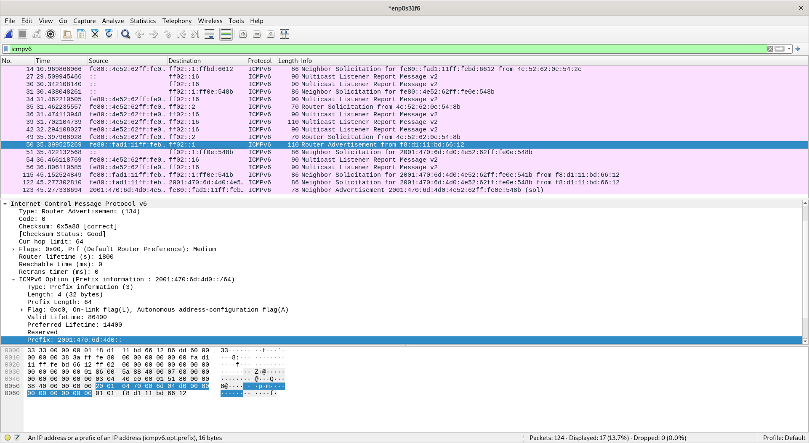

---
author: [Jakob Waibel, Daniel Hiller, Elia Wüstner, Felicitas Pojtinger]
date: "2021-11-09"
subject: "Praktikum Rechnernetze: Protokoll zu Versuch 4 (IPv6) von Gruppe 1"
keywords: [Rechnernetze, Protokoll, Versuch, HdM Stuttgart]
subtitle: "Protokoll zu Versuch 4 (IPv6) von Gruppe 1"
lang: "de"
...

# Praktikum Rechnernetze

## Einführung

### Mitwirken

Diese Materialien basieren auf [Professor Kiefers "Praktikum Rechnernetze"-Vorlesung der HdM Stuttgart](https://www.hdm-stuttgart.de/vorlesung_detail?vorlid=j212254).

**Sie haben einen Fehler gefunden oder haben einen Verbesserungsvorschlag?** Bitte eröffnen Sie ein Issue auf GitHub ([github.com/pojntfx/uni-netpractice-notes](https://github.com/pojntfx/uni-netpractice-notes)):

{ width=150px }

Wenn ihnen die Materialien gefallen, würden wir uns über einen GitHub-Stern sehr freuen.

### Lizenz

Dieses Dokument und der enthaltene Quelltext ist freie Kultur bzw. freie Software.

{ width=128px }

Uni Network Practice Notes (c) 2021 Jakob Waibel, Daniel Hiller, Elia Wüstner, Felicitas Pojtinger

SPDX-License-Identifier: AGPL-3.0

\newpage

## IPv6-Addressen

**Voreinstellung für die Aufgaben - deaktivieren von IPv4 und aktivivieren von IPv6 unter Windows.**

Um IPv4 zu deaktivieren und IPv6 zu aktivieren, muss man in den Netzwerkeinstellungen zum jeweiligen Adapter über den Pfad `Systemsteuerung > Netzwerk und Internet > Netzwerkverbindungen > Adaptereinstellungen` navigieren. Hier wurde der Haken bei IPv6 (Internetprotokoll, Version6) gesetzt und bei IPv4 (Internetprotokoll, Version4) entfernt.


\newpage

**Erkunden sie unter Windows und Ubuntu, wie viele IP-Adressen dem physikalischen Interface zugeordnet sind.**

> Linux

```shell
$ ip addr
1: lo: <LOOPBACK,UP,LOWER_UP> mtu 65536 qdisc noqueue state UNKNOWN group default qlen 1000
    link/loopback 00:00:00:00:00:00 brd 00:00:00:00:00:00
    inet 127.0.0.1/8 scope host lo
       valid_lft forever preferred_lft forever
2: enp0s31f6: <BROADCAST,MULTICAST,UP,LOWER_UP> mtu 1500 qdisc pfifo_fast state UP group default qlen 1000
    link/ether 4c:52:62:0e:54:8b brd ff:ff:ff:ff:ff:ff
    inet 141.62.66.5/24 brd 141.62.66.255 scope global dynamic enp0s31f6
       valid_lft 13993sec preferred_lft 13993sec
```

```plaintext
# /etc/sysctl.conf
net.ipv6.conf.all.disable_ipv6 = 0
net.ipv6.conf.default.disable_ipv6 = 0
net.ipv6.conf.lo.disable_ipv6 = 0
```

```shell
$ sudo sysctl -p
```

```shell
$ ip a
1: lo: <LOOPBACK,UP,LOWER_UP> mtu 65536 qdisc noqueue state UNKNOWN group default qlen 1000
    link/loopback 00:00:00:00:00:00 brd 00:00:00:00:00:00
    inet 127.0.0.1/8 scope host lo
       valid_lft forever preferred_lft forever
    inet6 ::1/128 scope host
       valid_lft forever preferred_lft forever
2: enp0s31f6: <BROADCAST,MULTICAST,UP,LOWER_UP> mtu 1500 qdisc pfifo_fast state UP group default qlen 1000
    link/ether 4c:52:62:0e:54:8b brd ff:ff:ff:ff:ff:ff
    inet 141.62.66.5/24 brd 141.62.66.255 scope global dynamic enp0s31f6
       valid_lft 13621sec preferred_lft 13621sec
    inet6 2001:470:6d:4d0:4e52:62ff:fe0e:548b/64 scope global dynamic mngtmpaddr
       valid_lft 86367sec preferred_lft 14367sec
    inet6 fe80::4e52:62ff:fe0e:548b/64 scope link
       valid_lft forever preferred_lft forever
```

> Windows

{ width=400px }

Es sind 3 Adressen zu finden; eine Host-Local-Adresse, eine Global-Unique-Adresse und eine Link-Local-Adresse.

Nun wird noch IPv4 deaktiviert:

> Linux

```shell
$ sudo ip addr delete 141.62.66.5/24 dev enp0s31f6
$ ip a
1: lo: <LOOPBACK,UP,LOWER_UP> mtu 65536 qdisc noqueue state UNKNOWN group default qlen 1000
    link/loopback 00:00:00:00:00:00 brd 00:00:00:00:00:00
    inet 127.0.0.1/8 scope host lo
       valid_lft forever preferred_lft forever
    inet6 ::1/128 scope host
       valid_lft forever preferred_lft forever
2: enp0s31f6: <BROADCAST,MULTICAST,UP,LOWER_UP> mtu 1500 qdisc pfifo_fast state UP group default qlen 1000
    link/ether 4c:52:62:0e:54:8b brd ff:ff:ff:ff:ff:ff
    inet6 2001:470:6d:4d0:4e52:62ff:fe0e:548b/64 scope global dynamic mngtmpaddr
       valid_lft 86328sec preferred_lft 14328sec
    inet6 fe80::4e52:62ff:fe0e:548b/64 scope link
       valid_lft forever preferred_lft forever
```

**Woraus setzt sich die Link-Lokale-Adresse zusammen und erkennen Sie das EUI-64 Format?**

Die Link-Lokale-Adresse setzt sich aus Prefix `fe80` und 48 Füll-Nullen, sowie der mit EUI-64 erweiterten MAC-Addresse zusammen.

Das EUI-64-Format lässt sich mittels `fe0e` bei `2001:470:6d:4d0:4e52:62ff:fe0e:548b/64` und `fe80::4e52:62ff:fe0e:548b/64` erkennen.

**Wie lautet der Prefix und die Host-ID der Global-Unicast-Adresse?**

Prefix: `2001:470:6d:4d0`

> Linux

Host-ID: `4e52:62ff:fe0e:548b`

> Windows

Host-ID: `4e52:62ff:fe0e:542b`

**Testen Sie die Netzwerkverbindung zwischen dem Linux und dem Windows-Rechner mit einem Ping (IPv6)?**

Vom Linux-Host zum Windows-Host:

```shell
$ ping6 2001:470:6d:4d0:4e52:62ff:fe0e:542b
PING 2001:470:6d:4d0:4e52:62ff:fe0e:542b(2001:470:6d:4d0:4e52:62ff:fe0e:542b) 56 data bytes
64 bytes from 2001:470:6d:4d0:4e52:62ff:fe0e:542b: icmp_seq=1 ttl=64 time=1.33 ms
64 bytes from 2001:470:6d:4d0:4e52:62ff:fe0e:542b: icmp_seq=2 ttl=64 time=0.790 ms
64 bytes from 2001:470:6d:4d0:4e52:62ff:fe0e:542b: icmp_seq=3 ttl=64 time=0.787 ms
64 bytes from 2001:470:6d:4d0:4e52:62ff:fe0e:542b: icmp_seq=4 ttl=64 time=0.787 ms
64 bytes from 2001:470:6d:4d0:4e52:62ff:fe0e:542b: icmp_seq=5 ttl=64 time=0.775 ms
64 bytes from 2001:470:6d:4d0:4e52:62ff:fe0e:542b: icmp_seq=6 ttl=64 time=0.808 ms
^C
--- 2001:470:6d:4d0:4e52:62ff:fe0e:542b ping statistics ---
6 packets transmitted, 6 received, 0% packet loss, time 5078ms
rtt min/avg/max/mdev = 0.775/0.879/1.327/0.200 ms
```

Vom Windows-Host zum Linux-Host:


\newpage

**Lassen Sie sich die Routen anzeigen und ermitteln Sie die „Default Route“**

> Linux

```shell
$ ip -6 route show
2001:470:6d:4d0::/64 dev enp0s31f6 proto kernel metric 256 expires 86097sec pref medium
fe80::/64 dev enp0s31f6 proto kernel metric 256 pref medium
default via fe80::fad1:11ff:febd:6612 dev enp0s31f6 proto ra metric 1024 expires 1497sec hoplimit 64 pref medium
```

> Windows


**Wer antwortet auf Multicast-Addressen?**

> Linux

```shell
$ ping6 ff02::1%enp0s31f6 # Stations
PING ff02::1%enp0s31f6(ff02::1%enp0s31f6) 56 data bytes
64 bytes from fe80::4e52:62ff:fe0e:548b%enp0s31f6: icmp_seq=1 ttl=64 time=0.057 ms
64 bytes from fe80::268:ebff:feb3:3487%enp0s31f6: icmp_seq=1 ttl=64 time=0.292 ms
64 bytes from fe80::fad1:11ff:febd:6612%enp0s31f6: icmp_seq=1 ttl=64 time=0.292 ms
64 bytes from fe80::dcab:6dff:fef8:ad58%enp0s31f6: icmp_seq=1 ttl=64 time=0.359 ms
64 bytes from fe80::b858:f6ff:fe60:f766%enp0s31f6: icmp_seq=1 ttl=64 time=0.359 ms
64 bytes from fe80::a4e2:e2ff:fecd:e47d%enp0s31f6: icmp_seq=1 ttl=64 time=0.359 ms
64 bytes from fe80::4e52:62ff:fe0e:5401%enp0s31f6: icmp_seq=1 ttl=64 time=0.426 ms
64 bytes from fe80::4e52:62ff:fe0e:e0e6%enp0s31f6: icmp_seq=1 ttl=64 time=0.426 ms
64 bytes from fe80::4e52:62ff:fe0e:545d%enp0s31f6: icmp_seq=1 ttl=64 time=0.426 ms
64 bytes from fe80::4e52:62ff:fe0e:e0e9%enp0s31f6: icmp_seq=1 ttl=64 time=0.478 ms
64 bytes from fe80::b04f:d6ff:fe65:93c7%enp0s31f6: icmp_seq=1 ttl=64 time=0.478 ms
64 bytes from fe80::268:ebff:feb3:3358%enp0s31f6: icmp_seq=1 ttl=64 time=0.704 ms
64 bytes from fe80::6039:f6ff:fe7b:b087%enp0s31f6: icmp_seq=1 ttl=64 time=0.777 ms
64 bytes from fe80::24c5:4ff:fe8a:faeb%enp0s31f6: icmp_seq=1 ttl=64 time=0.777 ms
64 bytes from fe80::e0a2:5fff:fe18:2fe8%enp0s31f6: icmp_seq=1 ttl=64 time=0.777 ms
64 bytes from fe80::74a8:deff:fe8b:4aa%enp0s31f6: icmp_seq=1 ttl=64 time=0.778 ms
64 bytes from fe80::6cfd:9fff:fe6d:3174%enp0s31f6: icmp_seq=1 ttl=64 time=0.841 ms
64 bytes from fe80::8461:e8ff:fec4:28e5%enp0s31f6: icmp_seq=1 ttl=64 time=0.841 ms
64 bytes from fe80::40bc:f2ff:fec8:62dd%enp0s31f6: icmp_seq=1 ttl=64 time=0.841 ms
64 bytes from fe80::f02a:80ff:fe19:5233%enp0s31f6: icmp_seq=1 ttl=64 time=0.841 ms
64 bytes from fe80::609:73ff:feaa:8ac0%enp0s31f6: icmp_seq=1 ttl=64 time=0.888 ms
64 bytes from fe80::609:73ff:feaa:8b80%enp0s31f6: icmp_seq=1 ttl=64 time=0.971 ms
64 bytes from fe80::215:99ff:fe7f:339d%enp0s31f6: icmp_seq=1 ttl=64 time=1.21 ms
^C
--- ff02::1%enp0s31f6 ping statistics ---
1 packets transmitted, 1 received, +22 duplicates, 0% packet loss, time 0ms
rtt min/avg/max/mdev = 0.057/0.617/1.210/0.274 ms
$ ping6 ff02::2%enp0s31f6 # Router
PING ff02::2%enp0s31f6(ff02::2%enp0s31f6) 56 data bytes
64 bytes from fe80::fad1:11ff:febd:6612%enp0s31f6: icmp_seq=1 ttl=64 time=0.299 ms
64 bytes from fe80::268:ebff:feb3:3487%enp0s31f6: icmp_seq=1 ttl=64 time=0.525 ms
64 bytes from fe80::268:ebff:feb3:3358%enp0s31f6: icmp_seq=1 ttl=64 time=0.675 ms
64 bytes from fe80::fad1:11ff:febd:6612%enp0s31f6: icmp_seq=2 ttl=64 time=0.302 ms
64 bytes from fe80::268:ebff:feb3:3487%enp0s31f6: icmp_seq=2 ttl=64 time=0.465 ms
64 bytes from fe80::268:ebff:feb3:3358%enp0s31f6: icmp_seq=2 ttl=64 time=0.697 ms
64 bytes from fe80::fad1:11ff:febd:6612%enp0s31f6: icmp_seq=3 ttl=64 time=0.294 ms
64 bytes from fe80::268:ebff:feb3:3487%enp0s31f6: icmp_seq=3 ttl=64 time=0.294 ms
64 bytes from fe80::268:ebff:feb3:3358%enp0s31f6: icmp_seq=3 ttl=64 time=0.648 ms
^C
--- ff02::2%enp0s31f6 ping statistics ---
3 packets transmitted, 3 received, +6 duplicates, 0% packet loss, time 2057ms
rtt min/avg/max/mdev = 0.294/0.466/0.697/0.165 ms
```

> Windows


Mit einem Ping mit Hilfe von `ping6 ff02::1%enp0s31f6` lassen sich alle Nodes im Netzwerk anpingen. Im Gegensatz dazu antworten bei `ping6 ff02::2%enp0s31f6` alle Router.

**Können Sie einzelne Nodes anhand der MAC-Adresse identifizieren?**

Die Station `fe80::fad1:11ff:febd:6612` konnte erkannt werden; diese ist wie zuvor schon beschrieben (`ip -6 route show`) das Standardgateway.

**Wieviele unterschiedliche Stationen antworten darauf, oder wieviele aktive Komponenten im RN-LAN arbeiten bereits mit IPv6?**

Es sind 23 IPv6-Stationen im Netzwerk; die Adressen der Router `fe80::fad1:11ff:febd:6612`, `fe80::268:ebff:feb3:3487` und `fe80::268:ebff:feb3:3358` finden sich wie oben zu erkennen ist auch im ersten `ping`-Command.

## IPv6 und DNS

**Identifizieren Sie mit Wireshark die Pakete mit denen der Router im Netz das Prefix mitteilt. Welches Protokoll wird dafür benutzt und um welchen Type handelt es sich und wie lautet die Zieladresse des Pakets?**

Das verwendete Protkoll ist wie auch in den unten stehenden Screenshots zu sehen `ICMPv6`. Die Types sind `Router Solicitation` und `Router Advertisement`. Die Zieladresse des Pakets ist die Multicast-Adresse `ff02::1`.

Router Solicitation:


Router Advertisement:




**Kommen Sie raus in das Internet? Was ist dazu noch erforderlich?**

> Linux

```shell
praktikum@rn05:~$ ping google.com
PING google.com(fra24s06-in-x0e.1e100.net (2a00:1450:4001:829::200e)) 56 data bytes
64 bytes from fra24s06-in-x0e.1e100.net (2a00:1450:4001:829::200e): icmp_seq=1 ttl=117 time=55.7 ms
^C
--- google.com ping statistics ---
1 packets transmitted, 1 received, 0% packet loss, time 0ms
rtt min/avg/max/mdev = 55.651/55.651/55.651/0.000 ms
praktikum@rn05:~$ sudo ip addr del 141.62.66.5/24 dev enp0s31f6
praktikum@rn05:~$ ip a
1: lo: <LOOPBACK,UP,LOWER_UP> mtu 65536 qdisc noqueue state UNKNOWN group default qlen 1000
    link/loopback 00:00:00:00:00:00 brd 00:00:00:00:00:00
    inet 127.0.0.1/8 scope host lo
       valid_lft forever preferred_lft forever
    inet6 ::1/128 scope host
       valid_lft forever preferred_lft forever
2: enp0s31f6: <BROADCAST,MULTICAST,UP,LOWER_UP> mtu 1500 qdisc pfifo_fast state UP group default qlen 1000
    link/ether 4c:52:62:0e:54:8b brd ff:ff:ff:ff:ff:ff
    inet6 2001:470:6d:4d0:4e52:62ff:fe0e:548b/64 scope global dynamic mngtmpaddr
       valid_lft 86055sec preferred_lft 14055sec
    inet6 fe80::4e52:62ff:fe0e:548b/64 scope link
       valid_lft forever preferred_lft forever
praktikum@rn05:~$ ping 8.8.8.8
ping: connect: Network is unreachable
praktikum@rn05:~$ ping google.com
ping: google.com: Name or service not known
praktikum@rn05:~$ ping6 2a00:1450:4001:829::200e
PING 2a00:1450:4001:829::200e(2a00:1450:4001:829::200e) 56 data bytes
64 bytes from 2a00:1450:4001:829::200e: icmp_seq=1 ttl=117 time=55.9 ms
64 bytes from 2a00:1450:4001:829::200e: icmp_seq=2 ttl=117 time=56.0 ms
^C
--- 2a00:1450:4001:829::200e ping statistics ---
2 packets transmitted, 2 received, 0% packet loss, time 1001ms
rtt min/avg/max/mdev = 55.925/55.962/56.000/0.037 ms
```

Wie zu erkennen ist, können DNS-Requests noch nicht beantwortet werden (`sudo ip addr del 141.62.66.5/24 dev enp0s31f6` deaktiviert hier IPv6), wird jedoch die IPv6-Addresse `2a00:1450:4001:829::200e` direkt verwendet, so kann eine direkte Verbindung (hier z.B. zu Google) aufgebaut werden. Um das Internet jedoch in vollem Umfang nutzen zu können, muss noch ein IPv6-fähiger Nameserver eingerichtet werden.

> Windows

Wie bereits unter Linux beschrieben müssen wir einen IPv6-fähigen Nameserver hinterlegen. Dies können wir über Windows wieder mit Hilfe des GUIs erledigen `Systemsteuerung > Netzwerk und ethernet > Netzwerkverbindungen > Adaptereinstellungen > Eigenschaften von Internetprotokoll, Version 6 (TCP/IPv6`. Hier kann im Feld `Bevorzugter DNS-Server` der DNS-Server hinterlegt und mit dem `OK-Button` bestätigt werden.


**Rufen Sie die Webseite www.kame.net mittels IPv6-Adresse auf (kame.net ist manchmal instabil, alternativ versuchen Sie ipv6.google.com)**

Zuerst wurde ein IPv6-fähiger Nameserver eingerichtet und getestet:

```shell
$ cat /etc/resolv.conf
nameserver 2001:4860:4860::8888
$ ping6 2001:4860:4860::8888
PING 2001:4860:4860::8888(2001:4860:4860::8888) 56 data bytes
64 bytes from 2001:4860:4860::8888: icmp_seq=1 ttl=119 time=34.1 ms
^C
--- 2001:4860:4860::8888 ping statistics ---
1 packets transmitted, 1 received, 0% packet loss, time 0ms
rtt min/avg/max/mdev = 34.118/34.118/34.118/0.000 ms
$ dig @2001:4860:4860::8888 +noall +answer google.com AAAA
google.com.		300	IN	AAAA	2a00:1450:4005:802::200e
$ dig +noall +answer google.com AAAA
google.com.		300	IN	AAAA	2a00:1450:4005:802::200e
$ ping google.com
PING google.com(ham02s21-in-x0e.1e100.net (2a00:1450:4005:802::200e)) 56 data bytes
64 bytes from ham02s21-in-x0e.1e100.net (2a00:1450:4005:802::200e): icmp_seq=1 ttl=119 time=26.5 ms
^C
--- google.com ping statistics ---
1 packets transmitted, 1 received, 0% packet loss, time 0ms
rtt min/avg/max/mdev = 26.463/26.463/26.463/0.000 ms
```

`www.kame.net` zeigt eine sich bewegende Schildkröte:


**Mit welcher IPv6-Adresse sie im Netz unterwegs sind, zeigt die Seite http://www.heise.de/netze/tools/meine-ip-adresse an**

> Linux

> Wir haben hierzu den Dienst `ifconfig.io` verwendet.

```shell
$ curl https://ifconfig.io
2001:470:6d:4d0:4e52:62ff:fe0e:548b
```

> Windows

> Dieses mal wurde die IPv6-Adresse mit Hilfe von Heise herausgefunden.


**Welche IPv6-Adresse hat http://www.google.com?**

```shell
$ dig +noall +answer google.com AAAA
google.com.		300	IN	AAAA	2a00:1450:4005:802::200e
```

Die IPv6-Adresse von `http://www.google.com` lautet `2a00:1450:4005:802:200e`.

**Was ist das besondere an der IPv6-Adresse von Facebook?**

```shell
$ dig +noall +answer facebook.com AAAA
facebook.com.		300	IN	AAAA	2a03:2880:f131:83:face:b00c:0:25de
```

Facebook hat das 5. und 6. Hextet `face` und `b00c`, als Anspielung zum Firmennamen, in deren IPv6-Addresse.

**Lösen Sie mittels nslookup oder dig die URL openldap.org in die IPv6-Adresse auf!**

```shell
$ dig +noall +answer openldap.org AAAA
openldap.org.		300	IN	AAAA	2600:3c00:e000:2d3::1
```

Die IPv6-Adresse von `openldap.org` lautet `2600:3c00:e000:2d3::1`.

## Neighbor Solicitation

**Starten Sie den „Kabelhai“ und pingen Sie ihren Nachbarrechner. Welches Protokoll/Type wird anstatt ARP zur Ermittlung der MAC-Adressen verwendet?**

> Windows


> Linux

```shell
$ sudo ip neigh flush dev enp0s31f6
$ ping6 fe80::fad1:11ff:febd:6612
PING fe80::fad1:11ff:febd:6612(fe80::fad1:11ff:febd:6612) 56 data bytes
64 bytes from fe80::fad1:11ff:febd:6612%enp0s31f6: icmp_seq=1 ttl=255 time=0.568 ms
^C
--- fe80::fad1:11ff:febd:6612 ping statistics ---
1 packets transmitted, 1 received, 0% packet loss, time 0ms
rtt min/avg/max/mdev = 0.568/0.568/0.568/0.000 ms
```


Hier wird ICMPv6 mit den Types `Neighbor Solicitation` und `Neigbor Advertisement` verwendet.

**Welche Zieladresse wird im ersten Neighbour-Paket verwendet und um welchen Adresstyp handelt es sich?**

Es wird eine Multicast-Addresse (`ff02::1:ffbd:6612`) verwendet.

\newpage

## IPv6-Header

**Starten Sie Wireshark und senden sie ein ping an einen IPv6-fähigen Webserver (www.ix.de, http://www.heise.de, http://www.kame.net), stoppen Sie Wireshark und schauen sich den Trace an.**

> Windows


> Linux

```shell
$ ping www.kame.net
PING www.kame.net(2001:2f0:0:8800:226:2dff:fe0b:4311 (2001:2f0:0:8800:226:2dff:fe0b:4311)) 56 data bytes
64 bytes from 2001:2f0:0:8800:226:2dff:fe0b:4311 (2001:2f0:0:8800:226:2dff:fe0b:4311): icmp_seq=1 ttl=48 time=317 ms
64 bytes from 2001:2f0:0:8800:226:2dff:fe0b:4311 (2001:2f0:0:8800:226:2dff:fe0b:4311): icmp_seq=2 ttl=48 time=271 ms
64 bytes from 2001:2f0:0:8800:226:2dff:fe0b:4311 (2001:2f0:0:8800:226:2dff:fe0b:4311): icmp_seq=3 ttl=48 time=273 ms
64 bytes from 2001:2f0:0:8800:226:2dff:fe0b:4311 (2001:2f0:0:8800:226:2dff:fe0b:4311): icmp_seq=4 ttl=48 time=271 ms
64 bytes from 2001:2f0:0:8800:226:2dff:fe0b:4311 (2001:2f0:0:8800:226:2dff:fe0b:4311): icmp_seq=5 ttl=48 time=271 ms
64 bytes from 2001:2f0:0:8800:226:2dff:fe0b:4311 (2001:2f0:0:8800:226:2dff:fe0b:4311): icmp_seq=6 ttl=48 time=271 ms
64 bytes from 2001:2f0:0:8800:226:2dff:fe0b:4311 (2001:2f0:0:8800:226:2dff:fe0b:4311): icmp_seq=7 ttl=48 time=271 ms
64 bytes from 2001:2f0:0:8800:226:2dff:fe0b:4311 (2001:2f0:0:8800:226:2dff:fe0b:4311): icmp_seq=8 ttl=48 time=272 ms
^C
--- www.kame.net ping statistics ---
8 packets transmitted, 8 received, 0% packet loss, time 7008ms
rtt min/avg/max/mdev = 271.343/277.307/316.896/14.971 ms
```


**Wodurch wird im Ethernet-Frame auf das eingepackte IPv6 hingewiesen?**


Der `Type IPv6` im Ethernet-Frame lässt auf das "eingepackte" IPv6 schließen.

**Welche Bedeutung haben folgende Felder des IPv6-Headers und gibt es Entsprechungen in IPv4?**

|      | Version                                                                 | Traffic Class                                                                                                                                                                                                                                       | Flow Label                                                                                                                                                                                | Payload Length                                                                                                                      | Hop Limit                                                                                                                                                 |
| ---- | ----------------------------------------------------------------------- | --------------------------------------------------------------------------------------------------------------------------------------------------------------------------------------------------------------------------------------------------- | ----------------------------------------------------------------------------------------------------------------------------------------------------------------------------------------- | ----------------------------------------------------------------------------------------------------------------------------------- | --------------------------------------------------------------------------------------------------------------------------------------------------------- |
| IPv6 | Dieses Feld ist 4 bits lang und enthält die Konstante 6 in Binär (0110) | Die Traffic Class ist ein Indikator für Class oder Priorität des IPv6 Packets. So können einzelne Packets mit einer höheren Priorität versehen werden. Kommt es zu einem Stau im Router werden die Packets mit der geringsten Priorität verworfen.  | Mit dem Flow-Label kann angegeben werden, dass ein IPv6 Paket des selben Flows von Routern speziell behandelt werden soll. Packets des gleichen Flows werden unverzüglich weitergeleitet. | Das "Payload-Length" Feld gibt die Länge des Payloads, also die Länge des Pakets ohne Berücksichtigung des Headers an.              | Das Hop-Limit gibt die maximale Anzahl an aufeinanderfolgenden Nodes an, die ein Paket durchlaufen darf. Fällt diese Zahl auf 0 wird das Paket verworfen. |
| IPv4 | Dieses Feld ist 4 bits lang und enthält die Konstante 4 in Binär (0100) | IPv6 besitzt das Traffic Class Feld nicht. Allerdings erfüllt das "Type of Service" oder auch "Differentiated Services Code Point" genannte Feld eine nahezu identische Funtion. Dieses Feld ist auch dazu da, Packets eine Priorität zu verleihen. | Das Flow-Label ist ebenfalls sehr ähnlich zum "Type of Service" Feld, welches einzelne Pakete priorisieren kann. Dieses Feld wurde bei IPv4 aber meistens ignoriert.                      | Bei IPv4 gibt es statt des "Payload-Length" Feldes das "Total Length" Feld. Dieses gibt die Länge des Pakets, inklusive Header, an. | Ein Analogon zum Hop-Limit ist die TTL (Time-to-Live). Die TTL funktioniert genau so wie das Hop-Limit auch.                                              |

**Senden Sie nun ein 5000 Byte großes Paket vom Windows-PC an den Ubuntu-PC und schauen sich die Abfolge der Pakete an**

Mit `ping -6 -l 5000 2001:470:6d:4d0:4e52:62ff:fe0e:548b` kann ein 5000 Byte langer Ping an das Linux-System gesendet werden.


**Welcher Wert taucht im Next-Header-Feld Ihres IPv6 Headers auf?**

Hier taucht der `Fragment-Header for IPv6` auf.


**Welche Bedeutung haben die unterschiedlichen Felder des Fragmentation Headers, oder anders gefragt; wie setzt IPv6 die Pakete wieder zusammen?**

**Next Header:** Das Next-Header Feld gibt den Typ des darauffolgenden Headers an. In diesem Fall ist der folgende Header ein ICMPv6 Header.

**Reserved octet:** Das Reserved Octet ist im Moment auf 0 gesetzt und für die eventuelle zukünftige Nutzung reserviert.

**Fragment Offset:** Das Fragment Offset gibt die Startposition der Daten im Fragment in Relation zum ursprünglichen Packet an.

**More Fragment:** More Fragments besteht aus einem einzelnen Bit, welches angibt, ob nach dem jetzigen Fragment weitere Fragmente folgen.

**Identification Number:** Die Identifikationsnummer ist unter allen Fragmenten eines Packets die gleiche.

Zusammengesetzt werden die einzelnen Pakete wieder, indem alle Fragmente mit gleichem IP-Header nach ihrem Fragment Offset geordnet wieder zusammengesetzt werden.


## Privacy Extension

**Tragen Sie weitere Informationen zur „Privacy Extension“ (vor allem auch zur Konfiguration unter Windows und Ubuntu) zusammen und versuchen hier im Versuch die Einstellungen für die „Privacy Extension“ auf beiden Rechnern (Windows und Ubuntu) zu realisieren.**

Privacy Extensions sind dafür da, Rückchluss auf Nutzer*innen schwerer zu machen, indem der Hostanteil der IPv6-Adressen anonymisiert wird. Privacy Extensions entkoppeln Interface Identifier und MAC-Adresse und erzeugen diese nahezu zufällig. Mit diesen periodisch wechselnden Adressen werden dann ausgehende Verbindungen hergestellt, was den Rückschluss auf _einzelne_ Nutzer*innen erschwert. Mit Hilfe der Privacy Extensions kann man also nicht mehr einzelne Nutzer*innen identifizieren. Was allerdings trotzdem möglich ist, ist das Identifizieren über den Präfix, welcher allerdings nur Informationen zum Netzwerk bereitstellt. Wenn der Provider den Präfix regelmäßig wechselt, dann kann auch die Identifikation über diesen erschwert werden.

\newpage

> Windows

Unter Windows kann die Privacy Extension mit den zwei folgenden Kommandos aktivert werden:

```shell
>netsh interface ipv6 set global randomizeidentifiers=enabled store=active
>netsh interface ipv6 set global state=enabled store=active
```


> Linux

Mittels `sysctl` kann die Privacy Extension aktiviert werden:

```plaintext
# /etc/sysctl.conf
net.ipv6.conf.all.use_tempaddr=2
net.ipv6.conf.default.use_tempaddr=2
```

```shell
$ sudo sysctl -p
```

\newpage

**Mit welchen IPv6-Adressen sind sie nach dem Aktivieren der Privacy Extension im Internet unterwegs?**

> Windows


Wie im oberen Screenshot zu sehen ist, surfen wir mit einer anderen IPv6 Adresse, welche von Website-Betreibern nicht mehr auf unseren Host zurückverfolgt werden kann.

> Linux

> Wir haben hierzu den Dienst `ifconfig.io` verwendet.

```shell
$ curl https://ifconfig.io
2001:7c7:2121:8d00:1902:f308:6c8b:acb7
```

\newpage

## Feste IPv6-Addressen

**Weisen Sie in dieser Aufgabe ihrem Netzwerkinterface eine feste sinnvolle (heißt: Der Prefix ist weiterhin gültig) IPv6-Adresse zu.**

> Windows


Mit einem Rechtsklick auf das Netzwerkinterface und dann bei IPv6 die Eigenschaften auswählen. Im Menü kann dann eine manuelle IP angegeben werden. Wir erhöhen die Hexadezimalzahl im letzen Hextet um eins.

Mit `ipconfig` kann dann die neue IP-Adresse gesehen werden.


> Linux

Im folgenden kann gesehen werden, wie eine neue IPv6-Adresse zum Netzwerkinterface `enp0s31f6` hinzugefügt wird. Dafür kann der Befehl `sudo ip addr add 2001:470:6d:4d0:4e52:62ff:fe0e:548c/64 dev enp0s31f6` verwendet werden. Die nun hinzugefügte IPv6-Adresse kann dann mit `ip a` betrachtet werden.

```shell
$ ip a
1: lo: <LOOPBACK,UP,LOWER_UP> mtu 65536 qdisc noqueue state UNKNOWN group default qlen 1000
    link/loopback 00:00:00:00:00:00 brd 00:00:00:00:00:00
    inet 127.0.0.1/8 scope host lo
       valid_lft forever preferred_lft forever
    inet6 ::1/128 scope host
       valid_lft forever preferred_lft forever
2: enp0s31f6: <BROADCAST,MULTICAST,UP,LOWER_UP> mtu 1500 qdisc pfifo_fast state UP group default qlen 1000
    link/ether 4c:52:62:0e:54:8b brd ff:ff:ff:ff:ff:ff
    inet6 2001:470:6d:4d0:4e52:62ff:fe0e:548b/64 scope global dynamic mngtmpaddr
       valid_lft 86255sec preferred_lft 14255sec
    inet6 fe80::4e52:62ff:fe0e:548b/64 scope link
       valid_lft forever preferred_lft forever
praktikum@rn05:~$ sudo ip addr add 2001:470:6d:4d0:4e52:62ff:fe0e:548c/64 dev enp0s31f6
praktikum@rn05:~$ ip a
1: lo: <LOOPBACK,UP,LOWER_UP> mtu 65536 qdisc noqueue state UNKNOWN group default qlen 1000
    link/loopback 00:00:00:00:00:00 brd 00:00:00:00:00:00
    inet 127.0.0.1/8 scope host lo
       valid_lft forever preferred_lft forever
    inet6 ::1/128 scope host
       valid_lft forever preferred_lft forever
2: enp0s31f6: <BROADCAST,MULTICAST,UP,LOWER_UP> mtu 1500 qdisc pfifo_fast state UP group default qlen 1000
    link/ether 4c:52:62:0e:54:8b brd ff:ff:ff:ff:ff:ff
    inet6 2001:470:6d:4d0:4e52:62ff:fe0e:548c/64 scope global
       valid_lft forever preferred_lft forever
    inet6 2001:470:6d:4d0:4e52:62ff:fe0e:548b/64 scope global dynamic mngtmpaddr
       valid_lft 86207sec preferred_lft 14207sec
    inet6 fe80::4e52:62ff:fe0e:548b/64 scope link
       valid_lft forever preferred_lft forever
```

**Warum sollten Sie jetzt alle übrigen IPv6-Adressen löschen?**

> Windows

Mit folgendem Command können die Privacy-Extensions deaktiviert und die damit einhergehenden IPv6-Adressen entfernt werden.

```shell
netsh interface ipv6 set privacy disabled
```

Nun wird die alte IPv6-Adresse entfernt.

```shell
netsh interface ipv6 delete address interface="WLAN" address=2003:cd:271d:f879:f4f2:d559:fca9:9fb2 store=active
```


> Linux

Mit `sudo ip addr del 2001:470:6d:4d0:4e52:62ff:fe0e:548b/64 dev enp0s31f6` löschen wir die alte IPv6-Adresse aus dem Netzwerkinterface. Mit `ip a` können wir sehen, dass lediglich die zuvor neu hinzugefügte Global-Unicast-Adresse angezeigt wird.

```shell
$ sudo ip addr del 2001:470:6d:4d0:4e52:62ff:fe0e:548b/64 dev enp0s31f6
$ ip a
1: lo: <LOOPBACK,UP,LOWER_UP> mtu 65536 qdisc noqueue state UNKNOWN group default qlen 1000
    link/loopback 00:00:00:00:00:00 brd 00:00:00:00:00:00
    inet 127.0.0.1/8 scope host lo
       valid_lft forever preferred_lft forever
    inet6 ::1/128 scope host
       valid_lft forever preferred_lft forever
2: enp0s31f6: <BROADCAST,MULTICAST,UP,LOWER_UP> mtu 1500 qdisc pfifo_fast state UP group default qlen 1000
    link/ether 4c:52:62:0e:54:8b brd ff:ff:ff:ff:ff:ff
    inet6 2001:470:6d:4d0:4e52:62ff:fe0e:548c/64 scope global
       valid_lft forever preferred_lft forever
    inet6 fe80::4e52:62ff:fe0e:548b/64 scope link
       valid_lft forever preferred_lft forever
```

Man sollte die übrigen IPv6-Adressen löschen, da es sonst eventuell zu Problemen beim wählen der Source-IP kommen kann.

**Reicht das aus?**

Wie auch schon oben erwähnt sollten außerdem noch die Privacy Extensions deaktiviert werden. Damit kann sichergestellt werden, dass auch wirklich unsere statisch konfigurierte IPv6-Adresse als Source-IP verwendet wird.

**Konfigurieren Sie die statische IPv6-Adresse über /etc/network/interfaces. Was wird dadurch verhindert? (U. U. müssen sie mit ifdown und ifup die Schnittstelle neu starten**

```plaintext
# /etc/network/interfaces
auto enp0s31f6
  allow-hotplug enp0s31f6
  iface enp0s31f6 inet6 static
        address 2001:470:6d:4d0:4e52:62ff:fe0e:548c
        netmask 64
```

```shell
$ sudo ifdown enp0s31f6
$ sudo ifup enp0s31f6
Waiting for DAD... Done
$ ip a
1: lo: <LOOPBACK,UP,LOWER_UP> mtu 65536 qdisc noqueue state UNKNOWN group default qlen 1000
    link/loopback 00:00:00:00:00:00 brd 00:00:00:00:00:00
    inet 127.0.0.1/8 scope host lo
       valid_lft forever preferred_lft forever
    inet6 ::1/128 scope host
       valid_lft forever preferred_lft forever
2: enp0s31f6: <BROADCAST,MULTICAST,UP,LOWER_UP> mtu 1500 qdisc pfifo_fast state UP group default qlen 1000
    link/ether 4c:52:62:0e:54:8b brd ff:ff:ff:ff:ff:ff
    inet6 2001:470:6d:4d0:4e52:62ff:fe0e:548c/64 scope global
       valid_lft forever preferred_lft forever
    inet6 fe80::4e52:62ff:fe0e:548b/64 scope link
       valid_lft forever preferred_lft forever
$ ping www.kame.net
PING www.kame.net(2001:2f0:0:8800:226:2dff:fe0b:4311 (2001:2f0:0:8800:226:2dff:fe0b:4311)) 56 data bytes
64 bytes from 2001:2f0:0:8800:226:2dff:fe0b:4311 (2001:2f0:0:8800:226:2dff:fe0b:4311): icmp_seq=1 ttl=48 time=280 ms
64 bytes from 2001:2f0:0:8800:226:2dff:fe0b:4311 (2001:2f0:0:8800:226:2dff:fe0b:4311): icmp_seq=2 ttl=48 time=274 ms
^C64 bytes from 2001:2f0:0:8800:226:2dff:fe0b:4311: icmp_seq=3 ttl=48 time=275 ms

--- www.kame.net ping statistics ---
3 packets transmitted, 3 received, 0% packet loss, time 2003ms
rtt min/avg/max/mdev = 274.357/276.472/280.370/2.759 ms
```

Wenn man die statische IPv6-Adresse über `/etc/network/interfaces` setzt, ist diese auch nach einem `reboot` konfiguriert. Einfache Anpassungen über `ip addr add` sind keine persistenten Änderungen.

**Mit welcher IPv6-Adresse sind sie jetzt im Netz unterwegs? Die Seite http://www.heise.de/netze/tools/meine-ip-adresse gibt Aufschluss.**

```shell
$ curl https://ipconfig.io
2001:470:6d:4d0:4e52:62ff:fe0e:548c
```

Nach dem setzen einer statischen IP-Adresse sind wir mit der IPv6-Adresse `2001:470:6d:4d0:4e52:62ff:fe0e:548c` unterwegs. Das ist die, die wir zuvor in `/etc/network/interfaces` konfiguriert haben.

## Lease-Zeiten

**Die Werte für "Maximale bevorzugte Gültigkeitsdauer" und "Maximale Gültigkeitsdauer" setzt man in Windows über die Schlüssel maxpreferredlifetime und maxvalidlifetime, die Zeitangaben in Tagen (d), Stunden (h), Minuten (m) und Sekunden (s) entgegennehmen. Wie sind diese Parameter bei Ihnen gesetzt?**

> Windows

```shell
netsh interface ipv6 show privacy
```


Die "Maximale bevorzugte Gültigkeitsdauer" und die "Maximale Gültigkeitsdauer" sind zu Beginn auf 7 Tage gesetzt.

> Linux

Mittels `sysctl` können die Werte abgefragt werden:

```shell
$ sysctl net.ipv6.conf.all.temp_prefered_lft
net.ipv6.conf.all.temp_prefered_lft = 86400
$ sysctl net.ipv6.conf.all.temp_valid_lft
net.ipv6.conf.all.temp_valid_lft = 604800
```

**Halbieren Sie die "Maximale bevorzugte Gültigkeitsdauer" auf den Rechnern.**

> Windows

```shell
netsh interface ipv6 set privacy maxpreferredlifetime=3d12h
```

Hiermit können wir `maxpreferredlifetime` setzen.


> Linux

Mittels `sysctl` kann der Wert halbiert werden:

```plaintext
net.ipv6.conf.all.temp_prefered_lft = 43200
```

```shell
$ sudo sysctl -p
```

**Verringern Sie ebenso die Zeitspanne, in der Windows über eine temporäre IPv6-Adresse eingehende Pakete empfängt.**

> Windows

Dies kann mit folgendem Command erreicht werden:

```shell
netsh interface ipv6 set privacy maxvalidlifetime=3d
```

> Linux

Mittels `sysctl` kann der Wert verringert werden:

```plaintext
net.ipv6.conf.all.temp_valid_lft = 404800
```

```shell
$ sudo sysctl -p
```

**Stellen Sie den Zusammenhang zwischen Preferred Lifetime und Valid Liftime anschaulich dar**

Die Preferred Lifetime gibt die Zeitspanne an, in welcher die Adresse frei als source und destination Adresse genutzt werden kann. Nach dem Ablauf dieser Zeit bekommt die Adresse den "deprecated" Status. Im "deprecated" Status kann nur noch mit bestehenden Kommunikationsverbindungen kommuniziert werden.
Die Valid Lifetime ist mindestens so groß wie die Preferred Lifetime. Wenn diese abläuft wird die Adresse invalide und kann ab diesem Punkt auch anderen Interfaces zugewiesen werden.

## OS-Updates

**Lässt sich eigentlich Windows über IPv6 updaten? Was sagt Wireshark dazu?**

> Windows

Unter Windows wurde das Update ohne Probleme installiert. Windows Update verfügt über vollen IPv6-Support. (https://serverfault.com/questions/844107/windows-server-update-on-ipv6-only-network). Dies konnte auch mittels Wireshark validiert werden:


**Wie verhält sich Linux im Vergleich dazu? (Anmerkung: Mittels sudo apt-get update und sudo apt-get upgrade im Terminal lässt sich Linux updaten)**

> Linux

Das Linux-Update (bzw. Debian-Update; APT wird verwendet) lässt sich auch durchführen. Dies ist natürlich von den verwendeten Spiegelservern und deren IPv6-Fähigkeit abhängig, siehe https://www.debian.org/mirror/list.

```shell
$ sudo ip addr del 141.62.66.5/24 dev enp0s31f6
$ sudo apt update
Hit:1 http://deb.debian.org/debian bullseye InRelease
Hit:2 http://security.debian.org bullseye-security InRelease
Get:3 http://deb.debian.org/debian bullseye-updates InRelease [39.4 kB]
Hit:4 http://ppa.launchpad.net/ansible/ansible/ubuntu bionic InRelease
Fetched 39.4 kB in 5s (7,169 B/s)
Reading package lists... Done
Building dependency tree... Done
Reading state information... Done
1 package can be upgraded. Run 'apt list --upgradable' to see it.
$ sudo apt upgrade -y
Reading package lists... Done
Building dependency tree... Done
Reading state information... Done
Calculating upgrade... Done
The following packages will be upgraded:
  tzdata
1 upgraded, 0 newly installed, 0 to remove and 0 not upgraded.
Need to get 0 B/284 kB of archives.
After this operation, 0 B of additional disk space will be used.
apt-listchanges: Reading changelogs...
Preconfiguring packages ...
(Reading database ... 199845 files and directories currently installed.)
Preparing to unpack .../tzdata_2021a-1+deb11u2_all.deb ...
Unpacking tzdata (2021a-1+deb11u2) over (2021a-1+deb11u1) ...
Setting up tzdata (2021a-1+deb11u2) ...

Current default time zone: 'Europe/Berlin'
Local time is now:      Tue Nov  9 16:52:29 CET 2021.
Universal Time is now:  Tue Nov  9 15:52:29 UTC 2021.
Run 'dpkg-reconfigure tzdata' if you wish to change it.
```

Ein Blick auf Wireshark zeigt, das auch tatsächlich IPv6 verwendet wird (hier mit TLS & einem Spiegelserver der Hochschule Esslingen):


