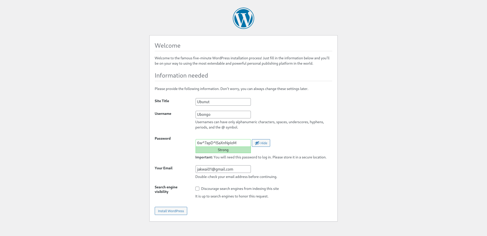
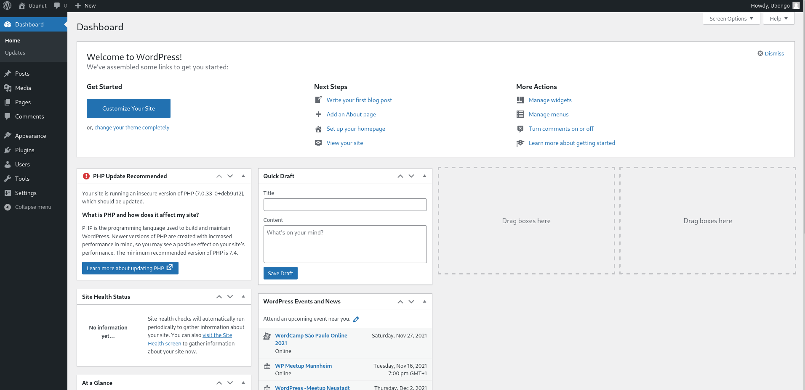
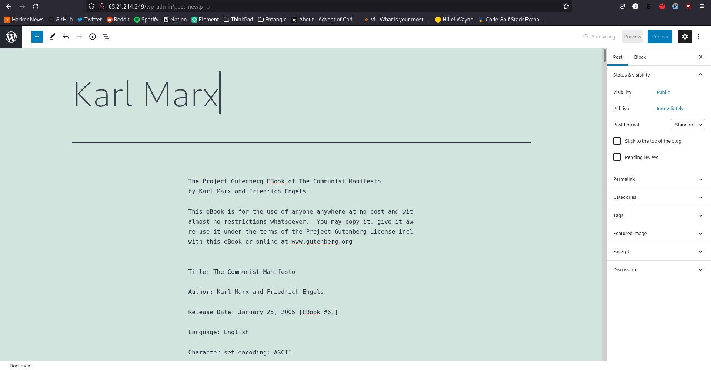
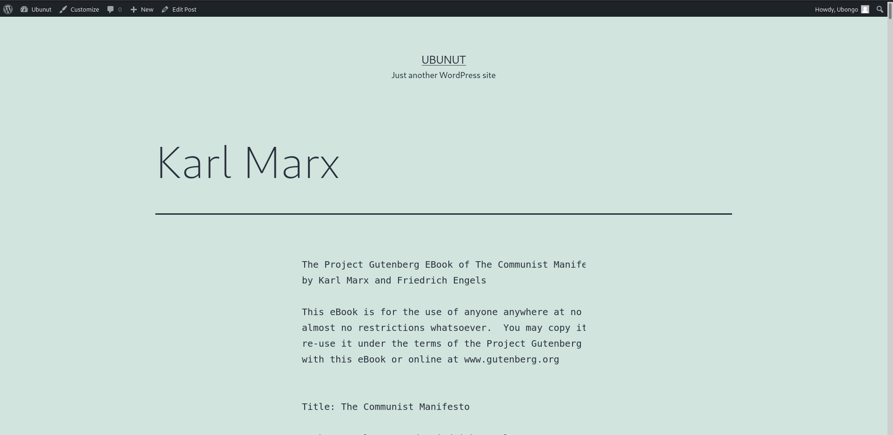
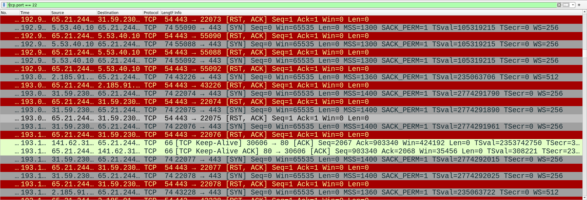

---
author: [Jakob Waibel, Daniel Hiller, Elia Wüstner, Felix Pojtinger]
date: "2021-11-16"
subject: "Praktikum Rechnernetze: Protokoll zu Versuch 5 (Paketfilter-Firewall unter Linux) von Gruppe 1"
keywords: [Rechnernetze, Protokoll, Versuch, HdM Stuttgart]
subtitle: "Protokoll zu Versuch 5 (Paketfilter-Firewall unter Linux) von Gruppe 1"
lang: "de"
...

# Praktikum Rechnernetze

## Einführung

### Mitwirken

Diese Materialien basieren auf [Professor Kiefers "Praktikum Rechnernetze"-Vorlesung der HdM Stuttgart](https://www.hdm-stuttgart.de/vorlesung_detail?vorlid=j212254).

**Sie haben einen Fehler gefunden oder haben einen Verbesserungsvorschlag?** Bitte eröffnen Sie ein Issue auf GitHub ([github.com/pojntfx/uni-netpractice-notes](https://github.com/pojntfx/uni-netpractice-notes)):

{ width=150px }

Wenn ihnen die Materialien gefallen, würden wir uns über einen GitHub-Stern sehr freuen.

### Lizenz

Dieses Dokument und der enthaltene Quelltext ist freie Kultur bzw. freie Software.

{ width=128px }

Uni Network Practice Notes (c) 2021 Jakob Waibel, Daniel Hiller, Elia Wüstner, Felix Pojtinger

SPDX-License-Identifier: AGPL-3.0

\newpage

## Wordpress Konfigurieren

**Auf ihrem Server ist Wordpress vorinstalliert / vorkonfiguriert. Lediglich die abschließende Einrichtung ist noch nicht erfolgt... Führen Sie die Einrichtung durch und stellen Sie die Funktion sicher. Rufen Sie dazu die IP der Servers in einem Web-Browser auf.**










\newpage

## Portscan durchführen

**Überprüfen Sie mit einem Portscanner welche Ports an Ihrem Server öffentlich erreichbar sind. Welche Ports/Services sind das? Müssen diese Services öffentlich erreichbar sein?**

{ width=256px }

`nmap` zeigt die offenen Ports:

```shell
$ sudo nmap 65.21.244.249
Starting Nmap 7.91 ( <https://nmap.org> ) at 2021-11-16 14:59 CET
sendto in send*ip*packet_sd: sendto(4, packet, 44, 0, 65.21.244.249, 16) => Operation not permitted
Offending packet: TCP 10.108.48.108:61668 > 65.21.244.249:53 S ttl=55 id=22537 iplen=44  seq=1930045695 win=1024 <mss 1460>
sendto in send*ip*packet_sd: sendto(4, packet, 44, 0, 65.21.244.249, 16) => Operation not permitted
Offending packet: TCP 10.108.48.108:61669 > 65.21.244.249:53 S ttl=50 id=21891 iplen=44  seq=1930111230 win=1024 <mss 1460>
Nmap scan report for static.249.244.21.65.clients.your-server.de (65.21.244.249)
Host is up (0.035s latency).
Not shown: 990 closed ports
PORT     STATE    SERVICE
22/tcp   open     ssh
25/tcp   filtered smtp
53/tcp   filtered domain
80/tcp   open     http
139/tcp  filtered netbios-ssn
445/tcp  filtered microsoft-ds
1900/tcp filtered upnp
2869/tcp filtered icslap
3306/tcp open     mysql
9100/tcp open     jetdirect
```

Ein Auszug des Wireshark-Captures zeigt dies ebenfalls (hier z.B. für Port 80):



## Blockieren von Services

**Sie haben in Aufgabe 2 mindestens einen Service identifiziert, der nicht öffentlich verfügbar sein muss. Blockieren Sie den externen Zugriff auf diesen Service in Ihrer Firewall (Blacklist-Ansatz).**

Blocken aller Ports neben 22 und 00:

```shell
$ sudo iptables -F INPUT
$ sudo iptables -A INPUT -p tcp --dport 25 -j DROP
$ sudo iptables -A INPUT -p tcp --dport 53 -j DROP
$ sudo iptables -A INPUT -p tcp --dport 139 -j DROP
$ sudo iptables -A INPUT -p tcp --dport 445 -j DROP
$ sudo iptables -A INPUT -p tcp --dport 1900 -j DROP
$ sudo iptables -A INPUT -p tcp --dport 2869 -j DROP
$ sudo iptables -A INPUT -p tcp --dport 3306 -j DROP
$ sudo iptables -A INPUT -p tcp --dport 9100 -j DROP
$ sudo iptables -L INPUT
Chain INPUT (policy ACCEPT)
target     prot opt source               destination
DROP       tcp  --  anywhere             anywhere             tcp dpt:9100
DROP       tcp  --  anywhere             anywhere             tcp dpt:smtp
DROP       tcp  --  anywhere             anywhere             tcp dpt:domain
DROP       tcp  --  anywhere             anywhere             tcp dpt:netbios-ssn
DROP       tcp  --  anywhere             anywhere             tcp dpt:microsoft-ds
DROP       tcp  --  anywhere             anywhere             tcp dpt:1900
DROP       tcp  --  anywhere             anywhere             tcp dpt:2869
DROP       tcp  --  anywhere             anywhere             tcp dpt:mysql
```

Check auf dem lokalen System:

```shell
$ nmap 65.21.244.249
Starting Nmap 7.91 ( https://nmap.org ) at 2021-11-16 15:23 CET
Nmap scan report for static.249.244.21.65.clients.your-server.de (65.21.244.249)
Host is up (0.079s latency).
Not shown: 991 closed ports
PORT     STATE    SERVICE
22/tcp   open     ssh
25/tcp   filtered smtp
80/tcp   open     http
139/tcp  filtered netbios-ssn
445/tcp  filtered microsoft-ds
1900/tcp filtered upnp
2869/tcp filtered icslap
3306/tcp filtered mysql
9100/tcp filtered jetdirect

Nmap done: 1 IP address (1 host up) scanned in 3.39 seconds
```

## Whitelist-Ansatz per Shell-Skript

**Stellen Sie den gleichen Zustand der Firewall (Damit meine ich, dass die gleichen Services erreichbar sind) her wie in Aufgabe 3, allerdings verfolgen Sie jetzt den Whitelist-Ansatz.**

Inhalt von `iptables-rules.sh`:

```shell
# $HOME/iptables-rules.sh

#!/usr/bin/env bash

sudo iptables -F INPUT

sudo iptables -A INPUT -p tcp --dport 22 -j ACCEPT
sudo iptables -A INPUT -p tcp --dport 80 -j ACCEPT
```

Zur Sicherheit wurde hier noch gecheckt, ob auch wirklich die richtigen Regeln angewandt wurden:

```shell
$ sudo iptables -L
Chain INPUT (policy ACCEPT)
target     prot opt source               destination
ACCEPT     tcp  --  anywhere             anywhere             tcp dpt:ssh
ACCEPT     tcp  --  anywhere             anywhere             tcp dpt:http
```

Nun wurde noch die Default Deny Rule aktiviert:

```shell
$ sudo iptables -P INPUT DROP
```

Und die korrekte Anwendung sichergestellt:

```shell
$ sudo iptables -L INPUT
Chain INPUT (policy DROP)
target     prot opt source               destination
ACCEPT     tcp  --  anywhere             anywhere             tcp dpt:ssh
ACCEPT     tcp  --  anywhere             anywhere             tcp dpt:http
```

`nmap` zeigt nun auch die Ports nicht mehr als `filtered` an:

```shell
$ nmap 65.21.244.249
Starting Nmap 7.91 ( https://nmap.org ) at 2021-11-16 15:48 CET
Nmap scan report for static.249.244.21.65.clients.your-server.de (65.21.244.249)
Host is up (0.053s latency).
Not shown: 997 filtered ports
PORT   STATE  SERVICE
22/tcp open   ssh
53/tcp closed domain
80/tcp open   http

Nmap done: 1 IP address (1 host up) scanned in 11.56 seconds
```

## ICMP und Prometheus Node-Exporter

**Der Prometheus Node-Exporter liefert Metriken für Prometheus (https://prometheus.io/). Konfigurieren Sie ihre Firewall so, dass diese Metriken nur von Ihren IP-Adressen aus erreichbar sind (Nutzen Sie https://ifconfig.co/ um Ihre öffnetliche IP-Adresse in Erfahrung zu bringen). Das selbe gilt für ICMP. Die Angriffsvektoren für ICMP sind zwar ziemlich eingeschränkt, trotzdem reicht es, wenn Sie in der Lage sind Probes an den Server zu senden.**

Unsere IP-Addresse:

```
$ curl https://ifconfig.io
193.27.14.134
```

Nun müssen zwei `ACCEPT`-Rules erstellt werden; zuerst für den Prometheus Node-Exporter:

```shell
$ sudo iptables -A INPUT -p tcp --dport 9100 -j ACCEPT -s 193.27.14.134
$ curl http://65.21.244.249:9100
<html>
			<head><title>Node Exporter</title></head>
			<body>
			<h1>Node Exporter</h1>
			<p><a href="/metrics">Metrics</a></p>
			</body>
			</html>
$ nmap 65.21.244.249
Starting Nmap 7.91 ( https://nmap.org ) at 2021-11-16 15:54 CET
Nmap scan report for static.249.244.21.65.clients.your-server.de (65.21.244.249)
Host is up (0.039s latency).
Not shown: 996 filtered ports
PORT     STATE  SERVICE
22/tcp   open   ssh
53/tcp   closed domain
80/tcp   open   http
9100/tcp open   jetdirect

Nmap done: 1 IP address (1 host up) scanned in 5.74 seconds
```

Wie zu sehen ist, ist der Port von dieser öffentlichen IP zu erreichen. Von einem anderen Host ist dies nicht der Fall:

```shell
$ curl https://ifconfig.io
141.62.31.100
$ nmap 65.21.244.249
Starting Nmap 7.80 ( https://nmap.org ) at 2021-11-16 15:55 CET
Nmap scan report for static.249.244.21.65.clients.your-server.de (65.21.244.249)
Host is up (0.024s latency).
Not shown: 996 filtered ports
PORT    STATE  SERVICE
22/tcp  open   ssh
25/tcp  closed smtp
80/tcp  open   http
445/tcp closed microsoft-ds

Nmap done: 1 IP address (1 host up) scanned in 5.18 seconds
```

Nun die Rule für ICMP:

```shell
$ sudo iptables -A INPUT -p icmp -j ACCEPT -s 193.27.14.134
```

Nun lässt sich von unserem System aus der Host anpingen:

```shell
$ ping 65.21.244.249
PING 65.21.244.249 (65.21.244.249) 56(84) bytes of data.
64 bytes from 65.21.244.249: icmp_seq=1 ttl=52 time=51.3 ms
64 bytes from 65.21.244.249: icmp_seq=2 ttl=52 time=51.5 ms
64 bytes from 65.21.244.249: icmp_seq=3 ttl=52 time=52.5 ms
64 bytes from 65.21.244.249: icmp_seq=4 ttl=52 time=29.2 ms
64 bytes from 65.21.244.249: icmp_seq=5 ttl=52 time=32.4 ms
^C
--- 65.21.244.249 ping statistics ---
5 packets transmitted, 5 received, 0% packet loss, time 4007ms
rtt min/avg/max/mdev = 29.212/43.383/52.477/10.323 ms
```

Von einer anderen Workstation (`193.27.14.134`) aus ist dies nicht der Fall:

```shell
$ ping 65.21.244.249
PING 65.21.244.249 (65.21.244.249) 56(84) bytes of data.
^C
--- 65.21.244.249 ping statistics ---
9 packets transmitted, 0 received, 100% packet loss, time 8226ms
```

Diese beiden Regeln wurden noch zu `$HOME/iptables-rules.sh` hinzugefügt, damit sie im folgenden auch nach dem Reboot persistiert werden. Ebenso wurde die Default-Deny-Rule in das Skript mit aufgenommen.

## Besprechung, Musterlösung und Einbindung als System-Service

**Diese Aufgabe führen wir zusammen durch, dokumentieren Sie trotzdem die Schritte und Ergebnisse!**

```shell
$ systemctl cat iptables
# /etc/systemd/system/iptables.service
[Unit]
Description=firewall service
Before=network.target
AssertPathExists=/root/iptables-rules.sh

[Service]
Type=oneshot
RemainAfterExit=yes
ExecStart=/root/iptables-rules.sh
StandardOutput=syslog
StandardError=syslog

[Install]
WantedBy=multi-user.target
$ sudo systemctl enable --now iptables.service
$ sudo systemctl reboot
```

Wie zu sehen ist, wurden die Regeln auch nach dem Reboot angewandt:

```shell
$ sudo iptables -L INPUT
Chain INPUT (policy DROP)
target     prot opt source               destination
ACCEPT     tcp  --  anywhere             anywhere             tcp dpt:ssh
ACCEPT     tcp  --  anywhere             anywhere             tcp dpt:http
ACCEPT     icmp --  193.27.14.134        anywhere
ACCEPT     tcp  --  193.27.14.134        anywhere             tcp dpt:9100
```

Auf einer anderen Workstation:

```shell
$ nmap 65.21.244.249
Starting Nmap 7.80 ( https://nmap.org ) at 2021-11-16 16:14 CET
Nmap scan report for static.249.244.21.65.clients.your-server.de (65.21.244.249)
Host is up (0.049s latency).
Not shown: 996 filtered ports
PORT STATE SERVICE
22/tcp open ssh
25/tcp closed smtp
80/tcp open http
445/tcp closed microsoft-ds

Nmap done: 1 IP address (1 host up) scanned in 10.74 seconds
```

Auf der allowlisteten Workstation:

```shell
$ nmap 65.21.244.249
Starting Nmap 7.91 ( https://nmap.org ) at 2021-11-16 16:14 CET
Nmap scan report for static.249.244.21.65.clients.your-server.de (65.21.244.249)
Host is up (0.036s latency).
Not shown: 996 filtered ports
PORT STATE SERVICE
22/tcp open ssh
53/tcp closed domain
80/tcp open http
9100/tcp open jetdirect

Nmap done: 1 IP address (1 host up) scanned in 5.43 seconds
```

Letztendlich sieht unser überarbeitetes Skript wie folgt aus:

```shell
#!/usr/bin/env bash

# exit on error 
set -e

IPT="/sbin/iptables"

$IPT -F INPUT

$IPT -A INPUT -p tcp --dport 22 -j ACCEPT
$IPT -A INPUT -p tcp --dport 80 -j ACCEPT
$IPT -A INPUT -p icmp -j ACCEPT -s 193.27.14.134
$IPT -A INPUT -p tcp --dport 9100 -j ACCEPT -s 193.27.14.134

# default targets
$IPT -P INPUT DROP # we want to block all incoming traffic (whitelist-approach)
$IPT -P OUTPUT ACCEPT # we trust the installed software
$IPT -P FORWARD DROP # we don't want to forward traffic at all
```
