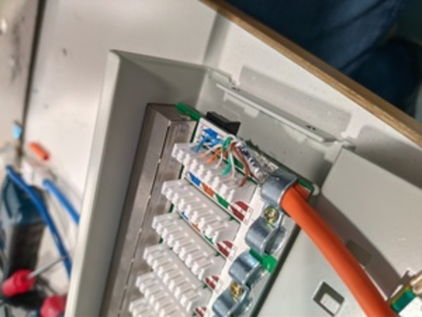

# Praktikum Rechnernetze

## Einführung

### Mitwirken

Diese Materialien basieren auf [Professor Kiefers "Praktikum Rechnernetze"-Vorlesung der HdM Stuttgart](https://www.hdm-stuttgart.de/vorlesung_detail?vorlid=j212254).

**Sie haben einen Fehler gefunden oder haben einen Verbesserungsvorschlag?** Bitte eröffnen Sie ein Issue auf GitHub ([github.com/pojntfx/uni-netpractice-notes](https://github.com/pojntfx/uni-netpractice-notes)):

{ width=150px }

Wenn ihnen die Materialien gefallen, würden wir uns über einen GitHub-Stern sehr freuen.

### Lizenz

Dieses Dokument und der enthaltene Quelltext ist freie Kultur bzw. freie Software.

{ width=128px }

Uni Network Practice Notes (c) 2021 Jakob Waibel, Daniel Hiller, Elia Wüstner, Felicitas Pojtinger

SPDX-License-Identifier: AGPL-3.0

\newpage

## Elektrische Verkabelung

**Die wichtigsten technischen Größen eines Kabels sind die Werte für die Impedanz, die Dämpfung, für das Nebensprechen und das sich daraus zu errechnende ACR.**

**Wie ist der ACR-Wert definiert?**

Der Attenuation-Crosstalk-Ratio ist als das Verhältnis von Nutzsignalstärke und Störsignalstärke definiert. Er lässt sich aus der Differenz des NEXT-Wertes und der Dämpfung berechnen, was dem Signal-to-Noise-Ratio entspricht.

**Sollte er hoch oder niedrig sein. Was kann ein ACR-Wert bewirken, der außerhalb der Toleranz liegt.**

Der ACR-Wert sollte so hoch wie möglich sein. Je höher der Wert ist, desto höher ist die Qualität der Übertragungsstrecke. Ein ACR-Wert, der au ss erhalb der Toleranz liegt kann dazu führen, dass das Signal nicht mehr eindeutig vom Rauschen zu unterscheiden ist. Dadurch kann es zu Übertragungsfehlern kommen.

**Welche weiteren Werte können zur Kabelqualifizierung herangezogen werden?**

Wie auch schon auf dem Vorbereitungsmaterial erwähnt, können diverse Werte zur Klassifizierung von Kabeln verwendet werden. Dazu gehören Werte wie Laufzeit, Transferimpedanz, Impedanz, Dämpfung, NEXT-Wert, Attenuation-Crosstalk-Ration und Normen:

- Signallaufzeit
- Transferimpedanz
- Impedanz
- Dämpfung
- NEXT

**Erläutern Sie mit wenigen Worten den Begriff der „strukturierten Verkabelung“**

Die Strukturierte Verkabelung definiert ein Konzept für die Verkabelung zwischen Gebäuden und wird in EN 50173 definiert. Ursprünglich bezog sich die Norm nur auf Bürogebäude. Sie wurde allerdings um andere Normen erweitert und bezieht sich nun auch auch industrielle Gebäude, Wohnkomplexe und Rechenzentren.

**Sie finden an einem Patchfeld oder einer Dose folgende Gigabit-Verbindung vor. Warum könnte ein derartiges Kabel Probleme verursachen und welche?**

Wenn die Paare direkt nebeneinander liegen hebe ich die Verdrillung auf, die notwendig ist damit sich mit Differenzsignalen die eingestreuten Störungen gegenseitig kompensieren.

**Warum müssen eigentlich alle 8 Adern (=4 Paare) angeschlossen sein? (Stichwort: 4D-PAM5)**

In Ethernet (10 Mbps) und FastEthernet (100 Mbps) werden unterschiedliche Adern Paare für Senden und Empfangen genutzt. Gigabit Ethernet (1000 Mbps) nimmt dagegen ein Paar für Senden und Empfangen, was gleichzeitiges Senden und Empfangen auf einem Paar ermöglicht. Die Bandbreite von 1 Gbps wird durch das komplette Ausnützen aller 8 Adern erreicht. 4D-PAM5 ist ein Pulsamplituden-Modulationsverfahren. Auf jeder der vier Doppeladern wird mit einer Nutzbitrate von 250Mbit/s üebertragen, was zu einer insgesamten Nutzbitrate von 1Gbit führt.
PAM-5 verwendet 5 Amplitudenstufen (1V, 0.5V, 0V, -0.5V, -1.0V). PAM5 wird verwendet, um eine Datenrate von 1Gbit zu ermöglichen.

**Wieso gibt es 2 Standards für die Kontaktierung von achtpoligen RJ-45-Steckern und Buchsen?**

Die Electronic Industries Alliance (EIA) definierte die Standards für die Kontaktierung von achtpoligen RJ-45 Steckern und Buchsen. Da es vor dem TIA-568A-Standard der EIA bereits den populären 258-A-Standard von AT&T gab, wurde bei der Veröffentlichung von TIA-568A der bereits etablierte 258-A-Standard als TIA-568B-Standard veröffentlicht.

## Optische Verkabelung

**Welche Messgrößen sind bei einem optischen Kabel im Vergleich zu den Messgrößen eines elektrischen Kabels sinnvoll?**

- Attenuation die den Lichtverlust aufgrund von z.B. Absorption, Biegen und Streuung angibt.
- Chromatische Dispersion. Sie kann gemessen werden in dem man die Dauer misst, wie lange unterschiedliche Wellenlängen benötigen, um eine Ader zu durchlaufen.
- Reflektionen

**Was ist ein OTDR (zur Qualifizierung optischer Verbindungen)?**

Ein OTDR ist ein "Optical-Time-Domain-Reflectometer". Das ist ein Werkzeug, um optische Leitungen zu analysieren.

**Wozu wird es benötigt**

Es kann dazu verwendet werden, um Lauflängen und Reflexionscharakteristika von optischen Wellen zu analysieren. So können Leitungen auf ihre Funktionalität und Reflexionseigenschaften an Verbindungen oder Kabelenden getestet werden.

## Aufgaben für die „Kabel“-Gruppen

**Schließen Sie eine RJ-45 Anschlussdose an das zur Verfügung gestellte Patchfeld an (kurzes Kabel von der Rolle abschneiden). Am Arbeitsplatz liegt entsprechendes Werkzeug. Lassen Sie sich vom Betreuer u. U. die Funktion des LSA-Werkzeuges erklären.**

Das Kabel stammt von folgender Kabelrolle:

{ width=300px }

Hier wurde nun ein Stück Kabel abgeschnitten und die äußere Abschirmung entfernt:

{ width=250px }

{ width=250px }

{ width=250px }

Und das Kabel mittels LSA-Werkzeug an die RJ45-Buchse angeschlossen:

{ width=250px }

Daraufhin wurde dasselbe für das Patch-Panel wiederholt:

{ width=250px }

Und das Kabel mittels LSA-Werkzeug an das Patch-Panel angeschlossen:

{ width=250px }

{ width=250px }

Um das Kabel zu testen wurden die Abdeckungen wieder angebracht und mit der Workstation verbunden:

{ width=250px }

{ width=250px }

**Welche zwei Anschlussmöglichkeiten (lt. Norm) haben sie für den Anschluss einer Dose?**

Laut Norm gibt es den EIA/TIA-568A-Standard und den EIA/TIA-568B-Standard. Letzterer beschreibt den Standard, welcher von AT&T etabliert worden ist.

Die Unterschiede der beiden Standards lassen sich in folgender Tabelle erkennen.

| Pin | TIA/EIA-568A | TIA/EIA-568B |
| --- | ------------ | ------------ |
| 1   | weiß/grün    | weiß/orange  |
| 2   | grün         | orange       |
| 3   | weiß/orange  | weiß/grün    |
| 4   | blau         | blau         |
| 5   | weiß         | weiß/blau    |
| 6   | orange       | grün         |
| 7   | weiß/braun   | weiß/braun   |
| 8   | braun        | braun        |

**Wie lang darf die unverdrillte Kabelstrecke sein?**

Sie muss möglichst kurz sein (max. ca. 1,5 cm) damit die Auswirkungen von Nahnebensprechen nicht überhandnehmen.

\newpage

**Überprüfen Sie mittels JPerf, wie hoch die Datenrate ihrer Verbindung ist.**

Wir haben mit `iperf` die Verbindung zu einem anderen Host im Rechnernetze-Labor gemessen.

{ width=350px }

{ width=350px }

Aus den Bildern lässt sich entnehmen, dass bei einem Transfer von einem Gigabyte eine Datenrate von 856 Mbit/s gemessen werden konnte.

\newpage

**Weisen Sie die Qualität Ihrer Strecke messtechnisch mit dem CM200 und dem Fluke DTX 1200 nach und dokumentieren Sie die Ergebnisse. (Benutzen Sie nicht die beigelegten kurzen blauen Kabel)**

**CM200**:

Hier wurde folgendes Setup aufgebaut:

{ width=250px }

Und, was sich mit dem Ergebnis des Fluke deckt, folgendes Ergebnis gemessen:

{ width=250px }

\newpage

**Fluke DTX 1200**:

Das Fluke-Setup sah folgendermaßen aus:

{ width=280px }

\newpage

Das Gerät zeigt uns an, dass wir am Patch-Feld aus Versehen den falschen Standard verwendet haben, um die Kabel anzuschließen. Das stellt aber keine weiteren Probleme dar. Eine Internetverbindung war auch so ohne Probleme möglich. Im folgenden Bild kann der Fehler betrachtet werden:

{ width=300px }

\newpage

Das Problem ist daher aufgetreten, dass am Patchfeld beide Standards verzeichnet sind, jedoch dies erst im Nachhinein bemerkt wurde und einer der beiden verwendet wurde.

{ width=280px }

\newpage

Des weiteren wurde ein hoher NEXT-Wert gemeldet, was an eventuell zu weit geöffneten Verdrillungen und der daher resultierenden fehlenden Abschirmung liegen könnte.

{ width=280px }

**Welche Aussage können Sie bezüglich CAT5 und CAT6 machen? (Messtechniker-Gruppe ist hier gefragt; lassen sie sich ihre Ergebnisse auf dem Fluke DTX 1200 speichern)**

Die Messtechniker-Gruppe stellte uns folgende Ergebnisse bereit:

{ width=500px }

{ width=500px }

Es scheint, als wäre das CAT5e-Kabel besser als das CAT6-Kabel. Dies sollte aber eigentlich nicht der Fall sein. Laut unseren Vorbereitungsunterlagen sollte das Cat6-Kabel sowohl eine geringere Dämpfung, als auch einen höheren NEXT-Wert als das Cat5e-Kabel vorweisen; genau das Gegenteil ist aber hier der Fall.

\newpage

**Versuchen Sie Ihr hoffentlich gut angeschlossenes Kabel so zu „bearbeiten“ (Quetschen, Pressen, Biegeradius verringern), daß Sie signifikant eine Änderung der Messqualität erreichen. Bitte systematisch und dokumentiert!**

Im ersten Durchgang knickten wir das Kabel sehr stark. Dies beinflusste die Ergebnisse allerdings gar nicht.

{ width=280px }

\newpage

Im zweiten Durchgang schnitten wir mit dem Seitenschneider in das Kabel und durchtrenten eine Ader. Dies lies sich dann an der Fluke-Analyse erkennen.

{ width=280px }

**Was versteht man unter „CableSharing“? Realisieren Sie solch eine Verbindung (Patchfeld -> Dose) und dokumentieren Sie Ihre Messergebnisse!**

Hierzu wurde ein CableSharing-Setup vorbereitet:

{ width=400px }

{ width=400px }

\newpage

{ width=300px }

Unter CableSharing versteht man, dass sich zwei Buchsen an der Dose und zwei Anschlüsse am Patchfeld ein einzelnes Kabel teilen. Dadurch ist allerdings nur eine maximale Datenrate von 100Mbit/s möglich. Dies konnte auch unter verwendung von `iperf` bestätigt werden. Es wurden beide Buchsen getestet:

\newpage

Misst man das CableSharing-Setup mit dem Fluke-Messgerät fällt auf, dass die Messung fehlschlägt. Dies liegt daran, dass das Fluke-Messgerät nicht für das Testen von CableSharing ausgelegt ist. Wir erhalten lediglich die Meldung, dass nicht alle Adern verbunden sind:

{ width=300px }

\newpage

Ähnlich verhält es sich mit dem Ergebnis des CM200, welcher `Open` anzeigt:

**Warum kann man mit CableSharing keine Gigabit-Anbindung realisieren?**

Bei Cable-Sharing werden ungenutzte Adern für eine zweite Netzwerkverbindung verwendet. Gigabit-Ethernet benötigt aber alleine schon alle acht Adern.

\newpage

**Ihnen stehen 3 blaue Kabel zur Verfügung, die unterschiedliche Fehler aufweisen. Messen sie diese Kabel mit ihrem CM200-Messgerät durch. Dokumentieren Sie die Messergebnisse**

Bei Kabel 1 wurden 1 & 2 blinkend und `Open` angezeigt:

{ width=400px }

Bei Kabel 2 wurden 7 & 8 blinkend und `Short` angezeigt:

{ width=400px }

Bei Kabel 3 wurden 6 & 2 blinkend und `Misswire` angezeigt:

{ width=400px }

**Können Sie bei Verwendung von Kabel 2 mittels JPerf die Übertragungsrate messen?**

Ja, dies war trotz Fehler `short` möglich, wie im folgenden Bild zu sehen ist:

{ width=400px }

\newpage

**Messen Sie mit ihrem CM200-Messgerät folgende Strecken und dokumentieren Sie die Ergebnisse. Grosser Systemschrank: 1-05 zu 1-06 (Fragen Sie nach den Messergebnissen der „Messtechnikern“-Gruppe und vergleichen sie mit Ihren Ergebnissen)**

Der CM200 wurde wie folgt angeschlossen:

{ width=350px }

Zu erkennen ist ein `Misswire`:

{ width=350px }

\newpage

Von den Messtechnikern bekamen wir folgendes Ergebnis:

{ width=500px }

Beide Ergebnisse lassen darauf schließen, dass die Buchsen am Patch-Panel nicht standardkonform aneinander angeschlossen sind.

\newpage

**Grosser Systemschrank: 1-07 zu 1-08 (Fragen Sie nach den Messergebnissen der „Messtechnikern“-Gruppe und vergleichen sie mit Ihren Ergebnissen)**

Zu erkennen ist ein `Pass`, jedoch mit vertauschten Kabeln:

\newpage

Von den Messtechnikern bekamen wir folgendes Ergebnis:

{ width=500px }

Die Ergebnisse der Messtechniker unterstützen unsere Vermutung; 1/2 respektive 3/6 wurden getauscht.

\newpage

**Kleiner Systemschrank: 2-13 zu 2-14 (Fragen Sie nach den Messergebnissen der „Messtechnikern“-Gruppe und vergleichen sie mit Ihren Ergebnissen)**

Zu erkennen ist ein `Open`; 3,4,5 und 6 blinken:

\newpage

Von den Messtechnikern bekamen wir folgendes Ergebnis:

{ width=500px }

Wie auch auf dem Ergebnis der Messtechniker zu erkennen ist, sind 3 und 4 nicht miteinander verbunden.
