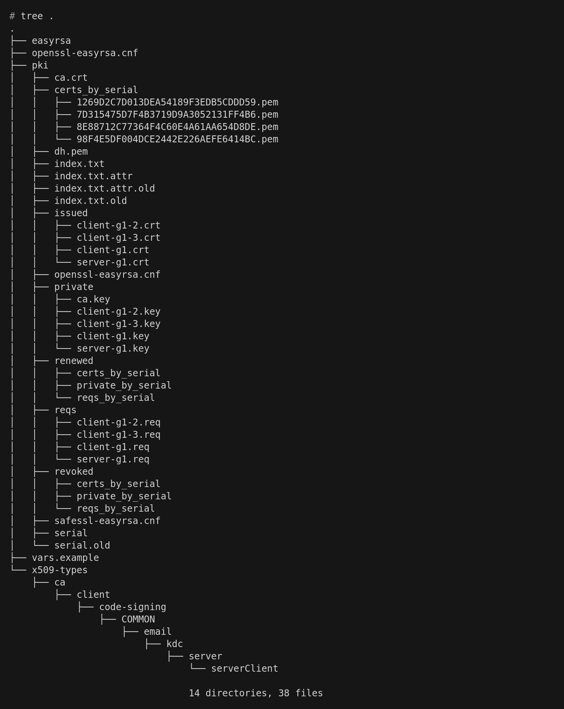
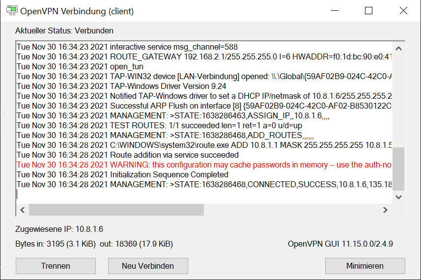
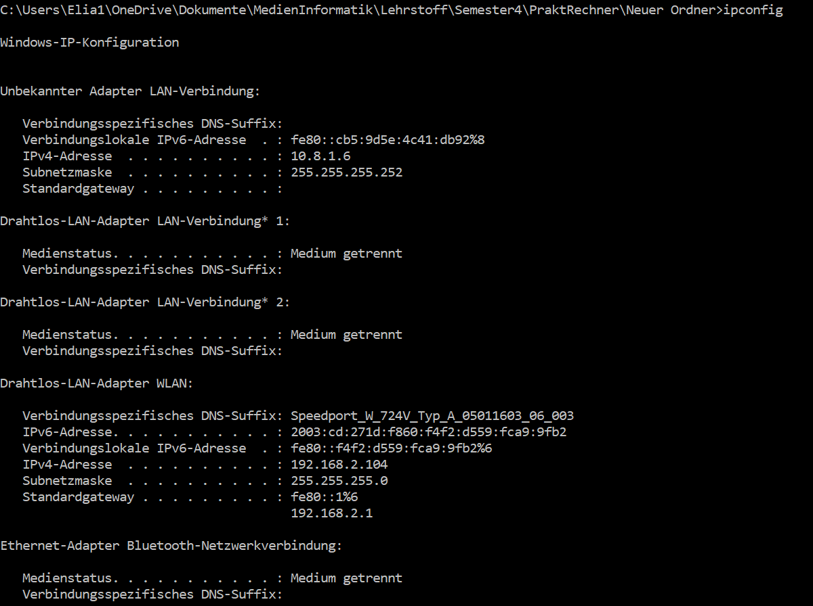
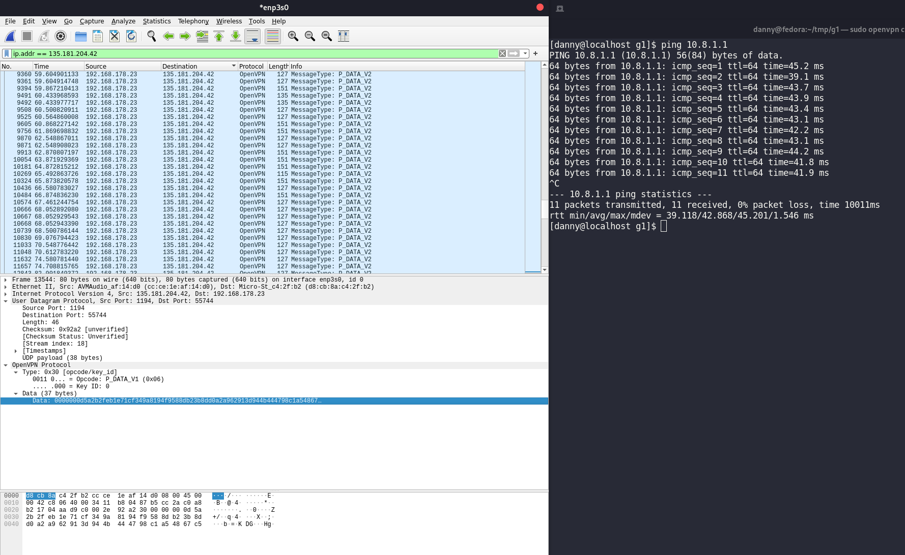
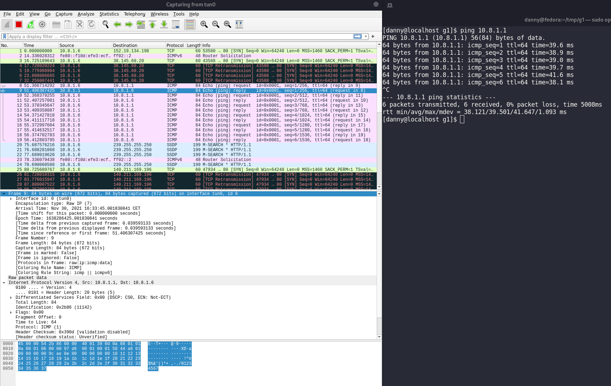
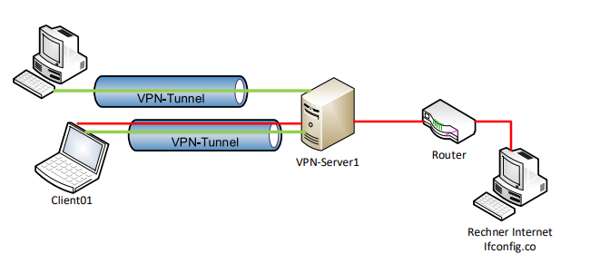

# Praktikum Rechnernetze

## Einführung

### Mitwirken

Diese Materialien basieren auf [Professor Kiefers "Praktikum Rechnernetze"-Vorlesung der HdM Stuttgart](https://www.hdm-stuttgart.de/vorlesung_detail?vorlid=j212254).

**Sie haben einen Fehler gefunden oder haben einen Verbesserungsvorschlag?** Bitte eröffnen Sie ein Issue auf GitHub ([github.com/pojntfx/uni-netpractice-notes](https://github.com/pojntfx/uni-netpractice-notes)):

{ width=150px }

Wenn ihnen die Materialien gefallen, würden wir uns über einen GitHub-Stern sehr freuen.

### Lizenz

Dieses Dokument und der enthaltene Quelltext ist freie Kultur bzw. freie Software.

{ width=128px }

Uni Network Practice Notes (c) 2021 Jakob Waibel, Daniel Hiller, Elia Wüstner, Felix Pojtinger

SPDX-License-Identifier: AGPL-3.0

\newpage

## CA (=Zertifizierungsstelle) und Schlüssel erzeugen und signieren

Verzeichnis erstellen und betreten:

```shell
# mkdir openvpn
# cd openvpn
```

Git installieren:

```shell
apt install git
```

Repository klonen:

```shell
# git clone https://github.com/OpenVPN/easy-rsa
Cloning into 'easy-rsa'...
remote: Enumerating objects: 2095, done.
remote: Counting objects: 100% (13/13), done.
remote: Compressing objects: 100% (11/11), done.
remote: Total 2095 (delta 3), reused 4 (delta 0), pack-reused 2082
Receiving objects: 100% (2095/2095), 11.72 MiB | 7.01 MiB/s, done.
Resolving deltas: 100% (914/914), done.
```

Verschieben und umbennenen einiger Ordner:

```shell
# mv easy-rsa/easyrsa3 easyrsa && rm -r easy-rsa && cd easyrsa
```

PKI-Infrastruktur erstellen:

```shell
root@g1:~/openvpn/easyrsa# ./easyrsa init-pki

init-pki complete; you may now create a CA or requests.
Your newly created PKI dir is: /root/openvpn/easyrsa/pki
```

Zertifizierungsstelle erstellen:

```shell
# ./easyrsa build-ca
Using SSL: openssl OpenSSL 1.1.0l  10 Sep 2019

Enter New CA Key Passphrase:
Re-Enter New CA Key Passphrase:
Generating RSA private key, 2048 bit long modulus
............................................+++++
.........+++++
e is 65537 (0x010001)
You are about to be asked to enter information that will be incorporated
into your certificate request.
What you are about to enter is what is called a Distinguished Name or a DN.
There are quite a few fields but you can leave some blank
For some fields there will be a default value,
If you enter '.', the field will be left blank.
-----
Common Name (eg: your user, host, or server name) [Easy-RSA CA]:g1.mi.hdm-stuttgart.de
CA creation complete and you may now import and sign cert requests.
Your new CA certificate file for publishing is at:
/root/openvpn/easyrsa/pki/ca.crt
```

Entfernen der Passphrase vom RSA Private Key:

```shell
# openssl rsa -in pki/private/ca.key -out pki/private/ca.key
Enter pass phrase for pki/private/ca.key:
writing RSA key
```

Keypair für Server generieren:

```shell
root@g1:~/openvpn/easyrsa# ./easyrsa gen-req server-g1 nopass
Using SSL: openssl OpenSSL 1.1.0l  10 Sep 2019
Generating a RSA private key
..................................................................................................................................................+++++
.............................................................................................+++++
writing new private key to '/root/openvpn/easyrsa/pki/easy-rsa-4141.HiTBNm/tmp.JnuJdp'
-----
You are about to be asked to enter information that will be incorporated
into your certificate request.
What you are about to enter is what is called a Distinguished Name or a DN.
There are quite a few fields but you can leave some blank
For some fields there will be a default value,
If you enter '.', the field will be left blank.
-----
Common Name (eg: your user, host, or server name) [server-g1]:g1.mi.hdm-stuttgart.de

Keypair and certificate request completed. Your files are:
req: /root/openvpn/easyrsa/pki/reqs/server-g1.req
key: /root/openvpn/easyrsa/pki/private/server-g1.key
```

\newpage 

Keypair für Client generieren:

```shell
root@g1:~/openvpn/easyrsa# ./easyrsa gen-req client-g1 nopass
Using SSL: openssl OpenSSL 1.1.0l  10 Sep 2019
Generating a RSA private key
...........................+++++
.........................................................................................+++++
writing new private key to '/root/openvpn/easyrsa/pki/easy-rsa-4162.amBaR1/tmp.1aHVQ6'
-----
You are about to be asked to enter information that will be incorporated
into your certificate request.
What you are about to enter is what is called a Distinguished Name or a DN.
There are quite a few fields but you can leave some blank
For some fields there will be a default value,
If you enter '.', the field will be left blank.
-----
Common Name (eg: your user, host, or server name) [client-g1]:g1.mi.hdm-stuttgart.de

Keypair and certificate request completed. Your files are:
req: /root/openvpn/easyrsa/pki/reqs/client-g1.req
key: /root/openvpn/easyrsa/pki/private/client-g1.key
```

Analog zur vorherigen Erstellung des Keypairs für den Client haben wir zwei weitere Keypairs `client-g1-2` und `client-g1-3` erstellt.

Einzelne Zertifikate signieren:

Server-Zertifikat:

```shell
# ./easyrsa sign server server-g1
Using SSL: openssl OpenSSL 1.1.0l  10 Sep 2019


You are about to sign the following certificate.
Please check over the details shown below for accuracy. Note that this request
has not been cryptographically verified. Please be sure it came from a trusted
source or that you have verified the request checksum with the sender.

Request subject, to be signed as a server certificate for 825 days:

subject=
    commonName                = g1.mi.hdm-stuttgart.de


Type the word 'yes' to continue, or any other input to abort.
Confirm request details: yes
Using configuration from /root/openvpn/easyrsa/pki/easy-rsa-4226.9Qm0XH/tmp.jenIQt
Check that the request matches the signature
Signature ok
The Subject's Distinguished Name is as follows
commonName            :ASN.1 12:'g1.mi.hdm-stuttgart.de'
Certificate is to be certified until Mar  4 13:45:08 2024 GMT (825 days)

Write out database with 1 new entries
Data Base Updated

Certificate created at: /root/openvpn/easyrsa/pki/issued/server-g1.crt


```

Client-Zertifikat:

```shell
# ./easyrsa sign client client-g1
Using SSL: openssl OpenSSL 1.1.0l  10 Sep 2019


You are about to sign the following certificate.
Please check over the details shown below for accuracy. Note that this request
has not been cryptographically verified. Please be sure it came from a trusted
source or that you have verified the request checksum with the sender.

Request subject, to be signed as a client certificate for 825 days:

subject=
commonName                = g1.mi.hdm-stuttgart.de


Type the word 'yes' to continue, or any other input to abort.
Confirm request details: yes
Using configuration from /root/openvpn/easyrsa/pki/easy-rsa-4288.S5KRe9/tmp.oh8FLq
Check that the request matches the signature
Signature ok
The Subject's Distinguished Name is as follows commonName            :ASN.1 12:'g1.mi.hdm-stuttgart.de'
Certificate is to be certified until Mar  4 13:45:38 2024 GMT (825 days)

Write out database with 1 new entries
Data Base Updated

Certificate created at: /root/openvpn/easyrsa/pki/issued/client-g1.crt
```

Analog wurden auch die zwei zusätzlich generierten Zertifikate signiert.

Generieren der Diffie-Hellman-Parameter:

```shell
# ./easyrsa gen-dh
Using SSL: openssl OpenSSL 1.1.0l  10 Sep 2019
Generating DH parameters, 2048 bit long safe prime, generator 2
This is going to take a long time
........................................................+.............+..................................................................+.................................................[...].........................................................................+.......................................................................................................................................+......++*++*++*++*


DH parameters of size 2048 created at /root/openvpn/easyrsa/pki/dh.pem
```

Gültigkeit der signierten Zertifikate prüfen:

Server-Zertifikat:

```shell
# openssl x509 -in pki/issued/server-g1.crt -text -noout
Certificate:
Data:
Version: 3 (0x2)
Serial Number:
98:f4:e5:df:00:4d:ce:24:42:e2:26:ae:fe:64:14:bc
Signature Algorithm: sha256WithRSAEncryption
Issuer: CN = g1.mi.hdm-stuttgart.de
Validity
Not Before: Nov 30 13:45:08 2021 GMT
Not After : Mar  4 13:45:08 2024 GMT
Subject: CN = g1.mi.hdm-stuttgart.de
Subject Public Key Info:
Public Key Algorithm: rsaEncryption
Public-Key: (2048 bit)
Modulus:
00:e3:ee:11:d2:55:a1:cb:fc:2f:78:0c:e7:d5:8b:
e2:a0:4b:b4:65:61:8a:75:49:35:1d:69:dd:d2:b9:
e9:3e:a8:f1:06:11:3b:d3:84:aa:89:e9:ae:c5:de:
ed:37:e4:3f:b3:c0:aa:27:5e:ab:a6:a1:3f:eb:c1:
65:89:c1:6a:65:8b:28:10:74:eb:44:50:96:ce:5f:
1d:5f:f7:0c:d1:a0:d4:22:2e:46:39:11:fc:89:5e:
68:9b:79:8c:28:d0:ea:3c:a2:02:c6:9e:ce:db:d6:
3d:5f:e7:2a:ed:02:d9:cb:3e:4d:0a:c1:c6:4e:35:
b7:1d:fe:8e:08:c2:ee:a1:b2:a9:7c:66:9f:b3:1b:
3b:20:4d:f4:b0:71:b4:5e:b5:4e:62:88:90:bb:f2:
87:cd:ba:63:29:68:af:65:96:14:08:2f:78:a3:0d:
3c:9b:c8:ac:fa:b3:2a:ed:ff:14:ce:01:af:8c:45:
e3:29:4e:3c:19:9b:6a:6e:40:6a:2f:86:ca:6c:9e:
1d:dd:ed:2f:72:c6:7a:3e:8a:8d:08:e2:e6:76:b6:
33:95:23:54:9a:e6:ea:4e:17:0c:08:c5:86:38:00:
2f:d5:70:0e:77:db:47:c4:48:a1:5e:6f:c6:95:1a:
4c:9b:b5:5b:41:fb:9d:99:23:8c:f0:55:37:eb:a7:
06:cf
Exponent: 65537 (0x10001)
X509v3 extensions:
X509v3 Basic Constraints:
CA:FALSE
X509v3 Subject Key Identifier:
EF:0D:06:76:FE:C8:B5:0B:3B:1E:D6:E9:98:94:25:29:11:C0:84:72
X509v3 Authority Key Identifier:
keyid:3F:CC:11:C2:51:85:77:9E:D1:D5:5F:0B:D6:D2:09:7F:79:D8:4D:4C
DirName:/CN=g1.mi.hdm-stuttgart.de
serial:AE:98:7F:B2:0A:A6:16:A4

X509v3 Extended Key Usage:
TLS Web Server Authentication
X509v3 Key Usage:
Digital Signature, Key Encipherment
X509v3 Subject Alternative Name:
DNS:g1.mi.hdm-stuttgart.de
Signature Algorithm: sha256WithRSAEncryption
97:13:f0:05:3a:91:b5:e7:69:5a:cb:53:70:8e:a4:f5:92:5e:
ed:9f:44:a9:11:6c:3f:0f:f8:b2:9e:1b:58:3f:17:a8:e4:9e:
79:44:be:c3:63:0c:c7:69:e4:1f:c8:39:8d:3c:3e:cd:ee:ff:
a5:88:67:ec:8a:df:6a:c7:45:68:3a:1b:97:b1:21:ba:0f:4f:
f2:f2:9d:27:71:cd:a8:f1:14:74:90:96:49:50:de:63:77:ad:
b1:87:be:4d:3e:78:59:cd:97:2c:08:b5:0c:f6:48:36:42:97:
6c:ab:79:9f:cf:b4:e7:3e:40:ca:65:fe:3f:2d:7a:f3:fc:20:
69:84:7b:e2:41:7e:22:db:52:6e:7f:be:9d:21:12:42:92:e3:
02:0d:47:3e:42:8a:42:d1:23:5e:c5:6f:16:3b:36:ce:84:c0:
71:d8:c6:97:f9:8f:fe:a2:44:92:5b:ee:cd:1b:f2:26:11:84:
d6:03:58:eb:44:d7:8e:8f:f7:74:fd:3d:98:17:2e:e1:81:42:
d6:77:fc:80:6d:2f:7e:8d:5e:fe:d1:8e:be:ba:9a:01:f8:01:
57:cb:5f:09:53:4d:f3:36:e9:cc:ac:25:d0:a2:54:27:28:c6:
4b:30:51:e0:13:6a:f2:73:3a:d4:2e:0f:44:72:07:73:56:98:
cd:7c:75:35
```

Client-Zertifikat:

```shell
# openssl x509 -in pki/issued/client-g1.crt -text -noout
Certificate:
Data:
Version: 3 (0x2)
Serial Number:
7d:31:54:75:d7:f4:b3:71:9d:9a:30:52:13:1f:f4:b6
Signature Algorithm: sha256WithRSAEncryption
Issuer: CN = g1.mi.hdm-stuttgart.de
Validity
Not Before: Nov 30 13:45:38 2021 GMT
Not After : Mar  4 13:45:38 2024 GMT
Subject: CN = g1.mi.hdm-stuttgart.de
Subject Public Key Info:
Public Key Algorithm: rsaEncryption
Public-Key: (2048 bit)
Modulus:
00:de:a5:7f:88:cb:40:dc:92:76:7b:ac:67:38:ad:
b8:e5:86:8d:18:e7:ca:35:ba:5f:92:a3:89:d9:18:
58:51:79:c2:5e:02:0c:f3:96:4e:1e:fc:73:9b:0c:
d9:3f:05:6d:7d:23:15:38:f5:0f:55:89:86:b3:6c:
ac:38:cc:85:8d:3f:97:ec:f6:0e:a7:5e:6e:39:fb:
bd:e5:78:ac:0c:04:b8:c9:ac:29:8c:84:90:8b:de:
3a:e6:83:b9:c3:82:48:9c:a1:71:d7:0b:15:ef:13:
f6:e7:59:84:bb:c9:7e:c3:69:ae:92:1e:f7:b6:39:
45:a1:63:72:25:41:a4:30:85:c3:ba:75:23:24:4b:
9c:98:58:90:98:38:40:65:1d:09:21:bf:36:9b:3d:
f7:2a:65:80:e8:84:67:5b:83:f3:b9:b7:8f:9b:03:
d0:db:23:7b:40:4d:f0:9c:c0:a9:81:26:0e:00:7c:
24:dd:ee:b0:d8:c5:f2:bf:be:f5:18:86:67:6c:0c:
b8:ab:f9:41:a0:c7:60:e2:d2:9c:32:6a:2f:8c:94:
c8:bb:1c:2c:80:5c:3b:20:b9:bf:a7:16:80:60:eb:
6c:f5:de:cb:34:c1:cc:89:ee:f0:bf:60:7b:56:ef:
1b:ca:f0:73:57:ba:b0:0d:a0:52:78:02:a1:d7:7f:
78:bf
Exponent: 65537 (0x10001)
X509v3 extensions:
X509v3 Basic Constraints:
CA:FALSE
X509v3 Subject Key Identifier:
A3:F6:BE:EC:50:50:92:A0:A3:1E:12:1A:00:A1:D1:53:B8:33:90:0F
X509v3 Authority Key Identifier:
keyid:3F:CC:11:C2:51:85:77:9E:D1:D5:5F:0B:D6:D2:09:7F:79:D8:4D:4C
DirName:/CN=g1.mi.hdm-stuttgart.de
serial:AE:98:7F:B2:0A:A6:16:A4

X509v3 Extended Key Usage:
TLS Web Client Authentication
X509v3 Key Usage:
Digital Signature
Signature Algorithm: sha256WithRSAEncryption
6d:18:13:c6:7d:04:58:f8:69:54:c0:74:a1:ec:5c:19:44:74:
a5:22:ff:ac:41:96:ca:23:50:4a:14:61:3a:4e:e8:d8:23:03:
5e:0c:2b:df:48:db:6c:f0:53:ab:36:57:9f:44:d5:f1:71:ae:
24:43:c9:86:52:d1:87:2a:5e:d8:a5:6e:90:c9:86:cc:44:b9:
69:2d:47:2a:94:87:46:29:00:8e:32:1b:8c:5e:cf:82:d8:e0:
d2:d1:85:87:94:a7:bc:53:c9:8b:eb:74:d2:59:be:44:92:72:
7a:85:ce:4c:40:ba:9f:fa:6b:e3:08:da:6a:e6:3b:34:4a:18:
25:7a:3d:2a:a1:8c:ad:47:c1:76:cc:a8:5b:46:38:3d:ee:0c:
35:68:c4:2f:a1:3b:66:64:e8:88:7a:1e:21:22:99:6e:4d:f2:
f1:55:d5:c3:25:ce:ac:27:2b:76:1e:11:6e:5b:78:4f:7b:1e:
2b:1e:5f:13:0c:b5:4e:0a:4f:b7:df:e6:85:ef:88:cd:9e:21:
e5:70:53:20:16:33:4b:6b:67:28:c7:0c:f5:bd:f6:38:30:47:
5a:44:99:c5:28:57:47:88:72:b9:de:a8:ae:ed:d3:c1:78:23:
07:9b:d5:2b:92:3f:ad:d8:88:f2:6e:e8:5a:0e:27:d8:7c:b2:
94:b5:27:ef
```

\newpage

Analog wurden auch die weiteren Zertifikate geprüft. Den Daten kann entnommen werden, dass die Zertifikate bis `Mar 4 13:45:38 2024 GMT` gültig sind. Die Zertifikate wurden von `g1.mi.hdm-stuttgart.de` signiert.

Die Ordnerstruktur sieht wie folgt aus:



Abschließend verschieben wir den `pki` Ordner ins Home-Verzeichnis:

```shell
# mv pki ~/pki
```

Aus der bisherigen Struktur generieren wir ein `client package`. Dafür muss man sich im `pki` Ordner befinden:

```shell
tar cf g1.tar ca.crt private/client-g1.key issued/client-g1.crt
```

### Fragen zur Aufgabe

**Beschreiben Sie kurz den Sinn der Dateien in diesen Ordnern**

Die `ca.crt` Datei ist öffentlich. User, Server und Client können damit beweisen, dass sie sich im selben vertrauten Netz befinden. Jeder daran beteiligte User und Server muss eine Kopie dieser Datei besitzen.

`ca.key` ist der private Schlüssel, mit dem die CA Zertifikate für Server und Clients signiert werden. Die ca.key Datei sollte nur auf der CA Maschine liegen, denn der Schlüssel darf nicht in die Hände eines Angreifers gelangen.

Die Private Keys liegen im Ordner `private` und im Ordner `issued` sind die signierten Zertifikate (Public Keys) für eine gegenseitige Bestätigung zwischen Server und Client.

Der Ordner `certs_by_serial` enthält alle von der CA signierten Zertifikate mit ihrer Seriennummer. 

`dh.pem` enthält die Parameter für den Diffie-Hellman-Key-Exchange.

`index.txt` ist die "Master-Datenbank" aller Zertifikate.

In `reqs` sind die Certificate Signing Requests (CSR) enthalten.

`renewed` und `revoked` enthalten Informationen über erneuerte und ungültig gemachte Zertifikate.

**Wie ist der Ablauf bei der Erstellung eines eigenen Zertifikates (gemeint sind die Schritte bei der
Erstellung)?**

Wir benötigen einen separaten Public Key und Private Key für den Server und jeden Client. Außerdem braucht es noch das Zertifikat und Key der CA, um alle Server und Client Zertifikate zu signieren. Bevor sich beide Parteien vertrauen muss der Client die Server Zertifikate authentifizieren und der Server muss die Client Zertifikate  authentifizieren. Dieses gegenseitige Authentifizieren erfolgt durch das Sicherstellen, dass ein Zertifikat, welches man bekommt bereits von der CA signiert wurde. Danach kann der Inhalt in dem neu authentifizierten Zertifikat Header, wie z.B. der certificate common name getestet werden.

**Schildern Sie den Ablauf der Authentisierung, des Schlüsselaustausches und der Verschlüsselung
bei der Verwendung von Zertifikats-basierter Authentisierung in OpenVPN!**

Als erstes tauschen Client und Server die Schlüsselpaare aus und verifizieren die Zertifikate. Der Client initiiert mit einer Anfrage an den Server die Verbindung. Der Server verifiziert sich mittels seiner eigenen "certificat chain". Mithilfe der eigenen Kopie des CA Files kann der Client die "certificate chain" überprüfen. Sofern dies klappt, erfolgt der Vorgang erneut umgekehrt, indem der Server die Client "certificate chain" checkt. CCD Dateien werden überprüft. Sie ermöglichen das Vergeben von spezifischen IP-Adressen an einen Client, um z.B. einen DNS Server einem bestimmten Client zuzuordnen oder einen Client zeitweise zu deaktivieren. Falls keine Fehler entstehen, kann die Verbindung aufgebaut werden.

**Was bewirkt die Option „nopass“ bei der Keypair-Erzeugung und ist diese sinnvoll?**

Schlüsselpaare werden mit dem Argument "nopass" unverschlüsselt gelassen, da Server in der Regel ohne Passworteingabe gestartet werden. Dadurch wird ein unverschlüsselter Schlüssel erzeugt, dessen Zugriff und Dateiberechtigungen daher sorgfältig geschützen werden muss.

**Erstellen Sie die CA + Keys + Zertifikate auf dem Server. Das sollte man eigentlich nicht machen, warum?**

## Konfiguration von Client und Server

### Server konfigurieren

Analog zu der in der Versuchsanleitung geschilderten Konfigurationsdatei wird im Folgenden eine angepasste `server.conf` dargestellt:

```shell
# cat server.conf
proto udp
dev tun
ca pki/ca.crt
cert pki/issued/server-g1.crt
key pki/private/server-g1.key
dh pki/dh.pem
server 10.8.1.0 255.255.255.0
keepalive 10 120
comp-lzo
persist-key
persist-tun
verb 3
```

Jetzt kann der OpenVPN-Server gestartet werden:

```shell
# sudo openvpn --config server.conf
Tue Nov 30 14:20:50 2021 OpenVPN 2.4.0 x86_64-pc-linux-gnu [SSL (OpenSSL)] [LZO] [LZ4] [EPOLL] [PKCS11] [MH/PKTINFO] [AEAD] built on Oct 14 2018
Tue Nov 30 14:20:50 2021 library versions: OpenSSL 1.0.2u  20 Dec 2019, LZO 2.08
Tue Nov 30 14:20:50 2021 Diffie-Hellman initialized with 2048 bit key
Tue Nov 30 14:20:50 2021 ROUTE_GATEWAY 172.31.1.1
Tue Nov 30 14:20:50 2021 TUN/TAP device tun0 opened
Tue Nov 30 14:20:50 2021 TUN/TAP TX queue length set to 100
Tue Nov 30 14:20:50 2021 do_ifconfig, tt->did_ifconfig_ipv6_setup=0
Tue Nov 30 14:20:50 2021 /sbin/ip link set dev tun0 up mtu 1500
Tue Nov 30 14:20:50 2021 /sbin/ip addr add dev tun0 local 10.8.1.1 peer 10.8.1.2
Tue Nov 30 14:20:50 2021 /sbin/ip route add 10.8.1.0/24 via 10.8.1.2
Tue Nov 30 14:20:50 2021 Could not determine IPv4/IPv6 protocol. Using AF_INET
Tue Nov 30 14:20:50 2021 Socket Buffers: R=[212992->212992] S=[212992->212992]
Tue Nov 30 14:20:50 2021 UDPv4 link local (bound): [AF_INET][undef]:1194
Tue Nov 30 14:20:50 2021 UDPv4 link remote: [AF_UNSPEC]
Tue Nov 30 14:20:50 2021 MULTI: multi_init called, r=256 v=256
Tue Nov 30 14:20:50 2021 IFCONFIG POOL: base=10.8.1.4 size=62, ipv6=0
Tue Nov 30 14:20:50 2021 Initialization Sequence Completed
```

Mit `scp` senden wir das `client package` mit dem Namen `g1.tar` zu unserem Client:

```shell
cp root@135.181.204.42:~/pki/g1.tar ~/
root@135.181.204.42's password:
g1.tar                                                       100%   20KB 389.8KB/s   00:00
```

Nachdem wir die Datei entpackt haben, erstellen wir unser `client.conf` file:

```shell
# cat client.conf
client
dev tun
proto udp
remote 135.181.204.42 1194
nobind
persist-key
persist-tun
ca ca.crt
cert issued/client-g1.crt
key private/client-g1.key
comp-lzo
verb 3
```

\newpage

Jetzt können wir den client mit unserer Konfiguration starten. Dabei ist zu beachten, dass der OpenVPN-Server auch bereits laufen muss:

```shell
# sudo openvpn --config client.conf
[sudo] password for root:
2021-11-30 15:58:20 WARNING: Compression for receiving enabled. Compression has been used in the past to break encryption. Sent packets are not compressed unless "allow-compression yes" is also set.
2021-11-30 15:58:20 --cipher is not set. Previous OpenVPN version defaulted to BF-CBC as fallback when cipher negotiation failed in this case. If you need this fallback please add '--data-ciphers-fallback BF-CBC' to your configuration and/or add BF-CBC to --data-ciphers.
2021-11-30 15:58:20 OpenVPN 2.5.3 x86_64-suse-linux-gnu [SSL (OpenSSL)] [LZO] [LZ4] [EPOLL] [PKCS11] [MH/PKTINFO] [AEAD] built on Jun 17 2021
2021-11-30 15:58:20 library versions: OpenSSL 1.1.1l  24 Aug 2021, LZO 2.10
2021-11-30 15:58:20 WARNING: No server certificate verification method has been enabled.  See http://openvpn.net/howto.html#mitm for more info.
2021-11-30 15:58:20 TCP/UDP: Preserving recently used remote address: [AF_INET]135.181.204.42:1194
2021-11-30 15:58:20 Socket Buffers: R=[212992->212992] S=[212992->212992]
2021-11-30 15:58:20 UDP link local: (not bound)
2021-11-30 15:58:20 UDP link remote: [AF_INET]135.181.204.42:1194
2021-11-30 15:58:20 TLS: Initial packet from [AF_INET]135.181.204.42:1194, sid=1cf1ee33 f316b385
2021-11-30 15:58:20 VERIFY OK: depth=1, CN=g1.mi.hdm-stuttgart.de
2021-11-30 15:58:20 VERIFY OK: depth=0, CN=g1.mi.hdm-stuttgart.de
2021-11-30 15:58:20 Control Channel: TLSv1.2, cipher TLSv1.2 ECDHE-RSA-AES256-GCM-SHA384, peer certificate: 2048 bit RSA, signature: RSA-SHA256
2021-11-30 15:58:20 [g1.mi.hdm-stuttgart.de] Peer Connection Initiated with [AF_INET]135.181.204.42:1194
2021-11-30 15:58:21 SENT CONTROL [g1.mi.hdm-stuttgart.de]: 'PUSH_REQUEST' (status=1)
2021-11-30 15:58:21 PUSH: Received control message: 'PUSH_REPLY,route 10.8.1.1,topology net30,ping 10,ping-restart 120,ifconfig 10.8.1.6 10.8.1.5,peer-id 0,cipher AES-256-GCM'
2021-11-30 15:58:21 OPTIONS IMPORT: timers and/or timeouts modified
2021-11-30 15:58:21 OPTIONS IMPORT: --ifconfig/up options modified
2021-11-30 15:58:21 OPTIONS IMPORT: route options modified
2021-11-30 15:58:21 OPTIONS IMPORT: peer-id set
2021-11-30 15:58:21 OPTIONS IMPORT: adjusting link_mtu to 1625
2021-11-30 15:58:21 OPTIONS IMPORT: data channel crypto options modified
2021-11-30 15:58:21 Data Channel: using negotiated cipher 'AES-256-GCM'
2021-11-30 15:58:21 Outgoing Data Channel: Cipher 'AES-256-GCM' initialized with 256 bit key
2021-11-30 15:58:21 Incoming Data Channel: Cipher 'AES-256-GCM' initialized with 256 bit key
2021-11-30 15:58:21 ROUTE_GATEWAY 100.64.84.78/255.255.255.240 IFACE=wlp3s0 HWADDR=c8:94:02:bd:60:53
2021-11-30 15:58:21 TUN/TAP device tun0 opened
2021-11-30 15:58:21 /usr/sbin/ip link set dev tun0 up mtu 1500
2021-11-30 15:58:21 /usr/sbin/ip link set dev tun0 up
2021-11-30 15:58:21 /usr/sbin/ip addr add dev tun0 local 10.8.1.6 peer 10.8.1.5
2021-11-30 15:58:21 /usr/sbin/ip route add 10.8.1.1/32 via 10.8.1.5
2021-11-30 15:58:21 WARNING: this configuration may cache passwords in memory -- use the auth-nocache option to prevent this
2021-11-30 15:58:21 Initialization Sequence Completed
```

### Erklären Sie die einzelnen Parameter/Optionen der „server.conf“ und der „client.conf“.

Client:

```conf
client                        # Definiert dass es sich um eine Konfigurationsdatei für einen Client handelt.
dev tun                       # Als virtuelles Netzwerkgerät verwenden wir tun, welches nur TCP/IP-Verkehr weiterleitet und keinen Broadcast-Verkehr über den VPN-Tunnel bereitstellt.
proto udp                     # Hier wird festgelegt, welches Protokoll auf Ebene 4 verwendet werden soll.
remote 135.181.204.42 1194    # Gibt an mit welcher Adresse sich verbunden werden soll. Dies wäre auch mit einem Hostnamen möglich.
nobind                        # Veranlasst OpenVPN dazu einen zufälligen clientseitigen Port zu verwenden.
persist-key                   # Versucht Zustände über den Neustart der Verbindung zu erhalten.
persist-tun                   # Versucht Zustände über den Neustart der Verbindung zu erhalten.
ca ca.crt                     # Gibt den Pfad zur Zertifikatsdatei der Certification Authority an.
cert issued/client-g1.crt     # Gibt den Pfad zur Zertifikatsdatei des Clients an.
key private/client-g1.key     # Gibt den Pfad zur Key-Datei des Clients an.
comp-lzo                      # Definiert dass keine Kompression verwendet werden soll.
verb 3                        # Definiert die Ausführlichkeit des Outputs. 3: Infos über Key-Generierung, Routen, Debugging des TUN/TAP-Treibers, Push/Pull/Ifconfig-Pool, Authentifizierung
```

\newpage

Server:

```conf
proto udp                     # Hier wird festgelegt, welches Protokoll auf Ebene 4 verwendet werden soll.
dev tun                       # Als virtuelles Netzwerkgerät verwenden wir tun, welches nur TCP/IP-Verkehr weiterleitet und keinen Broadcast-Verkehr über den VPN-Tunnel bereitstellt.
ca pki/ca.crt                 # Gibt den Pfad zur Zertifikatsdatei der Certification Authority an.
cert pki/issued/server-g1.crt # Gibt den Pfad zur Zertifikatsdatei des Servers an.
key pki/private/server-g1.key # Gibt den Pfad zur Key-Datei des Servers an.
dh pki/dh.pem                 # Gibt den Pfad zur Diffie-Hellman-Key-Datei des Servers an.
server 10.8.1.0 255.255.255.0 # Damit wird ein VPN-Subnetz unter Verwendung des Adressbereichs 10.8.1.XXX eingerichtet.
keepalive 10 120              # Hier wird alle 10 Sekunden ein Ping abgesetzt und wenn nach 120 Sekunden keine Antwort komt, gilt die Verbindung als down.
comp-lzo                      # Definiert dass keine Kompression verwendet werden soll.
persist-key                   # Versucht Zustände über den Neustart der Verbindung zu erhalten.
persist-tun                   # Versucht Zustände über den Neustart der Verbindung zu erhalten.
verb 3                        # Definiert die Ausführlichkeit des Outputs. 3: Infos über Key-Generierung, Routen, Debugging des TUN/TAP-Treibers, Push/Pull/Ifconfig-Pool, Authentifizierung
```

### Versuchen Sie ebenfalls mit einem Windows-Client eine Verbindung zu Ihrem Server aufzubauen. Die Client-Software können Sie von: https://openvpn.net/index.php/open-source/downloads.html herunterladen.




Windows verlangt, dass wir die "client.conf" in "client.ovpn" umbenennen. Die "client.ovpn" muss dann neben der "ca.crt", "client-g1.crt", "client-g1.key" abgelegt werden. Anschließend kann über das GUI eine Verbindung etabliert werden. 


## Analyse

### Analyse der Logs

**Inspizieren Sie die Log-Statements des Servers und des Clients. Ist ein Tunnel etabliert?**

Client-Log:

```shell
# sudo openvpn --config client.conf
[sudo] password for root:
2021-11-30 15:58:20 WARNING: Compression for receiving enabled. Compression has been used in the past to break encryption. Sent packets are not compressed unless "allow-compression yes" is also set.
2021-11-30 15:58:20 --cipher is not set. Previous OpenVPN version defaulted to BF-CBC as fallback when cipher negotiation failed in this case. If you need this fallback please add '--data-ciphers-fallback BF-CBC' to your configuration and/or add BF-CBC to --data-ciphers.
2021-11-30 15:58:20 OpenVPN 2.5.3 x86_64-suse-linux-gnu [SSL (OpenSSL)] [LZO] [LZ4] [EPOLL] [PKCS11] [MH/PKTINFO] [AEAD] built on Jun 17 2021
2021-11-30 15:58:20 library versions: OpenSSL 1.1.1l  24 Aug 2021, LZO 2.10
2021-11-30 15:58:20 WARNING: No server certificate verification method has been enabled.  See http://openvpn.net/howto.html#mitm for more info.
2021-11-30 15:58:20 TCP/UDP: Preserving recently used remote address: [AF_INET]135.181.204.42:1194
2021-11-30 15:58:20 Socket Buffers: R=[212992->212992] S=[212992->212992]
2021-11-30 15:58:20 UDP link local: (not bound)
2021-11-30 15:58:20 UDP link remote: [AF_INET]135.181.204.42:1194
2021-11-30 15:58:20 TLS: Initial packet from [AF_INET]135.181.204.42:1194, sid=1cf1ee33 f316b385
2021-11-30 15:58:20 VERIFY OK: depth=1, CN=g1.mi.hdm-stuttgart.de
2021-11-30 15:58:20 VERIFY OK: depth=0, CN=g1.mi.hdm-stuttgart.de
2021-11-30 15:58:20 Control Channel: TLSv1.2, cipher TLSv1.2 ECDHE-RSA-AES256-GCM-SHA384, peer certificate: 2048 bit RSA, signature: RSA-SHA256
2021-11-30 15:58:20 [g1.mi.hdm-stuttgart.de] Peer Connection Initiated with [AF_INET]135.181.204.42:1194
2021-11-30 15:58:21 SENT CONTROL [g1.mi.hdm-stuttgart.de]: 'PUSH_REQUEST' (status=1)
2021-11-30 15:58:21 PUSH: Received control message: 'PUSH_REPLY,route 10.8.1.1,topology net30,ping 10,ping-restart 120,ifconfig 10.8.1.6 10.8.1.5,peer-id 0,cipher AES-256-GCM'
2021-11-30 15:58:21 OPTIONS IMPORT: timers and/or timeouts modified
2021-11-30 15:58:21 OPTIONS IMPORT: --ifconfig/up options modified
2021-11-30 15:58:21 OPTIONS IMPORT: route options modified
2021-11-30 15:58:21 OPTIONS IMPORT: peer-id set
2021-11-30 15:58:21 OPTIONS IMPORT: adjusting link_mtu to 1625
2021-11-30 15:58:21 OPTIONS IMPORT: data channel crypto options modified
2021-11-30 15:58:21 Data Channel: using negotiated cipher 'AES-256-GCM'
2021-11-30 15:58:21 Outgoing Data Channel: Cipher 'AES-256-GCM' initialized with 256 bit key
2021-11-30 15:58:21 Incoming Data Channel: Cipher 'AES-256-GCM' initialized with 256 bit key
2021-11-30 15:58:21 ROUTE_GATEWAY 100.64.84.78/255.255.255.240 IFACE=wlp3s0 HWADDR=c8:94:02:bd:60:53
2021-11-30 15:58:21 TUN/TAP device tun0 opened
2021-11-30 15:58:21 /usr/sbin/ip link set dev tun0 up mtu 1500
2021-11-30 15:58:21 /usr/sbin/ip link set dev tun0 up
2021-11-30 15:58:21 /usr/sbin/ip addr add dev tun0 local 10.8.1.6 peer 10.8.1.5
2021-11-30 15:58:21 /usr/sbin/ip route add 10.8.1.1/32 via 10.8.1.5
2021-11-30 15:58:21 WARNING: this configuration may cache passwords in memory -- use the auth-nocache option to prevent this
2021-11-30 15:58:21 Initialization Sequence Completed
```

Server-Log:

```shell
# sudo openvpn --config server.conf
Tue Nov 30 14:57:41 2021 OpenVPN 2.4.0 x86_64-pc-linux-gnu [SSL (OpenSSL)] [LZO] [LZ4] [EPOLL] [PKCS11] [MH/PKTINFO] [AEAD] built on Oct 14 2018
Tue Nov 30 14:57:41 2021 library versions: OpenSSL 1.0.2u  20 Dec 2019, LZO 2.08
Tue Nov 30 14:57:41 2021 Diffie-Hellman initialized with 2048 bit key
Tue Nov 30 14:57:41 2021 ROUTE_GATEWAY 172.31.1.1
Tue Nov 30 14:57:41 2021 TUN/TAP device tun0 opened
Tue Nov 30 14:57:41 2021 TUN/TAP TX queue length set to 100
Tue Nov 30 14:57:41 2021 do_ifconfig, tt->did_ifconfig_ipv6_setup=0
Tue Nov 30 14:57:41 2021 /sbin/ip link set dev tun0 up mtu 1500
Tue Nov 30 14:57:41 2021 /sbin/ip addr add dev tun0 local 10.8.1.1 peer 10.8.1.2
Tue Nov 30 14:57:41 2021 /sbin/ip route add 10.8.1.0/24 via 10.8.1.2
Tue Nov 30 14:57:41 2021 Could not determine IPv4/IPv6 protocol. Using AF_INET
Tue Nov 30 14:57:41 2021 Socket Buffers: R=[212992->212992] S=[212992->212992]
Tue Nov 30 14:57:41 2021 UDPv4 link local (bound): [AF_INET][undef]:1194
Tue Nov 30 14:57:41 2021 UDPv4 link remote: [AF_UNSPEC]
Tue Nov 30 14:57:41 2021 MULTI: multi_init called, r=256 v=256
Tue Nov 30 14:57:41 2021 IFCONFIG POOL: base=10.8.1.4 size=62, ipv6=0
Tue Nov 30 14:57:41 2021 Initialization Sequence Completed
Tue Nov 30 14:58:20 2021 141.72.244.138:59463 TLS: Initial packet from [AF_INET]141.72.244.138:59463, sid=15b6f57f 995bddb5
Tue Nov 30 14:58:20 2021 141.72.244.138:59463 VERIFY OK: depth=1, CN=g1.mi.hdm-stuttgart.de
Tue Nov 30 14:58:20 2021 141.72.244.138:59463 VERIFY OK: depth=0, CN=g1.mi.hdm-stuttgart.de
Tue Nov 30 14:58:20 2021 141.72.244.138:59463 peer info: IV_VER=2.5.3
Tue Nov 30 14:58:20 2021 141.72.244.138:59463 peer info: IV_PLAT=linux
Tue Nov 30 14:58:20 2021 141.72.244.138:59463 peer info: IV_PROTO=6
Tue Nov 30 14:58:20 2021 141.72.244.138:59463 peer info: IV_NCP=2
Tue Nov 30 14:58:20 2021 141.72.244.138:59463 peer info: IV_CIPHERS=AES-256-GCM:AES-128-GCM
Tue Nov 30 14:58:20 2021 141.72.244.138:59463 peer info: IV_LZ4=1
Tue Nov 30 14:58:20 2021 141.72.244.138:59463 peer info: IV_LZ4v2=1
Tue Nov 30 14:58:20 2021 141.72.244.138:59463 peer info: IV_LZO=1
Tue Nov 30 14:58:20 2021 141.72.244.138:59463 peer info: IV_COMP_STUB=1
Tue Nov 30 14:58:20 2021 141.72.244.138:59463 peer info: IV_COMP_STUBv2=1
Tue Nov 30 14:58:20 2021 141.72.244.138:59463 peer info: IV_TCPNL=1
Tue Nov 30 14:58:20 2021 141.72.244.138:59463 WARNING: 'cipher' is present in local config but missing in remote config, local='cipher BF-CBC'
Tue Nov 30 14:58:20 2021 141.72.244.138:59463 Control Channel: TLSv1.2, cipher TLSv1/SSLv3 ECDHE-RSA-AES256-GCM-SHA384, 2048 bit RSA
Tue Nov 30 14:58:20 2021 141.72.244.138:59463 [g1.mi.hdm-stuttgart.de] Peer Connection Initiated with [AF_INET]141.72.244.138:59463
Tue Nov 30 14:58:20 2021 g1.mi.hdm-stuttgart.de/141.72.244.138:59463 MULTI_sva: pool returned IPv4=10.8.1.6, IPv6=(Not enabled)
Tue Nov 30 14:58:20 2021 g1.mi.hdm-stuttgart.de/141.72.244.138:59463 MULTI: Learn: 10.8.1.6 -> g1.mi.hdm-stuttgart.de/141.72.244.138:59463
Tue Nov 30 14:58:20 2021 g1.mi.hdm-stuttgart.de/141.72.244.138:59463 MULTI: primary virtual IP for g1.mi.hdm-stuttgart.de/141.72.244.138:59463: 10.8.1.6
Tue Nov 30 14:58:21 2021 g1.mi.hdm-stuttgart.de/141.72.244.138:59463 PUSH: Received control message: 'PUSH_REQUEST'
Tue Nov 30 14:58:21 2021 g1.mi.hdm-stuttgart.de/141.72.244.138:59463 SENT CONTROL [g1.mi.hdm-stuttgart.de]: 'PUSH_REPLY,route 10.8.1.1,topology net30,ping 10,ping-restart 120,ifconfig 10.8.1.6 10.8.1.5,peer-id 0,cipher AES-256-GCM' (status=1)
Tue Nov 30 14:58:21 2021 g1.mi.hdm-stuttgart.de/141.72.244.138:59463 Data Channel Encrypt: Cipher 'AES-256-GCM' initialized with 256 bit key
Tue Nov 30 14:58:21 2021 g1.mi.hdm-stuttgart.de/141.72.244.138:59463 Data Channel Decrypt: Cipher 'AES-256-GCM' initialized with 256 bit key
```

Aus dem Output lässt sich entnehmen, dass die Verbindung etabliert wurde und damit auch der Tunnel initialisiert wurde. Im Folgenden kann man auch sehen, dass nun die `tun` Netzwerkinterfaces angezeigt werden.

### Funktionstest

**Überprüfen Sie mit den Tools `ip link`, `ip address` und `ip route` die erzeugten Netzwerkkonfigurationen. Im Anschluss überprüfen Sie die Funktion des Tunnels mit einem Ping vom Client auf das tun0 Device des Servers.**

Zuerst verwenden wir `ip a`:

```shell
1: lo: <LOOPBACK,UP,LOWER_UP> mtu 65536 qdisc noqueue state UNKNOWN group default qlen 1000
    link/loopback 00:00:00:00:00:00 brd 00:00:00:00:00:00
    inet 127.0.0.1/8 scope host lo
        valid_lft forever preferred_lft forever
    inet6 ::1/128 scope host
        valid_lft forever preferred_lft forever
2: enp2s0f0: <NO-CARRIER,BROADCAST,MULTICAST,UP> mtu 1500 qdisc pfifo_fast state DOWN group default qlen 1000
    link/ether 84:a9:38:67:f2:18 brd ff:ff:ff:ff:ff:ff
3: wlp3s0: <BROADCAST,MULTICAST,UP,LOWER_UP> mtu 1500 qdisc noqueue state UP group default qlen 1000
    link/ether c8:94:02:bd:60:53 brd ff:ff:ff:ff:ff:ff
    inet 100.64.84.65/28 brd 100.64.84.79 scope global dynamic noprefixroute wlp3s0
        valid_lft 31703sec preferred_lft 31703sec
    inet6 2001:7c7:2126:4b00:1c82:4bbd:d5bc:2749/64 scope global temporary dynamic
        valid_lft 597550sec preferred_lft 78897sec
    inet6 2001:7c7:2126:4b00:7431:96ca:2ac9:c43b/64 scope global dynamic mngtmpaddr noprefixroute
        valid_lft 2591827sec preferred_lft 604627sec
    inet6 fe80::3d0a:2eec:1296:52be/64 scope link noprefixroute
        valid_lft forever preferred_lft forever
4: enp6s0f3u1u3c2: <NO-CARRIER,BROADCAST,MULTICAST,UP> mtu 1500 qdisc pfifo_fast state DOWN group default qlen 1000
    link/ether 00:50:b6:f5:31:44 brd ff:ff:ff:ff:ff:ff
6: tun0: <POINTOPOINT,MULTICAST,NOARP,UP,LOWER_UP> mtu 1500 qdisc pfifo_fast state UNKNOWN group default qlen 500
    link/none
    inet 10.8.1.6 peer 10.8.1.5/32 scope global tun0
        valid_lft forever preferred_lft forever
    inet6 fe80::847d:2db8:e5f6:2a09/64 scope link stable-privacy
        valid_lft forever preferred_lft foreverODO
```

Als Nächstes verwenden wir `ip link`

```shell
# ip link
1: lo: <LOOPBACK,UP,LOWER_UP> mtu 65536 qdisc noqueue state UNKNOWN mode DEFAULT group default qlen 1000
    link/loopback 00:00:00:00:00:00 brd 00:00:00:00:00:00
2: enp2s0f0: <NO-CARRIER,BROADCAST,MULTICAST,UP> mtu 1500 qdisc pfifo_fast state DOWN mode DEFAULT group default qlen 1000
    link/ether 84:a9:38:67:f2:18 brd ff:ff:ff:ff:ff:ff
3: wlp3s0: <BROADCAST,MULTICAST,UP,LOWER_UP> mtu 1500 qdisc noqueue state UP mode DORMANT group default qlen 1000
    link/ether c8:94:02:bd:60:53 brd ff:ff:ff:ff:ff:ff
4: enp6s0f3u1u3c2: <NO-CARRIER,BROADCAST,MULTICAST,UP> mtu 1500 qdisc pfifo_fast state DOWN mode DEFAULT group default qlen 1000
    link/ether 00:50:b6:f5:31:44 brd ff:ff:ff:ff:ff:ff
6: tun0: <POINTOPOINT,MULTICAST,NOARP,UP,LOWER_UP> mtu 1500 qdisc pfifo_fast state UNKNOWN mode DEFAULT group default qlen 500
    link/none
```

Jetzt noch ein Test mit `ip route`:

```shell
e0 proto dhcp metric 600
10.8.1.1 via 10.8.1.5 dev tun0
10.8.1.5 dev tun0 proto kernel scope link src 10.8.1.6
100.64.84.64/28 dev wlp3s0 proto kernel scope link src 100.64.84.65 metric 600
```

Als Letztes noch ein Ping vom Client an das `tun0` Interface des Servers:

```shell
NG 10.8.1.1 (10.8.1.1) 56(84) bytes of data.
64 bytes from 10.8.1.1: icmp_seq=1 ttl=64 time=25.5 ms
64 bytes from 10.8.1.1: icmp_seq=2 ttl=64 time=25.3 ms
64 bytes from 10.8.1.1: icmp_seq=3 ttl=64 time=25.5 ms
64 bytes from 10.8.1.1: icmp_seq=4 ttl=64 time=25.0 ms
64 bytes from 10.8.1.1: icmp_seq=5 ttl=64 time=25.8 ms
64 bytes from 10.8.1.1: icmp_seq=6 ttl=64 time=25.5 ms
64 bytes from 10.8.1.1: icmp_seq=7 ttl=64 time=25.2 ms
^C
--- 10.8.1.1 ping statistics ---
7 packets transmitted, 7 received, 0% packet loss, time 6008ms
rtt min/avg/max/mdev = 25.042/25.397/25.771/0.222 ms
```

\newpage

## Betrachtung via Wireshark

**Stellen Sie den Unterschied der Datenpakete (verschlüsselt, unverschlüsselt) mit Wireshark dar. Nutzen Sie dazu einen einfachen ping-Befehl. Beachten Sie, dass der Verkehr für Wireshark auf unterschiedlichen Interfaces stattfindet.**




Im Interface `enp3s0` werden die Daten durch ein `OpenVPN` Protokoll gehandelt, diese Daten sind, wie im Screenshot zu sehen, verschlüsselt.
Im Interface `tun0` werden die Daten mit einem `IPv4` Protokoll gehandelt.

\newpage

## Erweiterte Konfiguration

** Bis hierher haben wir nur Datenverbindung vom Client bis zum Server realisiert (In der Grafik grün dargestellt). Der Sinn einer VPN-Verbindung ist häufig die Network-to-Network-Anbindung. Eine ähnliche Verbindung ist eine Client-Verbindung über den VPN-Server nach draußen ins Internet. Folgende Grafik veranschaulicht die gewünschte Verbindung (rot dargestellt):**



**Um die Funktion zu testen, nutzen Sie den Dienst „ifconfig.co“ (Versuchen Sie einmal die
Adresse im Browser). Für was kann dieser Dienst genutzt werden?**

Der Dienst kann genutzt werden um die eigene öffentliche IP-Adresse herauszufinden.

Da bei der Person, welche die Clientverbindung hatte, IPv6 verwendet wurde, lieferte `ifconfig.co` folgendes Ergebnis:

```shell
# curl ifconfig.co
2001:7c7:2126:4b00:b016:5c9f:1161:eb14
```

Stattdessen kann `api.ipify.org` verwendet werden:

```shell
# curl api.ipify.org
141.72.244.138
```

### Änderung der Konfiguration

Die Datei `server.conf` muss um die IP des servers von `api.ipify.org` erweitert werden. Mit Dig können die IPs der Server verwendet werden. Wir erhalten hier mehrere IPs, da anscheinend Loadbalancing verwendet wird:

```shell
# dig api.ipify.org

; <<>> DiG 9.16.23-RH <<>> api.ipify.org
;; global options: +cmd
;; Got answer:
;; ->>HEADER<<- opcode: QUERY, status: NOERROR, id: 52052
;; flags: qr rd ra; QUERY: 1, ANSWER: 5, AUTHORITY: 0, ADDITIONAL: 1

;; OPT PSEUDOSECTION:
; EDNS: version: 0, flags:; udp: 65494
;; QUESTION SECTION:
;api.ipify.org.                 IN      A

;; ANSWER SECTION:
api.ipify.org.          3484    IN      CNAME   api.ipify.org.herokudns.com.
api.ipify.org.herokudns.com. 5  IN      A       54.91.59.199
api.ipify.org.herokudns.com. 5  IN      A       52.20.78.240
api.ipify.org.herokudns.com. 5  IN      A       3.232.242.170
api.ipify.org.herokudns.com. 5  IN      A       3.220.57.224

;; Query time: 27 msec
;; SERVER: 127.0.0.53#53(127.0.0.53)
;; WHEN: Wed Dec 01 11:55:12 CET 2021
;; MSG SIZE  rcvd: 147
```

Wir müssen also diese vier IPs in unsere Konfigurationsdatei einarbeiten:

```shell
# cat server.conf
proto udp
dev tun
ca pki/ca.crt
cert pki/issued/server-g1.crt
key pki/private/server-g1.key
dh pki/dh.pem
server 10.8.1.0 255.255.255.0
keepalive 10 120
comp-lzo
persist-key
persist-tun
verb 3
push "route 54.91.59.199 255.255.255.255"
push "route 52.20.78.240 255.255.255.255"
push "route 3.232.242.170 255.255.255.255"
push "route 3.220.57.224 255.255.255.255"
```

Zusätzlich müssen wir auf neue Firewall-Regeln auf dem Server einfügen:

```shell
# iptables -t nat -A POSTROUTING -s  10.8.1.0/24 -d 54.91.59.199 -j SNAT --to-source 135.181.204.42
# iptables -t nat -A POSTROUTING -s  10.8.1.0/24 -d 52.20.78.240 -j SNAT --to-source 135.181.204.42
# iptables -t nat -A POSTROUTING -s  10.8.1.0/24 -d 3.232.242.170 -j SNAT --to-source 135.181.204.42
# iptables -t nat -A POSTROUTING -s  10.8.1.0/24 -d 3.220.57.224 -j SNAT --to-source 135.181.204.42
```

Außerdem muss das IP-Forwarding eingeschaltet werden:

```shell
# sysctl net.ipv4.conf.all.forwarding=1
```

**Was bewirken diese Konfigurationsänderungen? Warum sind sie nötig?**

Die Änderung der Konfiguration ist nötig, um den Umfang des VPNs zu erweitern, sodass die Clients mehrere Maschinen (in unserem Fall `api.ipify.org`) im Servernetz erreichen können und nicht nur die Servermaschine selbst.

### Funktionstest

**Starten Sie den Open-VPN Client neu. Überprüfen Sie die Routen.**

Nach dem Neustarten des Clients sehen die Routen wie folgt aus:

```shell
# ip route get 54.91.59.199
54.91.59.199 via 10.8.1.5 dev tun0 src 10.8.1.6 uid 1000
    cache
```

```shell
# ip route get 52.20.78.240
52.20.78.240 via 10.8.1.5 dev tun0 src 10.8.1.6 uid 1000
    cache
```

```shell
# ip route get 3.232.242.170
3.232.242.170 via 10.8.1.5 dev tun0 src 10.8.1.6 uid 1000
    cache
```

```shell
# ip route get 3.220.57.224
3.220.57.224 via 10.8.1.5 dev tun0 src 10.8.1.6 uid 1000
    cache
```

\newpage

**Rufen Sie den Dienst „ifconfig.co“ vom Client aus auf. Was ist das Resultat? Warum?**

```shell
curl api.ipify.org
135.181.204.42
```

Das Resultat zeigt, dass der Traffic nun durch den Server getunnelt wird. Daher bekommen wir bei der Abfrage die IP-Adresse des Servers und nicht mehr unsere eigene IP-Adresse zurück.

## Zugriffsbeschränkung 
** Angenommen ein Client soll keinen Zugriff mehr über Ihren OpenVPN-Server erhalten. Wie verhindern Sie das, ohne dass Sie Zugang zum Client bekommen? Am Ende des Versuchs können sie die Methode für alle vergebenen Client-Zertifikate durchführen und testen. Können Sie diesen Vorgang wieder rückgängig machen, so das der Client wieder am VPN „teilnehmen“ kann?**

**Widerruf**

Wenn wir das Zertifikat widerrufen, führt dies dazu, dass das Zertifikat ungültig wird und nicht mehr für Authentifizierungszwecke genutzt werden kann.

Dies kann mit folgendem Kommando geschehen:

```shell
# ./revoke-full client-g1
```

Durch das vorangegangene Kommando wurde eine CRL-Datei erstellt (Certificate Revocation List), diese muss nun in ein Verzeichnis kopiert werden, auf das der OpenVPN-Server zugriff hat.

Nun muss noch die CRL-Verfizierung aktiviert werden:

```shell
# crl-verify crl.pem
```

Hierdurch werden die Client-Zertifikate aller sich verbindenden Clients mit der CRL verglichen, und jede positive Übereinstimmung führt zum Abbruch der Verbindung.

**Widerruf rückgängig machen**

Die "saubere Variante" wäre ein neues Zertifikat zu erstellen, jedoch ist es auch möglich den Widerruf eines Zertifikats rückgängig zu machen. Hierzu muss man im CA-Ordner die `index.txt` bearbeiten, welche die Zertifikats-IDs beinhaltet. Diejenigen, die mit `V` beginnen, sind gültig, und diejenigen mit `R` sind widerrufen. Wir können diese Datei bearbeiten und das erste Zeichen in `V` ändern und die dritte Spalte (das Widerrufsdatum) löschen.

Nun müssen wir die CRL-Datei noch einmal neu generieren und das Zertifikat sollte wieder gültig sein.
