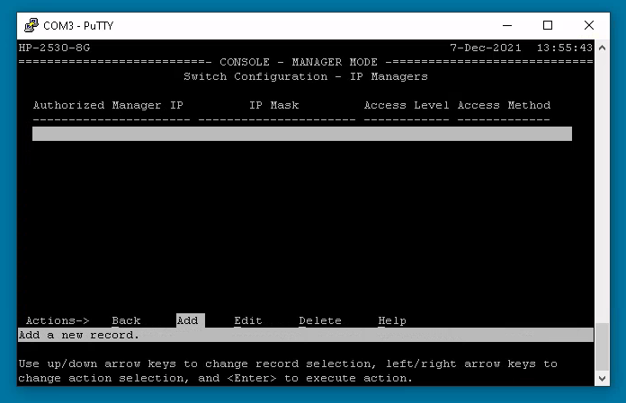
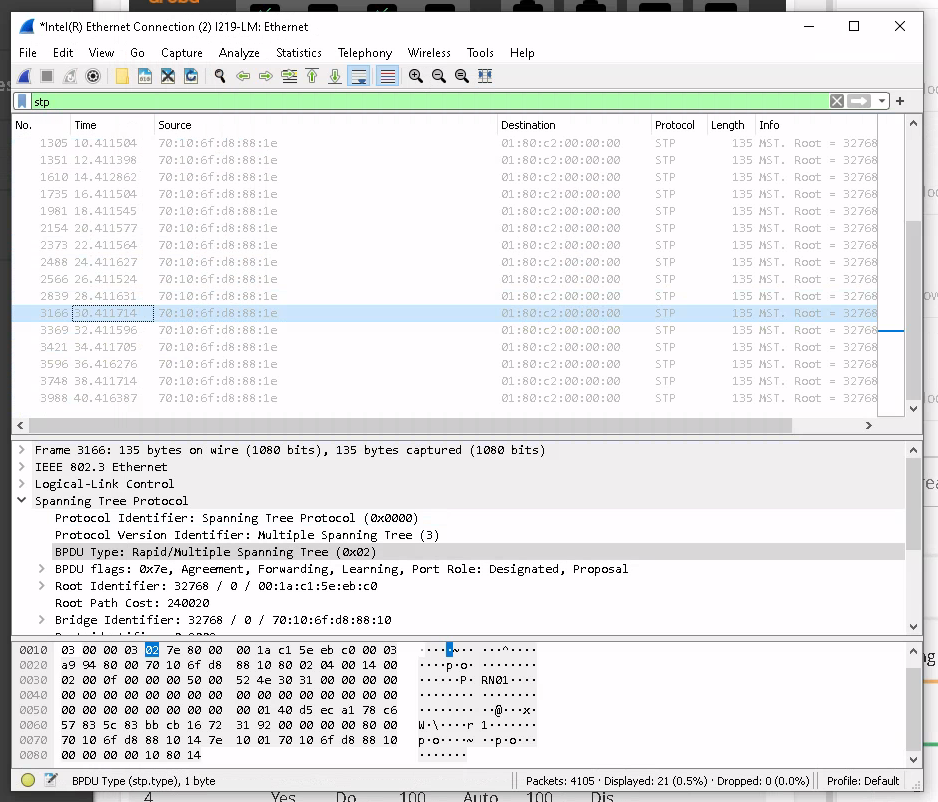
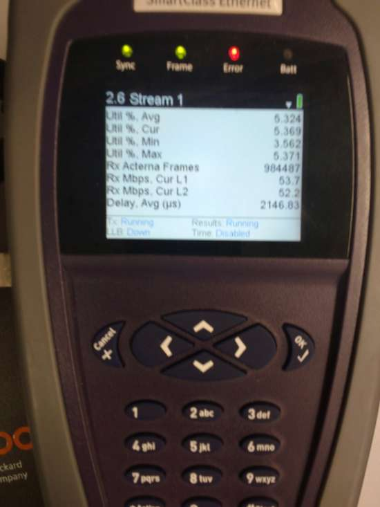

# Praktikum Rechnernetze

## Einführung

### Mitwirken

Diese Materialien basieren auf [Professor Kiefers "Praktikum Rechnernetze"-Vorlesung der HdM Stuttgart](https://www.hdm-stuttgart.de/vorlesung_detail?vorlid=j212254).

**Sie haben einen Fehler gefunden oder haben einen Verbesserungsvorschlag?** Bitte eröffnen Sie ein Issue auf GitHub ([github.com/pojntfx/uni-netpractice-notes](https://github.com/pojntfx/uni-netpractice-notes)):

{ width=150px }

Wenn ihnen die Materialien gefallen, würden wir uns über einen GitHub-Stern sehr freuen.

### Lizenz

Dieses Dokument und der enthaltene Quelltext ist freie Kultur bzw. freie Software.

{ width=128px }

Uni Network Practice Notes (c) 2021 Jakob Waibel, Daniel Hiller, Elia Wüstner, Felix Pojtinger

SPDX-License-Identifier: AGPL-3.0

\newpage

## Allgemeines

**Mal ganz dumm gefragt: Wieso haben manche Switches als Layer-2-Koppelelement eigentlich eine IP-Adresse?**

Ein switch benötigt keine IP-Adresse um frames zu benachbarten Geräten zu senden. Wenn ein Switch allerdings Remote-Access über e.g. telnet oder ssh benötigt, ist eine IP-Adresse notwendig. Diese IP kann allerdings nur einem virtuellen Interface zugewiesen werden.

**Ist ein Switch der eine IP-Adresse hat, automatisch ein Layer-3-Switch**

Wie aus der vorherigen Aufgabe hervorgeht, ist ein Switch mit IP-Adresse nicht automatisch ein Layer 3 Switch. 

**Was ist der Unterschied zwischen einem Layer-3-Switch und einem Router?**

Der Hauptunterschied liegt in der Hardware. Da Switches primär für Intranets ausgelegt sind besitzt ein Layer 3 Switch keine WAN-Ports. Switches sind für lokale Netzwerke und das routen zwischen VLANs gedacht.

## Switch Konfiguration

**Sie bekommen die Switche sozusagen „originalverpackt“. Um die Geräte initial zu konfigurieren, müssen Sie ein serielles Kabel (Console) an den PC anschließen und Putty oder MobaXterm (Console Serial: COMx, Speed: 9600; Console USB: COMx, Speed: 9600) starten**

Im Folgenden ist die PuTTY-Konfiguration zu sehen, welche die Verbindung mit dem Switch ermöglichts hat:

**Zur Sicherheit setzen Sie nach erfolgreicher Verbindung ihren Switch auf Werkszustand zurück. Das geht über die Console mit dem Befehl erase all. (Anm.: Da an dem Switch auch ihr PC mit RDP dranhängt, geht auch die RDP-Verbindung verloren. D.h. Sie müssen sich anschließend neu mit RDP auf ihrem PC anmelden)**

Vor Beginn der Konfiguration setzen wir den Switch auf Werkszustand zurück: 

Das Zurücksetzen hat ca. 3 Minuten gedauert.

**Vergeben Sie für Ihren Switch die entsprechende IP (siehe Zuordnung unter Ilias).**

Der Switch wurde nach folgender Zuordnung angeschlossen: `switch-71 (141.62.66.71) ist per seriellem Kabel an rn01 angeschlossen`

**Nach der IP-Konfiguration ist ihr Switch auch über einen Web-Browser erreichbar. Neuerdings bietet HP dazu zwei unterschiedliche GUIs an. Schauen Sie sich diese beiden GUIs an und bilden Sie sich ein Urteil.**

Die neue GUI sieht natürlich sehr schön aus, allerdings fiel uns die Navigation mit Hilfe des alten GUIs leichter, weshalb wir primär dieses verwendeten. 

## Analyse mit Wireshark

**Starten Sie Wireshark und dokumentieren Sie die Protokolle, die bereits jetzt Traffic in Zusammenhang mit ihrem Switch erzeugen (abgesehen von ihren eigenen httpAnfragen und die ARP-Anfragen von 141.62.66.236 (=FOG-Cloning Server) oder anderen Servern/Routern (=141.62.66.240, 141.62.66.250….) und natürlich dem RDP). Welchen Wireshark-Filter setzen Sie ein, um möglichst nur noch den Traffic ihres Switches einzufangen?**

Mit dem Filter `!ip.addr && !arp` werden alle Pakete, welche keine IP-Addresse haben, und das ARP-Protokoll ausgeblendet; zurück bleibt nur noch der Traffic des Switches.

**Was ist LLDP? Bringen Sie Ihren Windows-Client dazu, LLDP in Verbindung mit Ihrem Switch zu realisieren (Dafür ist unter Windows noch der LLDP-Dienst z.B. von https://raspi.github.io/projects/winlldpservice/ zu installieren. Unter Linux lässt sich mit apt install lldpd der Dienst ebenfalls nachinstallieren.)**

LLDP steht für `Link Layer Discovery Protocol`. Es ist ein Layer 2 Neighbor-Discovery Protokoll, welches ermöglicht, Geräteinformationen mit benac hbarten Geräten auszutauschen. Es ist üblich LLDP auf allen Koppelgeräten innerhalb eines Netzwerkes zu aktivieren, damit auch bei verschiedenen Herstellern Kommunikation reibungslos verlaufen kann. 

## Konfigurationsdatei

**Laden Sie sich die Switch-Konfiguration auf ihren PC und schauen Sie sich die Datei mit einem Texteditor an.**

Wir haben die Konfigurationsdatei mit Hilfe eines TFTP-Servers auf unser lokales Gerät geladen. 

**Ändern Sie in der heruntergeladenen Config-Datei den Namen des VLAN 1 und spielen Sie diese Datei als Konfiguration zurück auf den Switch.**

Nachdem wir den VLAN-Namen verändert haben, konnten wir die Datei mit Hilfe des TFTP-Servers wieder auf den Switch laden.

## Spanning-Tree-Verfahren

**Aktivieren Sie das Spanning-Tree-Protokoll (Versuchen Sie herauszufinden was in ihrem Fall einzustellen ist, MSTP oder RSTP, wo liegen die Unterschiede). Stecken Sie nun eine Schleife (Der Betreuer im Labor erledigt das für sie) zwischen den Switches und versuchen Sie durch Verändern der Parameter, den Ring an einer Stelle zu unterbrechen (Hinweis: spanning-tree <port-list> priority <prioritymultiplier> )**

Nach der Konfiguration des Spanning-Tree-Protokolls konnte man erkennen, wie beim Test des Betreuers Port 5 und 6 vom Spanning-Tree-Protokoll geblockt werden. Dies war in unserem Fall die richtige Handlung, da auf diesen Ports die Schleife angeschlossen war.

**Welche Funktion hat das Protokoll BPDU (vgl. Anhang, Internet) in Zusammenhang mit Switches? In welchen Abständen sendet es der Switch? Was will er damit erreichen?**

BPDU steht für "Bridge Protocol Data Unit". Dieses Protokoll wird genutzt, um Schleifen in einem Netzwerk festzustellen. Ein BPDU-Paket erhält Informationen zu Ports, Switches, Priorität von Ports und Adressen. Die Pakete werden von der jeweiligen Root-Bridge an alle Switches gesendet. Mit Hilfe dieses Protokolls kann sichergestellt werden, dass Schleifen frühzeitig erkannt werden.

In unserem Fall werden BPDU-Pakete alle 2 Sekunden gesendet. 

**Dokumentieren und interpretieren Sie die Ziel-MAC-Adresse, an die die BPDU-Pakete gesendet werden.**

Ziel-MAC-Adresse: `01:80:c2:00:00:00`

Dabei handelt es sich um eine Ethernet-Multicast-Adresse. Sie ist eine Well-Known-Adresse und wird beschrieben als "Local LAN Segment, stopping at STP-capable switches".

**Mit Hilfe von admin-edge-port kann man für einzelne Switchports das Forwarding aktivieren. Diese Option bringt einen Port sofort in den Forwarding-Zustand, unabhängig davon, ob evtl. Schleifen vorhanden sind oder nicht. Wo ist diese Funktion sinnvoll einsetzbar? Was ist der Unterschied zu der Option auto-edge-port? Welche Befehle gibt es sonst noch, um sich den Status des Spanning-Tree anzusehen (Der Befehl show und seine Optionen helfen weiter)?**

Bei aktiviertem `admin-edge-port`, werden die 3 Sekunden Wartezeit übersprungen, welche mit `auto-edge-port` verbunden wären und der Port geht direkt in den Forwarding-Zustand. Hierdurch wird die Verfügbarkeit des Ports beschleunigt. Jedoch besteht dann die Gefahr, dass nicht erkannt werden kann, ob unbekannte Switches angeschlossen werden. Selbst mit `BDU-Protection` können nur Switches mit STP erkannst werden, aber nicht ohne, da diese keine BDUs versenden.

Es kann der Befehl `show spanning-tree` verwendet werden, um sich den Status des Spanning-Tree anzusehen. 

## Port Mirroring und Port Security

**Spiegeln Sie den Datenverkehr eines beliebigen aktiven Ports auf einen anderen Port und dokumentieren Sie die Einstellung. Wann wird in der Praxis „Mirroring“ verwendet? Die entsprechende Funktion finden Sie unter Troubleshooting in der Web-Navigation links**

Port mirroring wird in der Regel verwendet, um Daten zu analysieren, zu debuggen oder Fehler im Netzwerk zu diagnostizieren.

**Überprüfen Sie, ob es möglich ist, alle Switch-Ports auf einen einzigen Port zu spiegeln. Wann ist dieses Vorgehen sinnvoll? Wo liegen die Grenzen?**

Hier gilt wieder selbiges, wie bereits oben angegeben: Port mirroring wird in der Regel verwendet, um Daten zu analysieren, zu debuggen oder Fehler im Netzwerk zu diagnostizieren.

TODO: Falls jemand noch etwas dazu wissen sollte - gerne einfügen

**Bei einem Switch können Sie aus Sicherheitsgründen den Zugriff auf erlaubte bzw. bekannte MAC-Adressen beschränken. Beispiel: Sie installieren einen Switch in Ihrer Firma und wollen, dass nur ausgewählte PCs (MAC-Adressen) in Ihrem Netzwerk kommunizieren können. Mitarbeiter dürfen keine privaten Geräte anschließen. Vorgehen: Sie konfigurieren die Port-Security für Port 8 und der Betreuer im Labor versucht über diesen Port mit einem Notebook (MAC-Adresse bitte erfragen) einen Ping ins Labor oder ins Internet.**

Beispielhaft wird nur unsere Workstation (MAC-Adresse `4C:52:62:0E:E0:E6`) allowlisted; theoretisch würde hier aber auch keine Addresse zum selben Effekt (keine Verbindung möglich).

Aktiviert wird "Send Trap and Disable", was zur Folge hat:

> A trap is sent to all trap receivers when an unauthorized device is detected, and the unauthorized device is disabled.

Wie zu erwarten ist, konnte vor einem allowlisten ein angeschlossenes Laptop (MAC-Adresse `28:d2:44:e0:d9:28`) nicht das Internet erreichen; wird dieser allerdings allowlisted, so kann dieses bzw. andere Hosts im Labor erreicht werden:

## VLANs

**Erstellen sie auf dem Switch zwei weitere VLANs mit unterschiedlicher Priorität. Es befindet sich immer ein sogenanntes Default-VLAN auf einem Switch, welches meistens die ID 1 besitzt. Legen Sie ein VLAN 2 und ein VLAN 3 an und konfigurieren Sie auf Switch-Port 5 und 6 des Switches jeweils die drei VLANs als getagged. Was bedeutet in diesem Zusammenhang tagged und untagged?**

TODO: Mehrere Tagged VLANs können über einen Switch Port laufen. An einem Ethernet Frame werden Tags angehängt, die angeben zu welchem VLAN der Frame gehört. Verfügen beide Switches die Tagging Funktionalität, dann reicht für die Verbindung zwischen diesen ein Kabel aus. Untagged VLANs sind portbasiert. Jeder Port stellt die Verbindung zu einem VLAN dar.

**Es sollen über diese 2 Switch-Ports 3 VLANs bedient werden. Im Weiteren setzen Sie für diese VLANs unterschiedlichen Prioritäten (Stichwort: qos)**

Diese Konfiguration spiegelt sich auch im Web-Interface wieder:

**Die VLAN-Priorisierung auf dem SmartClass Tester entspricht der VLAN-Konfiguration auf dem Switch. Was sollte ihrer Meinung mit den drei Streams passieren?**

TODO: Es muss gedrosselt werden, da das Loopback Gerät nur 100 Mbit durchlässt. Wir erwarten die größte Datenrate in VLAN 1, da hier auch am höchsten Priorisiert wurde. Danach folgt VLAN 2 welches etwas stärker in der Datenrate abgeschwächt werden sollte. Am stärksten muss die Drosselung in VLAN 3 sichtbar werden.

**Der Betreuer teilt Ihnen die Ergebnisse der Messung zur Dokumentation mit**

Gemessen wurden wie erwarted folgende Werte, welche zusammen eine Datenrate von ~99.6 Mbit/s darstellen:

| Stream | Datenrate  |
| ------ | ---------- |
| 1      | 53 Mbit/s  |
| 2      | 41 Mbit/s  |
| 3      | 5.6 Mbit/s |

Das Lastmessgerät zeigt Folgendes:

Die UI zeigt hier auch den Traffic an:

## Sichern der Konfiguration

**Sichern Sie Ihre Konfiguration mit: `write memory` bevor sie den Switch ausschalten und notieren Sie sich Ihre Switch-Nummer, im nächsten Versuch „Netzwerkmanagement“ werden Sie „Ihren“ Switch wieder brauchen.**

