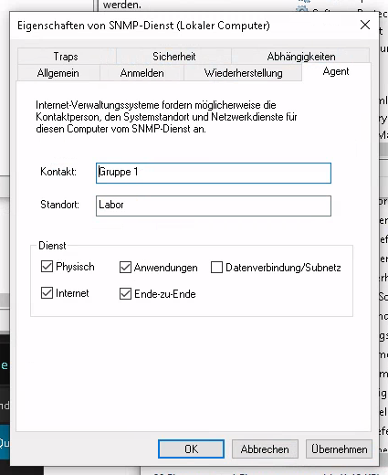

# Praktikum Rechnernetze

## Einführung

### Mitwirken

Diese Materialien basieren auf [Professor Kiefers "Praktikum Rechnernetze"-Vorlesung der HdM Stuttgart](https://www.hdm-stuttgart.de/vorlesung_detail?vorlid=j212254).

**Sie haben einen Fehler gefunden oder haben einen Verbesserungsvorschlag?** Bitte eröffnen Sie ein Issue auf GitHub ([github.com/pojntfx/uni-netpractice-notes](https://github.com/pojntfx/uni-netpractice-notes)):

{ width=150px }

Wenn ihnen die Materialien gefallen, würden wir uns über einen GitHub-Stern sehr freuen.

### Lizenz

Dieses Dokument und der enthaltene Quelltext ist freie Kultur bzw. freie Software.

{ width=128px }

Uni Network Practice Notes (c) 2021 Jakob Waibel, Daniel Hiller, Elia Wüstner, Felicitas Pojtinger

SPDX-License-Identifier: AGPL-3.0

\newpage

## SNMP

**Erkennen Sie, wer der Verwalter des Gerätes 141.62.66.213, 141.62.66.214 und 141.62.66.215 ist (sysContact)? Starten Sie eine Anfrage an einen Switch, die die Systeminfos abruft.**

Um die nötigen Informationen zu erhalten, verwendeten wir den folgenden Befehl für die angegebenen IP-Adressen:

```
./snmpwalk.exe -v 2c -c public 141.62.66.213 .1.3.6.1.2.1.1
```

`141.62.66.215` war, wie auf dem Screenshot zu sehen ist, zum Zeitpunkt der Versuchsdurchführung nicht erreichbar.

Der Screenshot zeigt, dass der `sysContact` und dementsprechend der Verwalter der Geräte für `141.62.66.213` und `141.62.66.214` den String-Wert "van der Kamp" hat.


\newpage

**Nutzen Sie den Befehl snmpwalk, um zu ergründen auf welchem Switchport (141.62.66.213, 141.62.66.214 oder 141.62.66.215) wie viel los war. Um welche Einheit handelt es sich? Auf welchem Switchport war bisher offensichtlich kein PC angesteckt?**

Verwendet wurde `ifInOctets` bzw. `ifOutOctets`, was die Anzahl an empfangenen bzw. gesendeten Oktets (Bytes) beschreibt; auf den Ports, an welchen kein Traffic stattfindet, ist offensichtlich kein PC eingesteckt.

`141.62.66.215` war zum Zeitpunkt der Versuchsdurchführung nicht erreichbar.

{ width=400px }

{ width=400px }

\newpage

**Welche „Geschwindigkeiten“ (10, 100, 1000 Mbit/s) haben die Interfaces derzeit jeweils und warum? Was ist das besondere bei Port 25 auf Switch 141.62.66.215? (Hinweis: ifSpeed vs. ifHighSpeed)**

{ width=400px }

{ width=400px }

{ width=400px }


- Port 2 auf `141.62.66.215`: 10 Mbit/s
- Port 24 auf `141.62.66.215`: 100 Mbit/s
- Port 25 auf `141.62.66.213`, `141.62.66.214`: 10 Gigabit/s
- Restliche Ports: 1 Gigabit/s

**Welche Geräte sind auf welchen Ports (141.62.66.213 oder .214, .215) angeschlossen (Hinweis: ifAlias)?**

`141.62.66.215` war zum Zeitpunkt der Versuchsdurchführung nicht erreichbar.

Mit `./snmpwalk.exe -v 2c -c public 141.62.66.213 ifAlias` können wir die angeschlossenenen Geräte an den jeweiligen Ports finden.

`141.62.66.213` hat ein Gerät namens `PC-1` in Port 20 angeschlossen und `Server-15` in Port 21.


An `141.62.66.214` sind an Port 20 ein `HP-Officejet` angeschlossen und an Port 21 eine `Fritzbox 7590`.


**Gibt es Unterschiede beispielsweise zwischen PCs die angeschaltet sind und solchen, die zwar angeschlossen, aber ausgeschaltet sind (Hinweis: Erkennbar an der Port-Geschwindgkeit) ?**

Anfangs waren alle Geräte bei uns angeschlossen und deren Ports als 1 Gigabit-Port dargestellt; Alias 25 aber wird als 10 Gigabit-Port dargestellt. Alias 4433 wird als 100 MBit-Port dargestellt.

Nachdem der Rechner `rn04` ausgeschaltet wurde, findet sich für den Switch mit der IP `141.62.66.214` an Port 5 die Geschwindigkeit 10 Mbit:


Zu sehen ist also, dass für ausgeschaltene PCs die Port-Geschwindigkeit auf 10 Mbit sinkt.

**Wie sieht ein entsprechender snmpwalk bei ihrem Switch aus (objectID: .1.3.6.1.2.1.1)?**

Wir verwenden den Befehl `./snmpwalk.exe -v 2c -c public 141.62.66.71 .1.3.6.1.2.1.1`:


Man kann auf dem Screenshot erkennen, dass `sysContact`, `sysName` und `sysLocation` noch nicht konfiguriert sind, beziehungsweise Stadardwerte haben.

**Setzen Sie mit snmpset einen Ansprechparter auf ihrem Switch. Überprüfen sie ihre Einstellung!**

Zuerst muss SNMP-Schreibzugriff aktiviert werden:


Im nachfolgenden wird nun der Switch mit der IP `141.62.66.81` verwendet.

Zunächst geben wir uns den alten `sysContact` mit `./snmpwalk.exe -v 2c -c public 141.62.66.81 syscontact` aus. Wir sehen, dieser hat aktuell den Wert `TestSwitch`.


Nun setzen wir den Wert des syscontacts mit dem Befehl `./snmpset.exe -v 2c -c public 141.62.66.81 1.3.6.1.2.1.1.4.0 s "uwu"` auf den Wert `uwu`. Danach geben wir uns den geänderten `sysContact` erneut aus:


**Verändern Sie mittels snmpset die Namen einzelner Switchports.**

Zuerst zeigen wir uns mit `./snmpwalk.exe -v 2c -c public 141.62.66.81 IF-MIB::ifAlias` die bisherigen Informationen und daher auch die Namen der Switchports an.

Im folgenden ändern wir den Namen des ersten Ports mit dem Befehl `./snmpset.exe -v 2c -c public 141.62.66.81 IF-MIB::ifAlias.1 s "uwu_port"` auf den Wert `uwu_port`.

Beim erneuten Anzeigen der Switchport-Informationen können wir den geänderten Namen sehen:


**Setzen Sie mit snmpset einen beliebigen Switchport auf disable (Vorsicht: „Schneiden Sie sich nicht den Ast auf dem Sie sitzen ab!“)**

Mit `./snmpset.exe -v 2c -c public 141.62.66.81 IF-MIB::ifAdminStatus.7 i 2` deaktivieren wir einen der Switchports. Der Wert `2` kann zum Deaktivieren verwendet werden. Der Wert `1` aktiviert den Switchport wieder.

Wie wir im Screenshot sehen können, hat sich der Status des Ports auf `down(2)` geändert:


**Wie ändert man den System-Namen des Switches?**

Zuerst geben wir uns den bisherigen Switch-Namen mit `./snmpwalk.exe -v 2c -c public 141.62.66.81 sysName.0` aus. Der bisherige System-Name ist `HP-2530-8G`.

Wir ändern den Switch-Namen mit `./snmpset.exe -v 2c -c public 141.62.66.81 sysName.0 s "uwu-switch"` auf den Wert `uwu-switch`.

Mit `./snmpwalk.exe -v 2c -c public 141.62.66.81 sysName.0` geben wir uns den geänderten System-Namen erneut aus:


\newpage

## Prometheus und Grafana

**Fragen Sie mit Prometheus den sysName ihres Switches ab**

Mit `sysName{instance="141.62.66.81"}` können wir den System-Namen unseres Switches abfragen:


Der Name unseres Switches ist, wie vorhin festgelegt, `uwu-switch`.

**Wie lange läuft Ihr Switch bereits?**

Mit `sysUpTime{instance="141.62.66.81}` können wir herausfinden, wie lange unser Switch bisher läuft:


Unser Switch läuft seit `8587799`. Unter diesem [Link](https://oidref.com/1.3.6.1.2.1.1.3) konnten wir herausfinden, dass dieser Wert in Hundertstel-Sekunden angegeben ist. Das lässt darauf schließen, dass dieser Switch seit `85877` Sekunden läuft, was ungefähr einem Tag entspricht.

**Sind alle Switchports „UP“?**

Mit `ifAdminStatus{instance="141.62.66.82"}` können wir uns Informationen über unsere Switchports anzeigen lassen. Die Value `1` deutet auf einen aktivierten Switchport hin. Der Wert `2` deutet auf deaktivierte Switchports hin.

Auf unserem Screenshot haben 7 Ports die Value `2`, was darauf deutet, dass diese Ports deaktiviert sind und damit nicht alle Switchports "up" sind.


**Mit welchem Speed laufen ihre Switchports**

Mit `ifSpeed{instance="141.62.66.82}` kann die Bandbreite der Switchports angezeigt werden. Laut der [Dokumentation](http://oid-info.com/get/1.3.6.1.2.1.2.2.1.5) wird die Bandbreite in Bits pro Sekunde angegeben.

Die meisten Switchports laufen auf 1.000.000.000 Bits pro Sekunde, was 1 Gigabit pro Sekunde entspricht.


**Über wie viele Ethernet-Interfaces verfügt ihr Switch?**

Mit `ifIndex{instance="141.62.66.81"}` können die Ethernet-Interfaces aufgelistet werden. Auf dem Screenshot sind 19 Ethernet-Interfaces zu sehen.


**Legen Sie sich zunächst ein eigenes Dashboard (entsprechend ihrem Switch-Namen) an, damit Sie niemandem in die Quere kommen.**

Zunächst erstellen wir eine neue Data Source mit der folgenden Konfiguration:


**Stellen Sie Ingress und Egress eines Switchports mit einem sinnvollen Graphen dar**

Mit Prometheus kann der Graph mit Hilfe der Query `irate(iflnOctets{instance="141.62.66.81", ifIndex="1"}[1m])` angezeigt werden.

![Query in Prometheus (`irate(ifInOctets{instance="141.62.66.81", ifIndex="1"}[1m])`)](./static/prometheus-irate.png)

Mit Graphana kann der Graph mit der gleichen Query angezeigt werden:


## Munin

**Wie platziert man sämtliche Nodes/Switche in der Web-Ansicht unter einer neuen Gruppe „Labor“ ? (Hinweis: Die gewählt Gruppenbezeichnung ist jedem Node voranzustellen.) Sprechen Sie sich innerhalb der Gruppe beim Editieren der /etc/munin/munin.conf ab, Sie arbeiten an EINER Datei!**

```shell
$ ssh-copy-id root@141.62.66.91
$ ssh root@141.62.66.91
# 83 ist im Versuch nicht erreichbar gewesen
for node in 81 82 84 85; do
munin-node-configure --shell --snmp 141.62.66.${node} --snmpcommunity public | bash
tee /etc/munin/munin-conf.d/141.62.66.${node}.conf <<EOT
[Labor;141.62.66.${node}]
    address 127.0.0.1
    use_node_name no
EOT
done
# systemctl restart munin-node
# munin-check
```


**Vergleichen Sie die beiden Tools Prometheus/grafana und munin. Welche Vor und Nachteile sehen sie jeweils?**

Bei Prometheus/grafana ist die UI etwas ansprechender und konfigurierbar. Das älter aussehende Munin ist nur in der CLI konfigurierbar. Es gibt dort bereits einige Grafen zu Themen wie Traffic und Errors. In grafana hätte man diese selbst konfigurieren müssen.

## LibreNMS

**Richten Sie ihren Windows-Client für den SNMP-Dienst her und fügen ihn als Device in LibreNMS hinzu. Konfigurieren Sie sinnvolle Einträge für „sysContact“ und „Location“. Wie interpretieren Sie die Anzahl und die Bezeichnungen der Ethernet-Ports für Ihre Windows-Maschine?**




\newpage

```shell
$ snmpwalk -v 2c -c public 141.62.66.1
SNMPv2-MIB::sysDescr.0 = STRING: Hardware: Intel64 Family 6 Model 158 Stepping 9 AT/AT COMPATIBLE - Software: Windows Version 6.3 (Build 19043 Multiprocessor Free)
SNMPv2-MIB::sysObjectID.0 = OID: SNMPv2-SMI::enterprises.311.1.1.3.1.1
DISMAN-EVENT-MIB::sysUpTimeInstance = Timeticks: (103835) 0:17:18.35
SNMPv2-MIB::sysContact.0 = STRING: Gruppe 1
SNMPv2-MIB::sysName.0 = STRING: rn01
SNMPv2-MIB::sysLocation.0 = STRING: Labor
SNMPv2-MIB::sysServices.0 = INTEGER: 77
```


- `loopback_5`: Ein Pseudo-Interface, über welches sich das System selbst kontaktieren kann (auf Linux: `lo`)
- `tunnel_*`: Windows-Äquivalent eines TAP- oder TUN-Device, mittels welchem z.B. VPNs realisiert werden können (auf Linux: `tapX`/`tunX`); da mehrere solcher Adapter vorhanden sind, sind wohl mehrere Tunnel vorhanden
- `ethernet_*`: Ethernet-Adapter (auf Linux: `enpXsX`); da mehrere solcher Adapter vorhanden sind, sind wohl mehrere Netzwerkkarten verbaut
- `ppp_*`: Ein Point-to-Point-Protokoll-Adapter (auf Linux: `pppX`)

**Welche Erkenntnisse ziehen Sie aus den Angaben zu STP und Neighbours bzgl. Ihres HP 2530-Switch, nachdem Sie ihn hinzugefügt haben?**

```shell
$ snmpwalk -v 2c -c public 141.62.66.81
SNMPv2-MIB::sysDescr.0 = STRING: HP J9777A 2530-8G Switch, revision YA.16.06.0006, ROM YA.15.20 (/ws/swbuildm/rel_washington_qaoff/code/build/lakes(swbuildm_rel_washington_qaoff_rel_washington)) (Formerly ProCurve)
SNMPv2-MIB::sysObjectID.0 = OID: SNMPv2-SMI::enterprises.11.2.3.7.11.141
DISMAN-EVENT-MIB::sysUpTimeInstance = Timeticks: (9263269) 1 day, 1:43:52.69
SNMPv2-MIB::sysContact.0 = STRING: uwu
SNMPv2-MIB::sysName.0 = STRING: uwu-switch
SNMPv2-MIB::sysLocation.0 = STRING:
SNMPv2-MIB::sysServices.0 = INTEGER: 74
```


Zu STP kann erkannt werden:

- Ob der Switch die Root-Bridge ist
- MAC-Adresse der Bridge
- Verwendete Protokollspezifikation
- Priorität
- Zeit, seitdem sich zuletzt die Topologie geändert hat
- MAC-Adresse des Roots
- Performance- und Latenzdaten wie Hello Time etc.

Bzgl. der Neighbors kann aus dem Graph entnommen werden, dass die Node `151.62.66.1` im selben Netz ist.

\newpage

**Fügen Sie den Switch 141.62.66.215 zu LibreNMS hinzu. Kontrollieren Sie den Port 25 (A1) auf Switch 141.62.66.215. Wie ist die Angabe des „Speed“ im Vergleich zur Feststellung aus Aufgabe 1 c?**

```shell
$ snmpwalk -v 2c -c public 141.62.66.215
SNMPv2-MIB::sysDescr.0 = STRING: HP J9726A 2920-24G Switch, revision WB.16.10.0015, ROM WB.16.03 (/ws/swbuildm/rel_ajanta_arenal_qaoff/code/build/anm(swbuildm_rel_ajanta_arenal_qaoff_rel_ajanta_arenal)) (Formerly ProCurve)
SNMPv2-MIB::sysObjectID.0 = OID: SNMPv2-SMI::enterprises.11.2.3.7.11.152
DISMAN-EVENT-MIB::sysUpTimeInstance = Timeticks: (1790824277) 207 days, 6:30:42.77
SNMPv2-MIB::sysContact.0 = STRING: van der Kamp
SNMPv2-MIB::sysName.0 = STRING: 215-HP-2920-24G-R141
SNMPv2-MIB::sysLocation.0 = STRING: R141
SNMPv2-MIB::sysServices.0 = INTEGER: 74
```


Der Port 25 (Port A1) ist ein 10-Gigabit-Port.

**Fügen Sie Device 141.62.66.241 hinzu. Wozu dient das Device?**

```shell
$ snmpwalk -v 2c -c public 141.62.66.241
SNMPv2-MIB::sysDescr.0 = STRING: ws_brs
SNMPv2-MIB::sysObjectID.0 = OID: SNMPv2-SMI::enterprises.40595
DISMAN-EVENT-MIB::sysUpTimeInstance = Timeticks: (189474772) 21 days, 22:19:07.72
SNMPv2-MIB::sysContact.0 = STRING: RNLab Admin
SNMPv2-MIB::sysName.0 = STRING: BrennenstuhlPDU
SNMPv2-MIB::sysLocation.0 = STRING: R142A
SNMPv2-MIB::sysServices.0 = INTEGER: 72
IF-MIB::ifNumber.0 = INTEGER: 1
IF-MIB::ifIndex.1 = INTEGER: 1
IF-MIB::ifDescr.1 = STRING: ti
IF-MIB::ifType.1 = INTEGER: ethernetCsmacd(6)
IF-MIB::ifMtu.1 = INTEGER: 1500
IF-MIB::ifSpeed.1 = Gauge32: 1000000
IF-MIB::ifPhysAddress.1 = STRING: 20:4c:6d:0:32:b
IF-MIB::ifAdminStatus.1 = INTEGER: up(1)
IF-MIB::ifOperStatus.1 = INTEGER: up(1)
IF-MIB::ifLastChange.1 = Timeticks: (0) 0:00:00.00
IF-MIB::ifInOctets.1 = Counter32: 0
IF-MIB::ifInUcastPkts.1 = Counter32: 0
IF-MIB::ifInNUcastPkts.1 = Counter32: 0
IF-MIB::ifInDiscards.1 = Counter32: 0
IF-MIB::ifInErrors.1 = Counter32: 0
IF-MIB::ifInUnknownProtos.1 = Counter32: 24726828
IF-MIB::ifOutOctets.1 = Counter32: 0
IF-MIB::ifOutUcastPkts.1 = Counter32: 0
IF-MIB::ifOutNUcastPkts.1 = Counter32: 0
IF-MIB::ifOutDiscards.1 = Counter32: 0
IF-MIB::ifOutErrors.1 = Counter32: 0
IF-MIB::ifOutQLen.1 = Gauge32: 0
IF-MIB::ifSpecific.1 = OID: SNMPv2-SMI::zeroDotZero
```


Aus dem Systennamen `brennenstuhlpdu` lässt sich schließen, dass es sich um eine Steckdosenleiste des Herstellers Brennenstuhl handelt.
